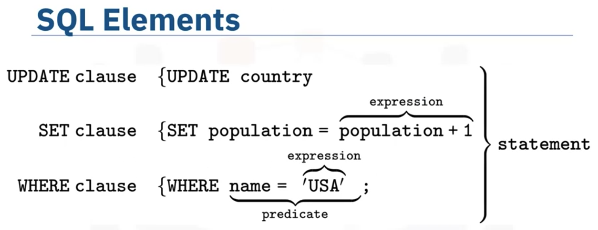
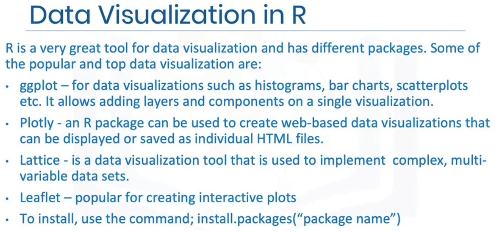
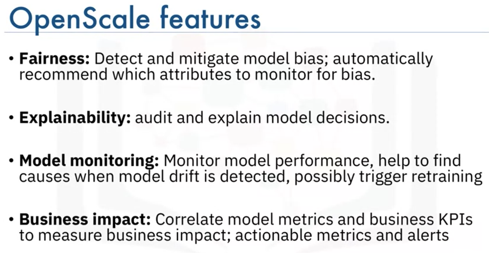

# Tools for Data Science <!-- omit in toc -->

- [Languages of Data Science](#languages-of-data-science)
  - [Python](#python)
  - [R](#r)
  - [SQL](#sql)
  - [Java](#java)
  - [Scala](#scala)
  - [C++](#c)
  - [JavaScript](#javascript)
  - [Julia](#julia)
- [Data Science Tools](#data-science-tools)
  - [Categories of Data Science Tools](#categories-of-data-science-tools)
  - [Open Source Tools](#open-source-tools)
  - [Commercial Tools](#commercial-tools)
  - [Cloud Based Tools](#cloud-based-tools)
- [Packages, APIs, Data Sets and Models](#packages-apis-data-sets-and-models)
  - [Packages](#packages)
  - [APIs](#apis)
  - [Data Sets](#data-sets)
    - [Where to find open data](#where-to-find-open-data)
    - [Community Data License Agreement](#community-data-license-agreement)
    - [The Data Asset eXchange](#the-data-asset-exchange)
  - [Models](#models)
    - [Supervised Learning](#supervised-learning)
    - [Unsupervised Learning](#unsupervised-learning)
    - [Reinforcement Learning](#reinforcement-learning)
    - [Deep Learning Models](#deep-learning-models)
    - [The Model Asset Exchange](#the-model-asset-exchange)
- [RStudio IDE](#rstudio-ide)
- [Git/GitHub](#gitgithub)
- [Watson Studio](#watson-studio)
  - [IBM Watson Knowledge Catalog](#ibm-watson-knowledge-catalog)
  - [Data Refinery](#data-refinery)
  - [Modeler flows](#modeler-flows)
  - [AutoAI](#autoai)
  - [Model Deployment](#model-deployment)
  - [Watson Openscale](#watson-openscale)

## Languages of Data Science

### Python

1. Python is a high-level **general-purpose programming language** that can be applied to many different classes of problems. 
2. It has a **large standard library** that provides tools suited to many different tasks, including but not limited to databases, automation, web scraping, text processing, image processing, machine learning, and data analytics. 
3. For **data science**, you can use Python's scientific computing libraries such as Pandas, NumPy, SciPy, and Matplotlib. 
4. For **artificial intelligence**, it has TensorFlow, PyTorch, Keras, and Scikit-learn. 
5. Python can also be used for **Natural Language Processing (NLP)** using the Natural Language Toolkit (NLTK).


### R

Like Python, R is free to use, but it's a GNU project -- instead of being open source, it's actually free software. 

So if Python is open source and R is free software, what’s the difference?  
- Both open source and free software commonly refer to the same set of licenses. Many open source projects use the GNU General Public License, for example. 
- Both open source and free software support collaboration. In many cases (but not all), these terms can be used interchangeably. 
- The Open Source Initiative (OSI) champions open source while the Free Software Foundation (FSF) defines free software. 
- Open source is more business focused, while free software is more focused on a set of values.


### SQL

The SQL language is subdivided into several language elements, including clauses, expressions, predicates, queries, and statements.

 


- Knowing SQL will help you do many different jobs in data science, including business and data analyst, and it's a must in data engineering and data science. 
- When performing operations with SQL, you access the data directly. There's no need to copy it beforehand. This can speed up workflow executions considerably. 
- SQL is the interpreter between you and the database. 
- SQL is an ANSI standard, which means if you learn SQL and use it with one database, you will be able to easily apply that SQL knowledge to many other databases.


### Java

- Java is a tried-and-true **general-purpose object oriented programming language**. 
- It's been widely adopted in the **enterprise space** and is designed to be fast and scalable. 
- Java applications are compiled to **bytecode** and run on the **Java Virtual Machine**, or "JVM." 
- Some notable data science tools built with Java include 
  - **Weka**, for data mining; 
  - **Java-ML**, which is a machine learning library; 
  - **Apache MLlib**, which makes machine learning scalable; 
  - **Deeplearning4j**, for deep learning.
- Apache **Hadoop** is another Java-built application. It manages data processing and storage for big data applications running in clustered systems.

### Scala

- Scala is a **general-purpose** programming language that provides support for **functional programming** and a strong static type system. 
- Designed as an extension to Java. Many of the design decisions in the construction of the Scala language were made to address criticisms of Java. Scala is also **inter-operable** with Java, as it runs on the JVM. 
- The name "Scala" is a combination of "scalable" and "language." This language is designed to grow along with the demands of its users. 
- For data science, the most popular program built using Scala is **Apache Spark**. 
  - Spark is a fast and general-purpose cluster computing system. It provides APIs that make parallel jobs easy to write, and an optimized engine that supports general computation graphs. 
  - **Shark**, which is a query engine; 
  - **MLlib**, for machine learning; 
  - **GraphX**, for graph processing; and 
  - **Spark Streaming**. 
  - Designed to be faster than Hadoop.


### C++

- C++ is a general-purpose programming language. It is an extension of the C programming language, or "C with Classes.” 
- C++ improves processing speed, enables system programming, and provides broader control over the software application. 
- Many organizations that use Python or other high-level languages for data analysis and exploratory tasks still rely on C++ to develop programs that feed that data to customers in real-time. 
- For data science, 
  - a popular deep learning library for dataflow called **TensorFlow** was built with C++. But while C++ is the foundation of TensorFlow, it runs on a Python interface, so you don’t need to know C++ to use it. 
  - **MongoDB**, a NoSQL database for big data management, was built with C++. 
  - **Caffe** is a deep learning algorithm repository built with C++, with Python and MATLAB bindings.


### JavaScript

- A core technology for the World Wide Web, JavaScript is a general-purpose language that extended beyond the browser with the creation of **Node.js** and other server-side approaches. 
- Javascript is NOT related to the Java language. 
- For data science, the most popular implementation is undoubtedly TensorFlow.js. 
  - **TensorFlow.js** makes machine learning and deep learning possible in Node.js as well as in the browser. 
    - TensorFlow.js was also adopted by other open source libraries, including brain.js and machinelearn.js.
  - The **R-js** project is another great implementation of JavaScript for data science. R-js has re-written linear algebra specifications from the R Language into Typescript. This re-write will provide a foundation for other projects to implement more powerful math base frameworks like Numpy and SciPy of Python.
- Typescript is a superset of JavaScript.


### Julia

- Julia was designed at MIT for **high-performance** numerical analysis and computational science. 
- It provides **speedy development** like Python or R, while producing programs that run as fast as C or Fortran programs. 
- Julia is **compiled**, which means that the code is executed directly on the processor as executable code; it calls C, Go, Java, MATLAB, R, Fortran, and Python libraries; and has **refined parallelism**. 
- The Julia language is relatively new, having been written in 2012, but it has a lot of promise for future impact on the data science industry. 
  - **JuliaDB** is a particularly useful application of Julia for data science. It's a package for working with large persistent data sets.


<br/>
<div align="right">
    <b><a href="#top">↥ back to top</a></b>
</div>
<br/>


## Data Science Tools

### Categories of Data Science Tools


 


- **Data Management** is the process of persisting and retrieving data. 
- **Data Integration and Transformation**, often referred to as Extract, Transform, and Load, or “ETL,” is the process of retrieving data from remote data management systems. Transforming data and loading it into a local data management system is also part of Data Integration and Transformation. 
- **Data Visualization** is part of an initial data exploration process, as well as being part of a final deliverable. 
- **Model Building** is the process of creating a machine learning or deep learning model using an appropriate algorithm with a lot of data. 
- **Model deployment** makes such a machine learning or deep learning model available to third-party applications. 
- **Model monitoring and assessment** ensures continuous performance quality checks on the deployed models. These checks are for accuracy, fairness, and adversarial robustness. 
- **Code Asset Management** uses versioning and other collaborative features to facilitate teamwork. 
- **Data Asset Management** brings the same versioning and collaborative components to data. Data asset management also supports replication, backup, and access right management. 
- **Development Environments**, commonly known as Integrated Development Environments, or "IDEs", are tools that help the data scientist to implement, execute, test, and deploy their work. 
- **Execution Environments** are tools where data preprocessing, model training, and deployment take place. 
- **Fully Integrated Visual Tools** covers all the previous tooling components, either partially or completely.


### Open Source Tools

- Data Management
  - Relational databases:
    - MySQL
    - PostgreSQL
  - NoSQL:
    - MongoDB
    - Apache CouchDB
    - Apache Cassandra
  - File-based:
    - Hadoop File System
    - Ceph, a Cloud File System
    - Elasticsearch
- Data Integration and Transformation (data refinery and cleansing)
  - Apache AirFlow, originally created by AirBNB
  - KubeFlow
  - Apache Kafka, orginated from LinkedIn
  - Apache Nifi, with a very nice visual editor
  - Apache SparkSQL (ANSI SQL, scales up to 1000 nodes)
  - NodeRED, with visual editor, can run on small devices like a Raspberry Pi
- Data Visualization
  - Hue, can create visualization from SQL queries
  - Kibana, for Elasticsearch
  - Apache Superset
- Model Deployment
  - Apache PredictionIO
  - Seldon (supports TensorFlow, Apache SparkML, R, scikit-learn, can run on top of Kubernetes and Redhat OpenShift)
  - MLeap
  - TensorFlow Service. TensorFlow can serve any of its models using the TensorFlow Service.
  - TensorFlow Lite, on a Raspberry Pi or a smartphone
  - TensorFlow.JS, on a web browser
- Model Monitoring
  - ModelDB, a machine model metadatabase where information about the models are stored and can be queried
  - Prometheus
- Model Performance 
  - IBM AI Fairness 360 open source toolkit (Model bias against protected groups like gender or race is also important)
  - IBM Adversarial Robustness 360 (Machine learning models, especially neural-network-based deep learning models, can be subject to adversarial attacks, where an attacker tries to fool the model with manipulated data or by manipulating the model itself)
  - IBM AI Explainability 360 Toolkit
- Code Asset Management (version management or version control)
  - Git
    - GitHub
    - GitLab
    - Bitbucket
- Data Asset Management (data governance or data lineage, crucial part of enterprise grade data science. Data has to be versioned and annotated with metadata)
  - Apache Atlas
  - ODPi Egeria
  - Kylo, an open source data lake management software platform
- Development Environments
  - Jupyter
    - Jupyter Notebooks
    - JupyterLab
  - Apache Zeppelin
  - RStudio
  - Spyder
- Execution Environments
  - Apache Spark, a batch data processing engine, capable of processing huge amounts of data file by file
  - Apache Flink, a stream processing data processing engine, focus on processing real-time data streams
  - Ray, focus on large-scale deep learning model training
- Fully Integrated and Visual open source tools for data scientists
  - KNIME
  - Orange


### Commercial Tools

- Data Management
  - Oracle
  - Microsoft SQL Server
  - IBM DB2
- ETL
  - Informatica Powercenter
  - IBM InfoSphere DataStage
  - SAP
  - Oracle
  - SAS
  - Talend
  - Watson Studio Desktop 
    - Data Refinery
- Data Visualization
  - Tableau
  - Microsoft Power BI
  - IBM Cognos Analytics
  - Watson Studio Desktop
- Model Building (integrated with model deployment)
  - SPSS Modeler, supports PMML (Predictive Model Markup Language)
  - SAS Enterprise Miner
- Data Asset Management
  - Informatica Enterprise Data Governance
  - IBM InfoSphere Information Governance Catalog
- Fully Integrated Development Environment
  - Watson Studio
  - H2O Driverless AI

### Cloud Based Tools

Cloud products are a newer species, they follow the trend of having multiple tasks integrated in tools.

- fully integrated visual tools
  - Watson Studio
  - Watson OpenScale
  - Microsoft Azure Machine Learning
  - H2O Driverless AI
  
Since operations and maintenance are not done by the cloud provider, as is the case with Watson Studio, Open Scale, and Azure Machine Learning, this delivery model should not be confused with Platform or Software as a Service -- PaaS or SaaS.

- Data Management (SaaS, software-as-a-service, taking operational tasks away from the user)
  - Amazon Web Services DynamoDB, a NoSQL database
  - Cloudant, based on Apache CouchDB
  - IBM offers DB2 as a service as well
- ETL, ELT (SaaS)
  - Informatica Cloud Data Integration
  - IBM Data Refinery
- Cloud Data Visualization
  - DataMeer
  - IBM Data Refinery
- Model Building
  - Watson Machine Learning
  - Google AI Platform Training
- Model Deployment (usually integrated in the model building process)
  - SPSS Collaboration and Deployment Services
  - SPSS Modeler supports exporting models as PMML
  - Watson Machine Learning can also be used to deploy a model and make it available using a REST interface
  - Amazon SageMaker Model Monitor


<br/>
<div align="right">
    <b><a href="#top">↥ back to top</a></b>
</div>
<br/>


## Packages, APIs, Data Sets and Models

### Packages

**Python Libraries**
- Scientifics Computing Libraries
  - Pandas, data structures & tools, built on top of Numpy
  - Numpy, arrays & matrices
- Visualization Libraries
  - Matplotlib, plots & graphs, most popular
  - Seaborn, plots: heat maps, time series, violin plots
- Machine Learning and Deep Learning
  - Scikit-learn, machine learning: regression, classification, ...
  - Keras, deep learning: neural networks, ...
- Deep Learning Libraries
  - TensorFlow, deep learning: production and deployment
  - PyTorch, for experimentation, deep learning: regression, classification, ...
- Cluster-computer framework
  - Apache Spark, data processing jobs can use Python, R, Scala, SQL


**Scala Libraries**
- Vegas, statistical data visualization, you can work with data files as well as Spark DataFrames
- BigDL, deep learning

**R Libraries**
- ggplot2, data visualization

### APIs

The API is simply the interface. There are also multiple volunteer-developed APIs for TensorFlow; for example Julia, MATLAB, R, Scala, and many more. REST APIs are another popular type of API.

They enable you to communicate using the internet, taking advantage of storage, greater data access, artificial intelligence algorithms, and many other resources. The RE stands for “Representational,” the S stands for “State,” the T stand for “Transfer.” In rest APIs, your program is called the “client.” The API communicates with a web service that you call through the internet. A set of rules governs Communication, Input or Request, and Output or Response.

HTTP methods are a way of transmitting data over the internet We tell the REST APIs what to do by sending a request.

The **request** is usually communicated through an HTTP message. The HTTP message usually contains a **JSON file**, which contains instructions for the operation that we would like the service to perform. This operation is transmitted to the web service over the internet. The service performs the operation. Similarly, the web service returns a **response** through an HTTP message, where the information is usually returned using a JSON file.

### Data Sets

#### Where to find open data

- Open data portal list from around the world
  - http://datacatalogs.org/
- Governmental, intergovernmental and organization websites
  - http://data.un.org/ (United Nations)
  - https://www.data.gov/ (USA)
  - https://www.europeandataportal.eu/en/ (Europe)
- Kaggle
  - https://www.kaggle.com/datasets
- Google data set search
  - https://datasetsearch.research.google.com/

#### Community Data License Agreement

- http://cdla.io - A Linux Foundation project
- CDLA-Sharing: Permission to use and modify data; publication only under same terms
- CDLA-Permissive: Permission to use and modify data; no obligations

#### The Data Asset eXchange

- Curated collection of data sets:
  - From IBM Research and 3rd party
  - Multiple application domains
- Data Science friendly licenses

### Models

- Data can contain a wealth of information
- Machine Learning models identify patterns in data
- A model must be trained on data before it can be used to make predictions

#### Supervised Learning

- Data is labeled and model trained to make correct predictions

Regression
- Predict real number values
- e.g. home sales prices, stock markdet prices

Classification
- Classify things into categories
- e.g. email spam filters, fraud detection, image classification

#### Unsupervised Learning

- Data is not labeled
- Model tries to identify patterns without external help
- Common learning problems: clustering and anomaly detection

#### Reinforcement Learning
- Conceptually similar to human learning processes
- e.g. a robot learning to walk; chess, Go and other games of skill

#### Deep Learning Models
- Build from scratch or download from public model repositories
- Built using frameworks, such as:
  - TensorFlow
  - PyTorch
  - Keras
- Popular model repositories
  - Most frameworks provides a "model zoo"
  - ONNX model zoo

#### The Model Asset Exchange


 


- Free open-source deep learning microservices
  - Use pre-trained or custom-trainable state-of-the-art models
  - Fully tested, deploy in minutes
  - Approved for personal and commercial use
- Available for variety of domains:
  - Object detection ("which objects are in this image")
  - Image, audio, and text classification ("what is in this...")
  - Named Entity recognition ("identify entities in text")
  - Image-to-Text translation ("generate image caption")
  - Human pose detection


<br/>
<div align="right">
    <b><a href="#top">↥ back to top</a></b>
</div>
<br/>


## RStudio IDE

Popular R Libraries for Data Science

- dplyr. Data Manipulation
- stringr. String Manipulation
- ggplot. Data Visualization
- caret. Machine Learning


 

```R
library(ggplot2)
ggplot(mtcars, aes(x=mpg,y=wt))+geom_point()+ggtitle("Miles per gallon vs weight")+labs(y="weight", x="Miles per gallon")
```

GGally is an extension of ggplot2
```R
library(datasets)
data(iris)
library(GGally)
ggpairs(iris, mapping=ggplot2::aes(colour = Species))
```

 

## Git/GitHub

Basic Git Commands

- init
- add
- status
- commit
- reset
- log
- branch
- checkout
- merge

To learn more, visit https://try.github.io/


## Watson Studio

### IBM Watson Knowledge Catalog

- Find data
- Catalog data
- Govern data
- Understand data
- Power data science
- Prepare data
- Connect data
- Deploy anywhere

the catalog only contains **metadata**. You can have the data in unpremises data repositories in other IBM cloud services like Cloudant or Db2 on Cloud and in non-IBM cloud services like Amazon or Azure.

Included in the metadata is how to access the data asset. In other words, the location and credentials. That means that anyone who is a member of the catalog and has sufficient permissions can get to the data without knowing the credentials or having to create their own connection to the data.

### Data Refinery

Simplifying Data Preparation

- Cleansing, Shaping, and Preparing data take up a lot of Data Scientist's time
- These tasks come in the way of the more enjoyable parts of Data Science: analyzing data and building ML models
- Data sets are typically not readily consumable. They need to be refined and cleansed
- IBM Data Refinery simplifies these tasks with an interactive visual interface that enables self-service data preparation
- Data Refinery comes with Watson Studio - on Public/Private Cloud and Desktop


Which features of Data Refinery help save hours and days of data preparation?

- Flexibility of using Intuitive user interface and coding templates enabled with powerful operations to shape and clean data.
- Data visualization and profiles to spot the difference and guide data preparation steps.
- Incremental snapshots of the results allowing the user to gauge success with each iterative change.
- Saving, editing and fixing the steps provide ability to iteratively fix the steps in the flow.

### Modeler flows

XGBoost is a very popular model, representing gradient-boosted ensemble of decision trees. The algorithm was discovered relatively recently and has been used in many solutions and winning data science competitions. In this case, it created a model with the highest accuracy, which "won" as well. "C&RT" stands for Classification and Regression Tree", a decision tree algorithm that is widely used. This is the same decision tree we saw earlier when we built it separately. "LE" is "linear engine", an IBM implementation of linear regression model that includes automatic interaction detection.

IBM SPSS Modeler and Watson Studio Modeler flows allow you to graphically create a stream or flow that includes data transformation steps and machine learning models. Such sequences of steps are called **data pipelines** or **ML pipelines**. 

### AutoAI

AutoAI provides automatic finding of optimal data preparation steps, model selection, and hyperparameter optimization.

### Model Deployment

- **PMML**. Open standards for model deployment are designed to support model exchange between a wider variety of proprietary and open source models. **Predictive Model Markup Language**, or **PMML**, was the first such standard, based on XML. It was created in the 1990s by the Data Mining Group, a group of companies working together on the open standards for predictive model deployment.
- **PFA**. In 2013, a demand for a new standard grew, one that did not describe models and their features, but rather the scoring procedure directly, and one that was based on JSON rather than XML. This led to the creation of **Portable Format for Analytics**, or **PFA**. PFA is now used by a number of companies and open source packages. After 2012, deep learning models became widely popular. Yet PMML and PFA did not react quickly enough to their proliferation.
- **ONNX**. In 2017, Microsoft and Facebook created and open-sourced **Open Neural Network Exchange**, or **ONNX**. Originally created for neural networks, this format was later extended to support “traditional machine learning” as well. There are currently many companies working together to further develop and expand ONNX, and a wide range of products and open source packages are adding support for it.

### Watson Openscale


 


Insurance underwriters can use machine learning and Openscale to more consistently and accurately assess claims risk, ensure fair outcomes for customers, and explain AI recommendations for regulatory and business intelligence purposes. 

Before an AI model is put into production it must prove it can make accurate predictions on test data, a subset of its training data; however, over time, production data can begin to look different than training data, causing the model to start making less accurate predictions. This is called **drift**.

IBM Watson Openscale monitors a model's accuracy on production data and compares it to accuracy on its training data. When a difference in accuracy exceeds a chosen threshold Openscale generates an alert. Watson Openscale reveals which transactions caused drift and identifies the top transaction features responsible. 

The transactions causing drift can be sent for manual labeling and use to retrain the model so that its predictive accuracy does not drop at run time. 


<br/>
<div align="right">
    <b><a href="#top">↥ back to top</a></b>
</div>
<br/>

