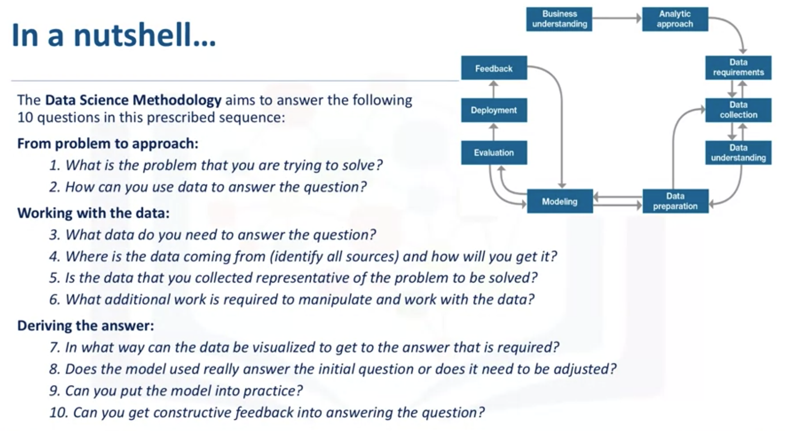
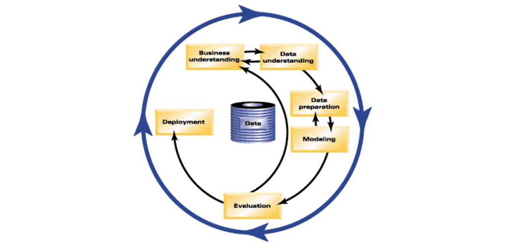

# Data Science Methodology  <!-- omit in toc -->

- [What is CRISP-DM?](#what-is-crisp-dm)
- [From Problem to Approach](#from-problem-to-approach)
  - [Jupyter Notebook](#jupyter-notebook)
- [From Requirements to Collection](#from-requirements-to-collection)
  - [Jupyter Notebook](#jupyter-notebook-1)
- [From Understanding to Preparation](#from-understanding-to-preparation)
  - [Jupyter Notebook](#jupyter-notebook-2)
- [From Modeling to Evaluation](#from-modeling-to-evaluation)
  - [Jupyter Notebook](#jupyter-notebook-3)
- [From Deployment to Feedback](#from-deployment-to-feedback)

 

## What is CRISP-DM?

The CRISP-DM methodology is a process aimed at increasing the use of data mining over a wide variety of business applications and industries. The intent is to take case specific scenarios and general behaviors to make them domain neutral. CRISP-DM is comprised of six steps with an entity that has to implement in order to have a reasonable chance of success. The six steps are shown in the following diagram:

 

1. Business Understanding This stage is the most important because this is where the intention of the project is outlined. Foundational Methodology and CRISP-DM are aligned here. It requires communication and clarity. The difficulty here is that stakeholders have different objectives, biases, and modalities of relating information. They don’t all see the same things or in the same manner. Without clear, concise, and complete perspective of what the project goals are resources will be needlessly expended.
1. Data Understanding Data understanding relies on business understanding. Data is collected at this stage of the process. The understanding of what the business wants and needs will determine what data is collected, from what sources, and by what methods. CRISP-DM combines the stages of Data Requirements, Data Collection, and Data Understanding from the Foundational Methodology outline.
1. Data Preparation Once the data has been collected, it must be transformed into a useable subset unless it is determined that more data is needed. Once a dataset is chosen, it must then be checked for questionable, missing, or ambiguous cases. Data Preparation is common to CRISP-DM and Foundational Methodology.
1. Modeling Once prepared for use, the data must be expressed through whatever appropriate models, give meaningful insights, and hopefully new knowledge. This is the purpose of data mining: to create knowledge information that has meaning and utility. The use of models reveals patterns and structures within the data that provide insight into the features of interest. Models are selected on a portion of the data and adjustments are made if necessary. Model selection is an art and science. Both Foundational Methodology and CRISP-DM are required for the subsequent stage.
1. Evaluation The selected model must be tested. This is usually done by having a pre-selected test, set to run the trained model on. This will allow you to see the effectiveness of the model on a set it sees as new. Results from this are used to determine efficacy of the model and foreshadows its role in the next and final stage.
1. Deployment In the deployment step, the model is used on new data outside of the scope of the dataset and by new stakeholders. The new interactions at this phase might reveal the new variables and needs for the dataset and model. These new challenges could initiate revision of either business needs and actions, or the model and data, or both.

## From Problem to Approach

- Business understanding. What is the problem that you are trying to solve?
- Analytic approach. How can you use data to answer the question?
  - desciptive. 
    - current status
  - diagnostic (statistical analysis). 
    - what happened?
    - why is this happening?
  - predictive (forecasting)
    - what if these trends continue?
    - what will happen next?
  - prescriptive
    - how do we solve it?

If the question is to determine probabilities of an action
- use a predictive model

If the question is to show relationships
- use a descriptive model

If the question requires a yes/no answer
- use a classification model

### [Jupyter Notebook](res/DS0103EN-Exercise-From-Problem-to-Approach.ipynb)

## From Requirements to Collection

- The significance of defining the data requirements for your model.
- Why the content, format, and representation of your data matter.   
- The importance of identifying the correct sources of data for your project.
- How to handle unavailable and redundant data.
- To anticipate the needs of future stages in the process.

### [Jupyter Notebook](res/DS0103EN-Review-From-Requirements-to-Collection.ipynb)

## From Understanding to Preparation

- Descriptive statistics
  - Univarate statistics
  - Pairwise correlations
  - Histogram

Summary

- The importance of descriptive statistics.
- How to manage missing, invalid, or misleading data.
- The need to clean data and sometimes transform it.
- The consequences of bad data for the model.
- Data understanding is iterative; you learn more about your data the more you study it. 

### [Jupyter Notebook](res/DS0103EN-Exercise-From-Understanding-to-Preparation.ipynb)

## From Modeling to Evaluation

[**ROC**](https://developers.google.com/machine-learning/crash-course/classification/roc-and-auc) stands for receiver operating characteristic curve, which was first developed during World War II to detect enemy aircraft on radar. 

The ROC curve is a useful diagnostic tool in determining the optimal classification model. This curve quantifies how well a binary classification model performs, declassifying the yes and no outcomes when some discrimination criterion is varied. In this case, the criterion is a relative misclassification cost. By plotting the true-positive rate against the false-positive rate for different values of the relative misclassification cost, the ROC curve helped in selecting the optimal model.

### [Jupyter Notebook](res/DS0103EN-Exercise-From-Modeling-to-Evaluation.ipynb)

[Introduction to Machine Learning Google Crash Course](https://developers.google.com/machine-learning/crash-course/ml-intro)

- The difference between descriptive and predictive models.
- The role of training sets and test sets.
- The importance of asking if the question has been answered.
- Why diagnostic measures tools are needed.
- The purpose of statistical significance tests.
- That modeling and evaluation are iterative processes.

## From Deployment to Feedback

- The importance of stakeholder input.
- To consider the scale of deployment.
- The importance of incorporating feedback to refine the model.
- The refined model must be redeployed.
- This process should be repeated as often as necessary.

 

    <b><a href="#top">↥ back to top</a></b>

 

