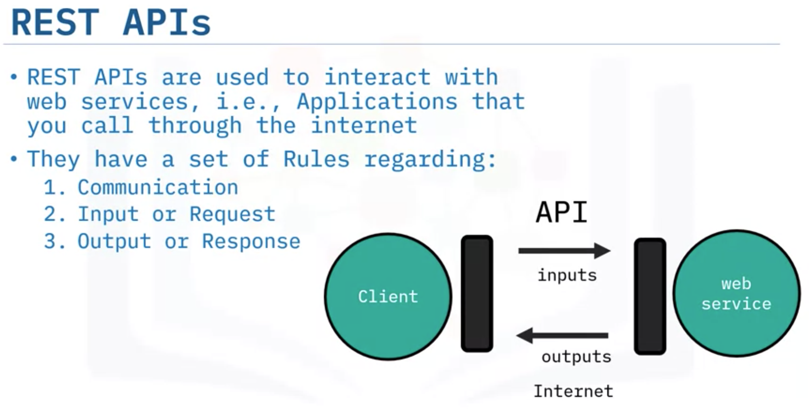

# Python for Data Science, AI & Development  <!-- omit in toc -->

## Working with Data in Python

- Explain how Pandas use data frames.
- Use Pandas for library and data analysis by using commands.
- Read text files using Python libraries including open and with.
- Use NumPy to create one-dimensional and two-dimensional arrays.
- Write and save files in Python.

Pandas
- `loc` vs. `iloc`

## APIs, and Data Collection

- Explain the use of the HTTP protocol using the Requests Library method.
- Describe how the URL Request Response HTTP protocol works.
- Learn to apply simple, open-source APIs.
- Perform basic webscraping using Python.
- Work with different file formats using Python.
- Explain the difference between APIs and REST APIs.
- Summarize how APIs receive and send information.

 

- HTTP methods are a way of transmitting data over the internet We tell the Rest API’s what to do by sending a request. The request is usually communicated via an HTTP message. 
- The HTTP message usually contains a JSON file. This contains instructions for what operation we would like the service to perform. 
- This operation is transmitted to the webservice via the internet. The service performs the operation. In the similar manner, the webservice returns a response via an HTTP message, where the information is usually returned via a JSON file. This information is transmitted back to the client.

[Python Cheat Sheet - Basics](res/Python%20Cheat%20Sheet%20-%20The%20Basics%20Coursera.pdf)

