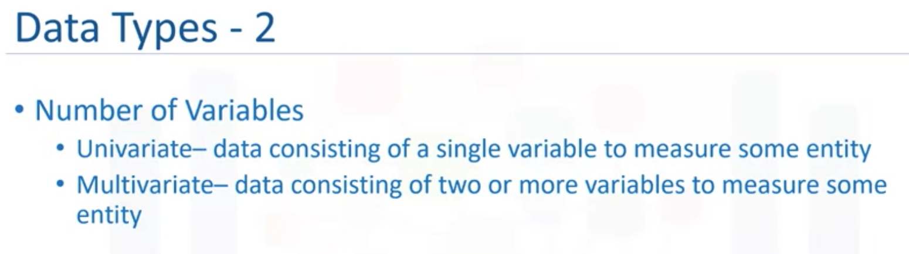
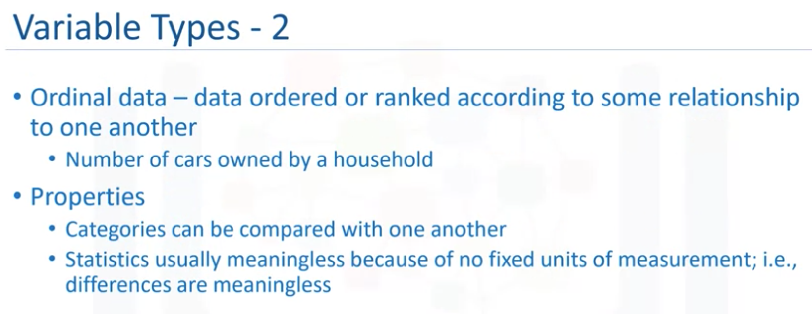
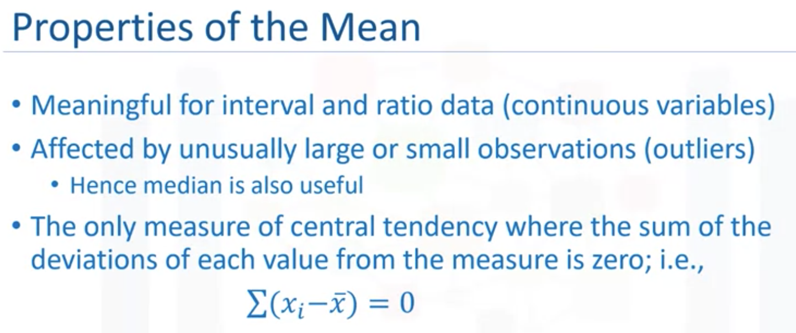
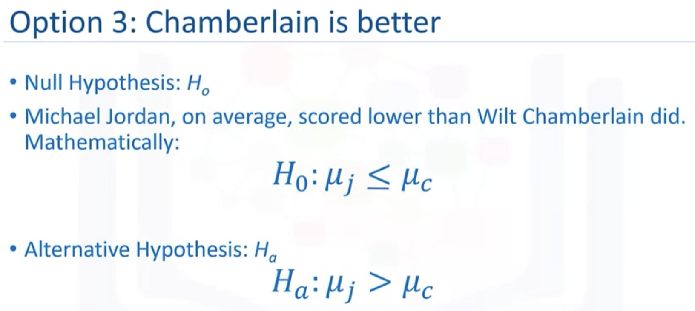
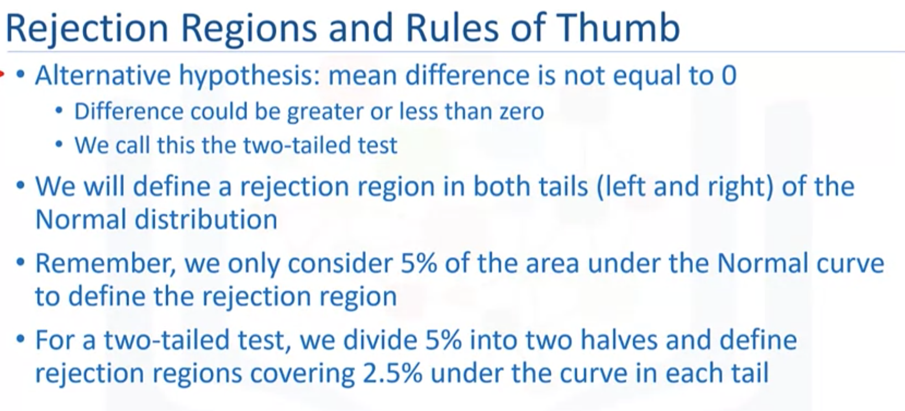
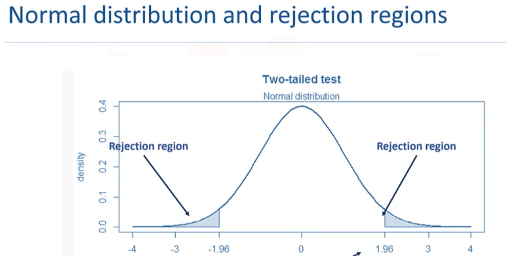
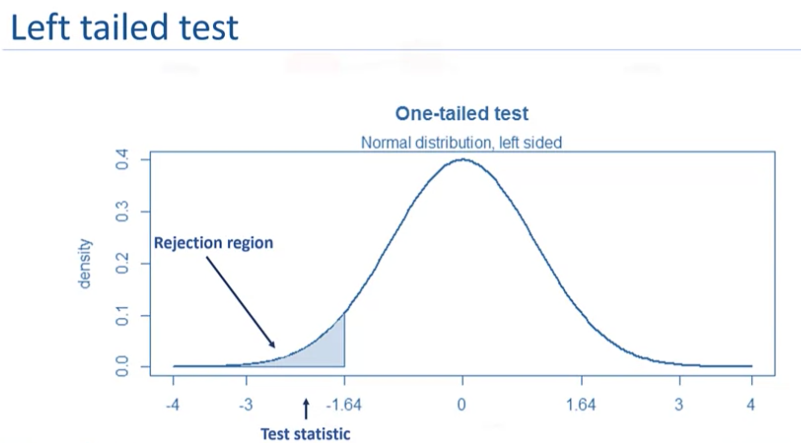
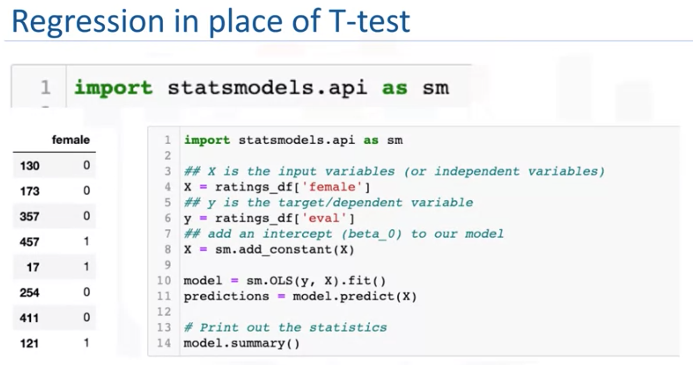
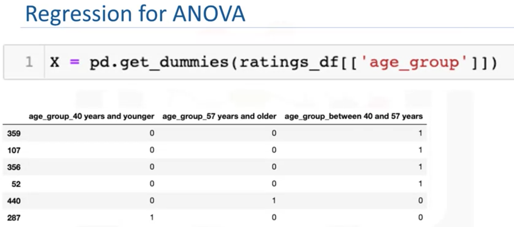
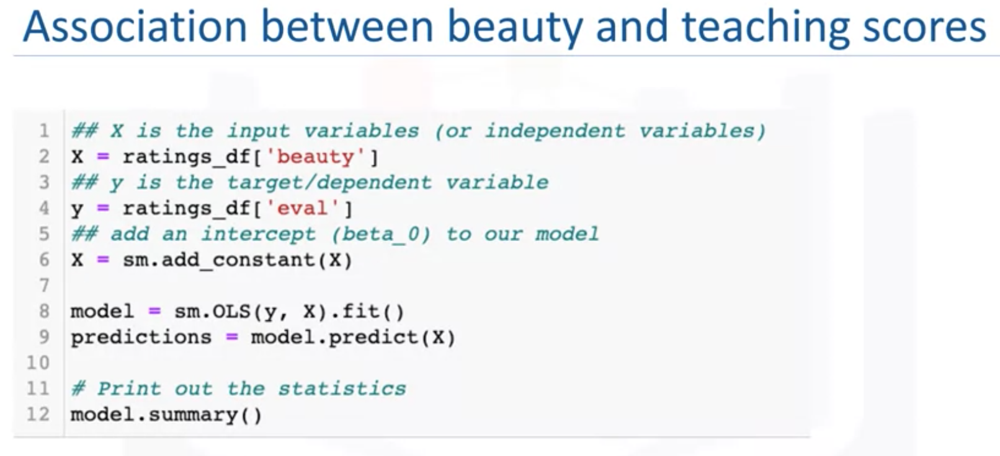

# Statistics for Data Science with Python  <!-- omit in toc -->

This course is one of courses in the [Data Science Fundamentals with Python and SQL Specialization](https://www.coursera.org/specializations/data-science-fundamentals-python-sql), which is useful for data analysis but not included in this Data Science Professional Certificate.

- [Introduction and Descriptive Statistics](#introduction-and-descriptive-statistics)
  - [Types of Data](#types-of-data)
  - [Measure of Central Tendency](#measure-of-central-tendency)
  - [Measure of Dispersion](#measure-of-dispersion)
    - [Reliability](#reliability)
  - [Jupyter Notebook: Descriptive Statistics](#jupyter-notebook-descriptive-statistics)
- [Data Visualization](#data-visualization)
  - [Jupyter Notebook: Visualizing Data](#jupyter-notebook-visualizing-data)
- [Introduction to Probability Distribution](#introduction-to-probability-distribution)
  - [Hypothesis Test](#hypothesis-test)
  - [Jupyter Notebook: T Test](#jupyter-notebook-t-test)
  - [Z test or T test](#z-test-or-t-test)
  - [Levene's Test](#levenes-test)
  - [ANOVA](#anova)
  - [Correlation Test](#correlation-test)
  - [Jupyter Notebook: Hypothesis Testing](#jupyter-notebook-hypothesis-testing)
- [Regression Analysis](#regression-analysis)
  - [Regression in place of t-test](#regression-in-place-of-t-test)
  - [Regression in place of ANOVA](#regression-in-place-of-anova)
  - [Regression in place of Correlation](#regression-in-place-of-correlation)
  - [Jupyter Notebook: Regression Analysis](#jupyter-notebook-regression-analysis)
- [Cheat Sheet for Statistical Analysis in Python](#cheat-sheet-for-statistical-analysis-in-python)
  - [Descriptive Statistics](#descriptive-statistics)
  - [Data Visualization](#data-visualization-1)
  - [Hypothesis Testing](#hypothesis-testing)
  - [Jupyter Notebook: Final Project](#jupyter-notebook-final-project)

## Introduction and Descriptive Statistics


 

### Types of Data

 

 

 

 


 


 

### Measure of Central Tendency

```python
# get information about each variable
df.info()
```

 


 

 

 

```python
df.describe()
```

### Measure of Dispersion

 

**Dispersion**, which is also called variability, scatter or spread, is the extent to which the data distribution is stretched or squeezed. The common measures of dispersion are **standard deviation** and **variance**.

 

#### Reliability

- Average paints a partial picture
- Average statistics are incomplete without standard deviation/variance
- Risk metrics are all about variance

### [Jupyter Notebook: Descriptive Statistics](res/Descriptive_Stats.ipynb)

<br/>
<div align="right">
    <b><a href="#top">↥ back to top</a></b>
</div>
<br/>


## Data Visualization

[The Extreme Presentation Method](https://extremepresentation.com/):
- The step-by-step approach for designing presentations of complex or controversial information in ways that drive people to action.


 

- `seaborn`
- `matplotlib`

### [Jupyter Notebook: Visualizing Data](res/Visualizing_Data.ipynb)


<br/>
<div align="right">
    <b><a href="#top">↥ back to top</a></b>
</div>
<br/>


## Introduction to Probability Distribution


 

### Hypothesis Test

 

 

 

 

 

 

To use both the **p-value** and significance level together,  you have to decide on a value for **alpha** after you state your hypothesis.  Suppose that is alpha = 0.10 (or 10%).  You then collect the data and calculate the p-value.  
- If the p-value is greater than alpha, you assume that the null hypothesis is true and you fail to reject.  
- If the p-value is less than alpha, you assume that the null hypothesis is false and you reject it. 
- In cases when the p-value and the significance levels are approximately equal e.g. a p-value of 0.11, it is your call to decide to reject or fail to reject or you could decide to resample and collect more data.

**Normal Distribution:**

```python
import numpy as np
import matplotlib.pyplot as plt
from scipy.stats import norm

x_axis = np.arange(-4, 4, 0.1)
plt.plot(x_axis, norm.pdf(x_axis,0,1))
plt.show()
```

 


### [Jupyter Notebook: T Test](res/Introduction_to_probability_distribution.ipynb)


### Z test or T test
- If the population's standard deviation is known, use z test
- Otherwise, use T-test

Comparing means - 4 cases:
- Use Z test: Comparing sample mean to a population mean when the population standard deviation is known
- Use **T test**: Comparing sample mean to a population mean when the population standard deviation is not known
- Always use **T test**: Comparing the means of two independent samples with unequal variances
- Always use **T test**: Comparing the means of two independent samples with equal variances

| Type of Test | `z` or `t` Statistics* | Expected p-value | Decision |
| :---: | :---: | :---: | :---: | 
| Two-tailed test | The absolute value of the calculated `z` or `t` statistics is greater than 1.96 | Less than 0.05 | Reject the null hypothesis |
| One-tailed test | The absolute value of the calculated `z` or `t` statistics is greater than 1.64 | Less than 0.05 | Reject the null hypothesis |

\* in large samples this rule of thumb holds true for the `t-test` because in large sample sizes, the t-distribution is approximate to a normal distribution

 

 

 

 

### Levene's Test

[Levene's test](https://www.statisticshowto.com/levene-test/) is used to check that variances are equal for all samples when your data comes from a non normal distribution. You can use Levene's test to check the assumption of equal variances before running a test like One-Way ANOVA.

 

 

### ANOVA

ANOVA - Comparing means of more than two groups

[Analysis of variance (ANOVA)](https://en.wikipedia.org/wiki/Analysis_of_variance) is a collection of statistical models and their associated estimation procedures (such as the "variation" among and between groups) used to analyze the differences among means.

 

### Correlation Test

Correlation test is used to evaluate the association between two or more variables. For instance, if we are interested to know whether there is a relationship between the heights of fathers and sons, a correlation coefficient can be calculated to answer this question.

 

See also: 
- [How To Do Cross Tabulation Analysis](https://www.youtube.com/watch?v=BAcG2TE5tmU)
- [Contingency table](https://en.wikipedia.org/wiki/Contingency_table)
- [Pivot table](https://en.wikipedia.org/wiki/Pivot_table)


### [Jupyter Notebook: Hypothesis Testing](res/Hypothesis_Testing.ipynb)


<br/>
<div align="right">
    <b><a href="#top">↥ back to top</a></b>
</div>
<br/>


## Regression Analysis

Linear regression is a linear relationship between the response variable and predictor variables. It can be used to predict the value of a continuous variable, based on the value of another continuous variable. The t-test statistic helps to determine the correlation between the response and the predictor variables. A one-sample t-test will be used in linear regression to test the null hypothesis that the slope or the coefficient is equal to zero. In the case of the multiple regression model, the null hypothesis is that the coefficient of each of the predictor variables is equal to zero.

### Regression in place of t-test

 

 

### Regression in place of ANOVA

 

 

### Regression in place of Correlation

 


### [Jupyter Notebook: Regression Analysis](res/Regression_Analysis.ipynb)

<br/>
<div align="right">
    <b><a href="#top">↥ back to top</a></b>
</div>
<br/>


## Cheat Sheet for Statistical Analysis in Python

### Descriptive Statistics

Here is a quick review of some popular functions:

- To find the average of the data, we use the `mean()` function
- To find the median of the data, we use the `median()` function
- To find the mode of the data, we use the `mode()` function
- To find the variance of the data, we use the `variance()` function
- To find the standard deviation of the data, we use the `stdev()` function
- To get the unique values in a dataset, we use the `unique()`. `unique()` prints out the values and `nunique()` prints out the number of unique values.

### Data Visualization

One of the most popular visualization tools is the `seaborn` library. It is a Python Data visualization library that is based on `matplotlib`. You can learn more [here](https://seaborn.pydata.org/). To get access to functions in the seaborn library or any library, you must first import the library. To import the seaborn library: import seaborn.

Here is a quick summary for creating graphs and plots:

- Barplots: A barplot shows the relationship between a numeric and a categorical variable by plotting the categorical variables as bars in correspondence to the numerical variable. In the seaborn library, barplots are created by using the `barplot()` function. The following code `ax = seaborn.barplot(x="division", y="eval", data=division_eval)` will return a barplot that shows the average evaluation scores for the lower-division and upper-division.
  
   

- Scatterplots: This is a two-dimensional plot that displays the relationship between two continuous data. Scatter plots are created by using the `scatterplot()` function in the seaborn library. The following code: `ax = seaborn.scatterplot(x='age', y='eval', hue='gender', data=ratings_df)` will return a plot that shows the relationship between age and evaluation scores:
  
   

- Boxplots: A boxplot is a way of displaying the distribution of the data. It returns the minimum, first quartile, median, third quartile, and maximum values of the data. We use the `boxplot()` function in the seaborn library. This code `ax = seaborn.boxplot(y='beauty', data=ratings_df)` will return a boxplot with the data distribution for beauty. We can make the boxplots horizontal by specifying `x='beauty'` in the argument.
  
   

- Other useful functions include `catplot()` to represent the relationship between a numerical value and one or more categorical variables, `distplot()`, and `histplot()` for plotting histograms.


### Hypothesis Testing

- Use the `norm.cdf()` function in the `scipy.stats` library to find the standardized (z-score) value. In cases where we are looking for the area to the right of the curve, we will remove the results above from 1. Remember to `import scipy.stats`
- Levene's test for equal variance: Levene's test is a test used to check for equality of variance among groups. We use the `scipy.stats.levene()` from the `scipy.stats` library.
- T-test for two independent samples: This test compares the means of two independent groups to determine whether there is a significant difference in means for both groups. We use the `scipy.stats.ttest_ind()` from the `scipy.stats` library.
- One-way ANOVA: It compares the mean between two or more independent groups to determine whether there is a statistical significance between them. We use the `scipy.stats.f_oneway()` from the `scipy.stats` library or you can use the `anova_lm()` from the `statsmodels` library.
- Chi-square (𝜒2) test for association: Chi-square test for association tests the association between two categorical variables. To do this we must first create a crosstab of the counts in each group. We do this by using the `crosstab()` function in the `pandas` library. Then the `scipy.stats.chi2_contingency()` on the contingency table - it returns the 𝜒2 value, p-value, degree of freedom and expected values.
- Pearson Correlation: Tests the correlation between two continuous variables. we use the `scipy.stats.pearsonr()` to get the correlation coefficient
- To run the tests using Regression analysis, you will need the `OLS()` from the `statsmodels` library. When running these tests using regression analysis, you have `fit()` the model, make predictions using `predict()` and print out the model summary using `model.summary()`.


### [Jupyter Notebook: Final Project](res/Coursera_DataScience_Stat_Project.ipynb)

<br/>
<div align="right">
    <b><a href="#top">↥ back to top</a></b>
</div>
<br/>

