# Databases and SQL for Data Science with Python <!-- omit in toc -->

- [Basic SQL](#basic-sql)
- [Relational Database](#relational-database)
- [Refine your results](#refine-your-results)
- [Functions, Multiple Tables, and Sub-queries](#functions-multiple-tables-and-sub-queries)
  - [Built-in Database Functions](#built-in-database-functions)
    - [Aggregate or Column Functions](#aggregate-or-column-functions)
    - [Scalar and string functions](#scalar-and-string-functions)
    - [Date and time built-in functions](#date-and-time-built-in-functions)
  - [Sub-Queries and Nested Selects](#sub-queries-and-nested-selects)
  - [Multiple Tables](#multiple-tables)
- [Accessing databases using Python](#accessing-databases-using-python)
  - [Jupyter Notebook: Creating tables, inserting and querying Data](#jupyter-notebook-creating-tables-inserting-and-querying-data)
  - [Jupyter Notebook: Accessing Databases with SQL magic](#jupyter-notebook-accessing-databases-with-sql-magic)
  - [Jupyter Notebook: Analyzing a real world data-set with SQL and Python](#jupyter-notebook-analyzing-a-real-world-data-set-with-sql-and-python)
- [Working with real-world datasets and getting table and column details](#working-with-real-world-datasets-and-getting-table-and-column-details)
  - [Jupyter Notebook: Chicago Public Schools - Progress Report Cards](#jupyter-notebook-chicago-public-schools---progress-report-cards)
- [Views](#views)
- [Stored Procedures](#stored-procedures)
- [ACID](#acid)
- [JOIN statements](#join-statements)
- [Reference Links](#reference-links)
## Basic SQL

What is SQL?
- A language used for relational database
- Query data

What is data?
- Facts (words, numbers)
- Pictures
- One of the most critical assets of any business

What is a database?
- A repository of data
- Provides the functionality for adding, modifying and querying that data
- Different kinds of databases store data in different forms

Relational Database
- Data stored in tabular form - columns and rows
- Columns contain item properties e.g. Last Name, First Name, etc.
- Table is collection of related things e.g. Employees, Authors, etc.
- Relationships can exist between tables (hence: "relational")

DBMS
- Database: repository of data
- DBMS: Database Management System - software to manage databases
- Database, Database Server, Database System, Data Server, DBMS - often used interchangeably

RDBMS
- RDBMS - Relational database management system
- A set of software tools that controls the data
  - access, organization, and storage
- Examples are: MySQL, Oracle Database, IBM Db2, etc.

Basic SQL Commands
- Create a table
- Insert
- Select
- Update
- Delete


## Relational Database

Relational Model
- Most used data model
- Allows for data independence
  - logical data independence
  - physical data independence
  - physical storage independence
- Data is stored in tables

Entity-Relationship Model
- Used as a tool to design relational databases
  
Mapping Entity Diagrams to Tables
- Entities become tables
- Attributes get translated into columns


 

Examples of Cloud databases
- IBM Db2
- Databases for PostgreSQL
- Oracle Database Cloud Service
- Microsoft Azure SQL Database
- Amazon Relational Database Services (RDS)

Available as:
- VMs or Managed Service
- Single or Multi-tenant

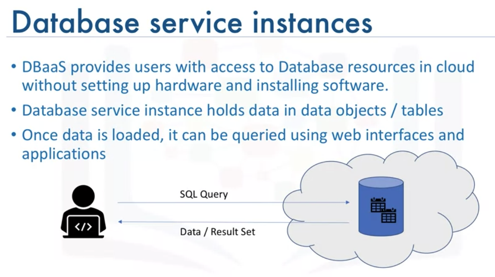 


SQL Statement types
- DDL (Data Definition Language) statements:
  - define, change, or drop data
  - common DDL:
    - create
    - alter
    - truncate
    - drop
- DML (Data Manipulation Language) statements:
  - read and modify data
  - CRUD operations (Create, Read, Update & Delete rows)
  - common DML:
    - insert
    - select
    - update
    - delete

<br/>
<div align="right">
    <b><a href="#top">↥ back to top</a></b>
</div>
<br/>

## Refine your results

- `distinct` clause
- `group by` clause
- `having` clause

```sql
--Query 1.1--

SELECT F_NAME , L_NAME
FROM EMPLOYEES
WHERE ADDRESS LIKE '%Elgin,IL%';

--Query 1.2--

SELECT F_NAME , L_NAME
FROM EMPLOYEES
WHERE B_DATE LIKE '197%';

--Query 1.3--

SELECT *
FROM EMPLOYEES
WHERE (SALARY BETWEEN 60000 AND 70000) AND DEP_ID = 5;

--Query 2.1--

SELECT F_NAME, L_NAME, DEP_ID 
FROM EMPLOYEES
ORDER BY DEP_ID;

--Query 2.2--

SELECT F_NAME, L_NAME, DEP_ID 
FROM EMPLOYEES
ORDER BY DEP_ID DESC, L_NAME DESC;

--Optional Query 2.3--

SELECT D.DEP_NAME , E.F_NAME, E.L_NAME
FROM EMPLOYEES as E, DEPARTMENTS as D
WHERE E.DEP_ID = D.DEPT_ID_DEP
ORDER BY D.DEP_NAME, E.L_NAME DESC;

--Query 3.1--

SELECT DEP_ID, COUNT(*)
FROM EMPLOYEES
GROUP BY DEP_ID;

--Query 3.2--

SELECT DEP_ID, COUNT(*), AVG(SALARY)
FROM EMPLOYEES
GROUP BY DEP_ID;

--Query 3.3--

SELECT DEP_ID, COUNT(*) AS "NUM_EMPLOYEES", AVG(SALARY) AS "AVG_SALARY"
FROM EMPLOYEES
GROUP BY DEP_ID;

--Query 3.4--

SELECT DEP_ID, COUNT(*) AS "NUM_EMPLOYEES", AVG(SALARY) AS "AVG_SALARY"
FROM EMPLOYEES
GROUP BY DEP_ID
ORDER BY AVG_SALARY;

--Query 3.5--

SELECT DEP_ID, COUNT(*) AS "NUM_EMPLOYEES", AVG(SALARY) AS "AVG_SALARY"
FROM EMPLOYEES
GROUP BY DEP_ID
HAVING count(*) < 4
ORDER BY AVG_SALARY;

```

<br/>
<div align="right">
    <b><a href="#top">↥ back to top</a></b>
</div>
<br/>

## Functions, Multiple Tables, and Sub-queries

### Built-in Database Functions

Built-in Functions
- Most databases come with built-in SQL functions
- Built-in functions can be included as part of SQL statements
- Database functions can significantly reduce the amount of data that needs to be retrieved
- Can speed up data processing

#### Aggregate or Column Functions

- input: Collection of values (e.g. entire column)
- output: Single value
- Examples:
  - SUM()
  - MIN()
  - MAX()
  - AVG()

#### Scalar and string functions

- scalar: perform operations on every input value
- examples:
  - ROUND()
  - LENGTH()
  - UCASE()
  - LCASE()

```sql
select DISTINCT(UCASE(ANIMAL)) FROM PETRESCUE
```

#### Date and time built-in functions

```sql
--Query C1: Enter a function that displays the day of the month when cats have been rescued.
select DAY(RESCUEDATE) from PETRESCUE where ANIMAL = 'Cat';

--Query C2: Enter a function that displays the number of rescues on the 5th month.
select SUM(QUANTITY) from PETRESCUE where MONTH(RESCUEDATE)='05';

--Query C3: Enter a function that displays the number of rescues on the 14th day of the month.
select SUM(QUANTITY) from PETRESCUE where DAY(RESCUEDATE)='14';

--Query C4: Animals rescued should see the vet within three days of arrivals. 
--Enter a function that displays the third day from each rescue.
select (RESCUEDATE + 3 DAYS) from PETRESCUE;

--Query C5: Enter a function that displays the length of time the animals have been rescued; 
--the difference between today’s date and the recue date.
select (CURRENT DATE - RESCUEDATE) from PETRESCUE;
```

### Sub-Queries and Nested Selects


- how sub-queries and nested queries can be used to form richer queries
- how they can overcome some of the limitations of aggregate functions
- use sub-queries in 
  - `WHERE` clause
  - list of `columns`
  - `FROM` clause


One of the limitations of built in aggregate functions, like the average function, is that they cannot always be evaluated in the WHERE clause.
```sql
Select * from employees, where salary > AVG(salary)
```

should use **sub-select** expression:

```sql
Select EMP_ID, F_NAME, L_NAME, SALARY from employees where SALARY < ( select AVG (SALARY) from employees)
```

Use the average function in a sub-query placed in the list of the columns:

```sql
select EMP_ID, SALARY, (select AVG(SALARY) from employees ) AS AVG_SALARY from employees
```

Make the sub-query be part of the FROM clause:

```sql
Select * from (select EMP_ID, F_NAME, L_NAME, DEP_ID from employees) AS EMP4ALL
```


### Multiple Tables

Accessing Multiple Tables with Sub-Queries

```sql
--- Query 1A ---
select * from employees where JOB_ID IN (select JOB_IDENT from jobs)
;	
--- Query 1B ---	
select * from employees where JOB_ID IN (select JOB_IDENT from jobs where JOB_TITLE= 'Jr. Designer')
;
--- Query 1C ---
select JOB_TITLE, MIN_SALARY,MAX_SALARY,JOB_IDENT from jobs where JOB_IDENT IN (select JOB_ID from employees where SALARY > 70000 )
;	
--- Query 1D ---
select JOB_TITLE, MIN_SALARY,MAX_SALARY,JOB_IDENT from jobs where JOB_IDENT IN (select JOB_ID from employees where YEAR(B_DATE)>1976 )
;
--- Query 1E ---
select JOB_TITLE, MIN_SALARY,MAX_SALARY,JOB_IDENT from jobs where JOB_IDENT IN (select JOB_ID from employees where YEAR(B_DATE)>1976 and SEX='F' )
;
```

Accessing Multiple Tables with Implicit Joins

```sql
--- Query 2A ---
select * from employees, jobs
;
--- Query 2B ---
select * from employees, jobs where employees.JOB_ID = jobs.JOB_IDENT
;
--- Query 2C ---
select * from employees E, jobs J where E.JOB_ID = J.JOB_IDENT
;
--- Query 2D ---
select EMP_ID,F_NAME,L_NAME, JOB_TITLE from employees E, jobs J where E.JOB_ID = J.JOB_IDENT
;
--- Query 2E ---
select E.EMP_ID,E.F_NAME,E.L_NAME, J.JOB_TITLE from employees E, jobs J where E.JOB_ID = J.JOB_IDENT
;
```

<br/>
<div align="right">
    <b><a href="#top">↥ back to top</a></b>
</div>
<br/>

## Accessing databases using Python


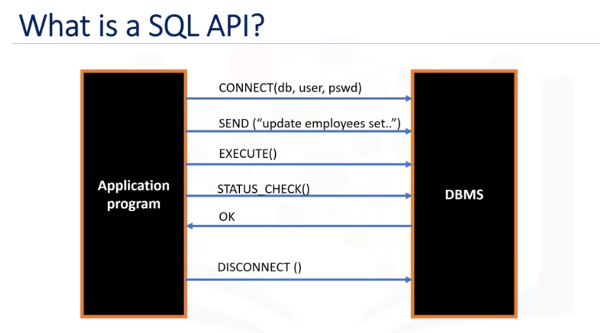 


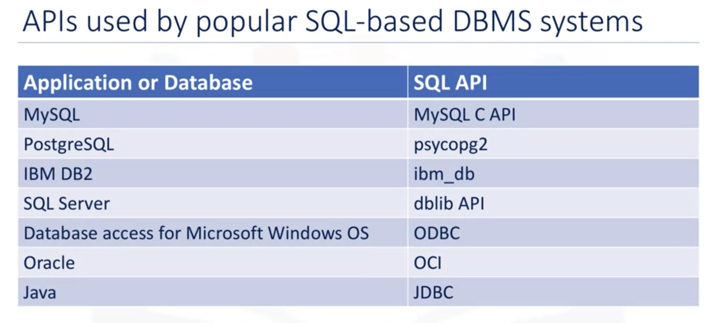 

Concepts of the Python DB API

- Connection Objects
  - Database connections
  - Manage transactions
- Cursor Objects
  - Database Queries
  - Scroll through result set
  - Retrieve results

connect methods:
- `.cursor()`
- `.commit()`
- `.rollback()`
- `.close()`

cursor methods:
- `.callproc()`
- `.execute()`
- `.executemany()`
- `.fetchone()`
- `.fetchmany()`
- `.fetchall()`
- `.nextset()`
- `.arraysize()`
- `.close()`


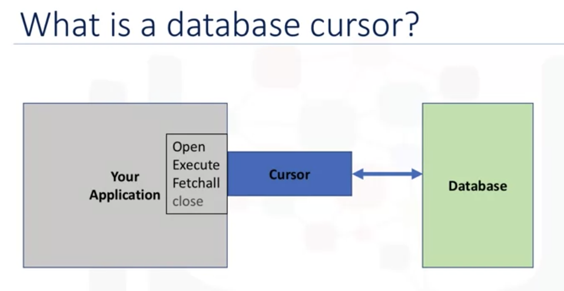 


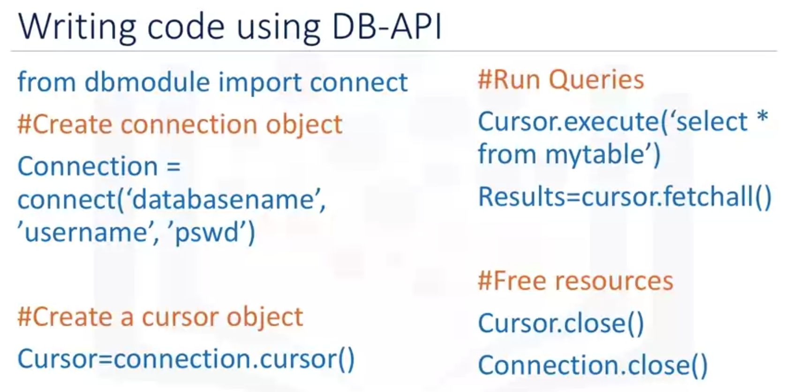 


### [Jupyter Notebook: Creating tables, inserting and querying Data](res/DB0201EN-Week3-1-2-Querying-v4-py.ipynb)

### [Jupyter Notebook: Accessing Databases with SQL magic](res/DB0201EN-Week3-1-3-SQLmagic-v3-py.ipynb)

### [Jupyter Notebook: Analyzing a real world data-set with SQL and Python](res/DB0201EN-Week3-1-4-Analyzing-v5-py.ipynb)

<br/>
<div align="right">
    <b><a href="#top">↥ back to top</a></b>
</div>
<br/>


## Working with real-world datasets and getting table and column details

```sql
%sql select TABSCHEMA, TABNAME, CREATE_TIME from SYSCAT.TABLES where TABSCHEMA='YOUR-DB2-USERNAME'

--or, you can retrieve list of all tables where the schema name is not one of the system created ones:

%sql select TABSCHEMA, TABNAME, CREATE_TIME from SYSCAT.TABLES \
      where TABSCHEMA not in ('SYSIBM', 'SYSCAT', 'SYSSTAT', 'SYSIBMADM', 'SYSTOOLS', 'SYSPUBLIC')
      
--or, just query for a specifc table that you want to verify exists in the database
%sql select * from SYSCAT.TABLES where TABNAME = 'SCHOOLS'
```

Working with a real world data-set using SQL and Python

### [Jupyter Notebook: Chicago Public Schools - Progress Report Cards](res/DB0201EN-Week4-1-1-RealDataPractice-v5.ipynb)

<br/>
<div align="right">
    <b><a href="#top">↥ back to top</a></b>
</div>
<br/>


## Views

Syntax of a `CREATE VIEW` statement:
```sql
CREATE VIEW view_name AS
SELECT column1, column2, ...
FROM table_name
WHERE condition;
```

Syntax of a `REPLACE VIEW` statement:
```sql
CREATE OR REPLACE VIEW view_name AS
SELECT column1, column2, ...
FROM table_name
WHERE condition;
```

Syntax of a `DROP VIEW` statement:
```sql
DROP VIEW view_name;
```

<br/>
<div align="right">
    <b><a href="#top">↥ back to top</a></b>
</div>
<br/>


## Stored Procedures

```sql
--#SET TERMINATOR @
CREATE PROCEDURE RETRIEVE_ALL       -- Name of this stored procedure routine

LANGUAGE SQL                        -- Language used in this routine 
READS SQL DATA                      -- This routine will only read data from the table

DYNAMIC RESULT SETS 1               -- Maximum possible number of result-sets to be returned to the caller query

BEGIN 

    DECLARE C1 CURSOR               -- CURSOR C1 will handle the result-set by retrieving records row by row from the table
    WITH RETURN FOR                 -- This routine will return retrieved records as a result-set to the caller query
    
    SELECT * FROM PETSALE;          -- Query to retrieve all the records from the table
    
    OPEN C1;                        -- Keeping the CURSOR C1 open so that result-set can be returned to the caller query

END
@                                   -- Routine termination character
```

```sql
--#SET TERMINATOR @
CREATE PROCEDURE UPDATE_SALEPRICE ( 
    IN Animal_ID INTEGER, IN Animal_Health VARCHAR(5) )     -- ( { IN/OUT type } { parameter-name } { data-type }, ... )

LANGUAGE SQL                                                -- Language used in this routine
MODIFIES SQL DATA                                           -- This routine will only write/modify data in the table

BEGIN 

    IF Animal_Health = 'BAD' THEN                           -- Start of conditional statement
        UPDATE PETSALE
        SET SALEPRICE = SALEPRICE - (SALEPRICE * 0.25)
        WHERE ID = Animal_ID;
    
    ELSEIF Animal_Health = 'WORSE' THEN
        UPDATE PETSALE
        SET SALEPRICE = SALEPRICE - (SALEPRICE * 0.5)
        WHERE ID = Animal_ID;
        
    ELSE
        UPDATE PETSALE
        SET SALEPRICE = SALEPRICE
        WHERE ID = Animal_ID;

    END IF;                                                 -- End of conditional statement
    
END
@                                                           -- Routine termination character
```

```sql
CALL RETRIEVE_ALL;

CALL UPDATE_SALEPRICE(1, 'BAD');        -- Caller query

CALL RETRIEVE_ALL;
```

<br/>
<div align="right">
    <b><a href="#top">↥ back to top</a></b>
</div>
<br/>


## ACID


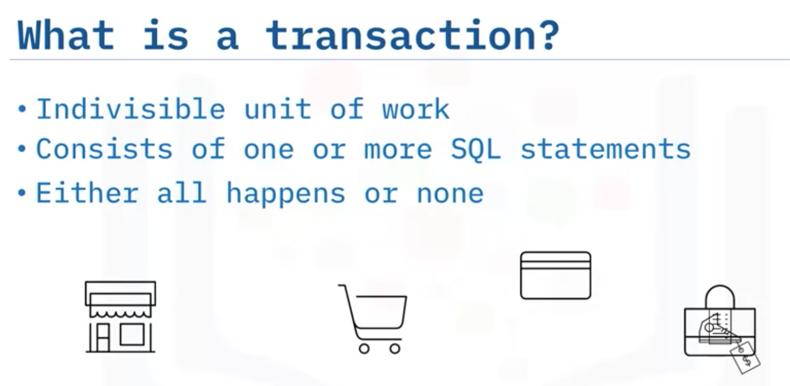 

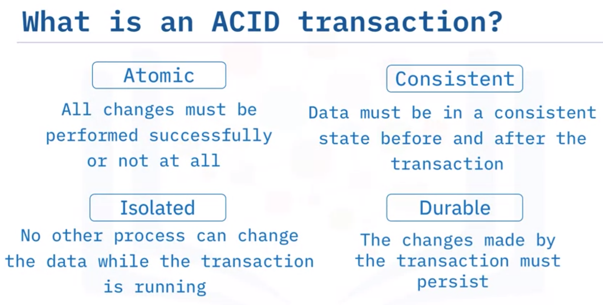 

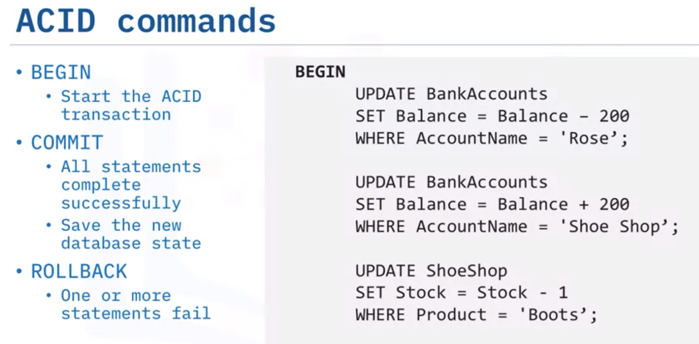 

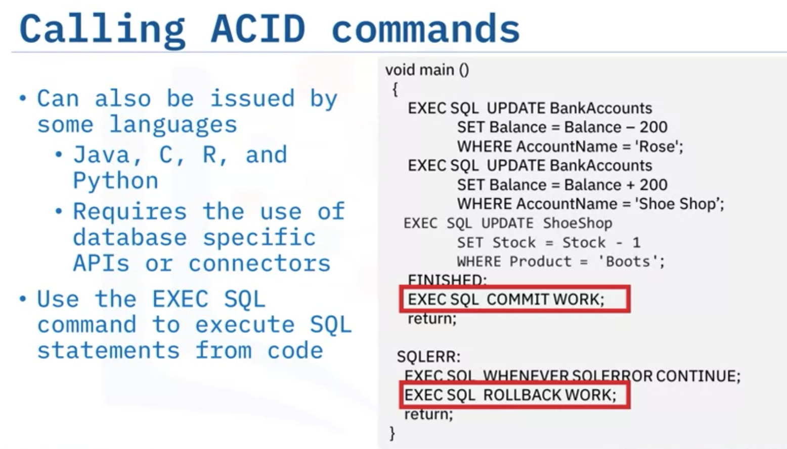 

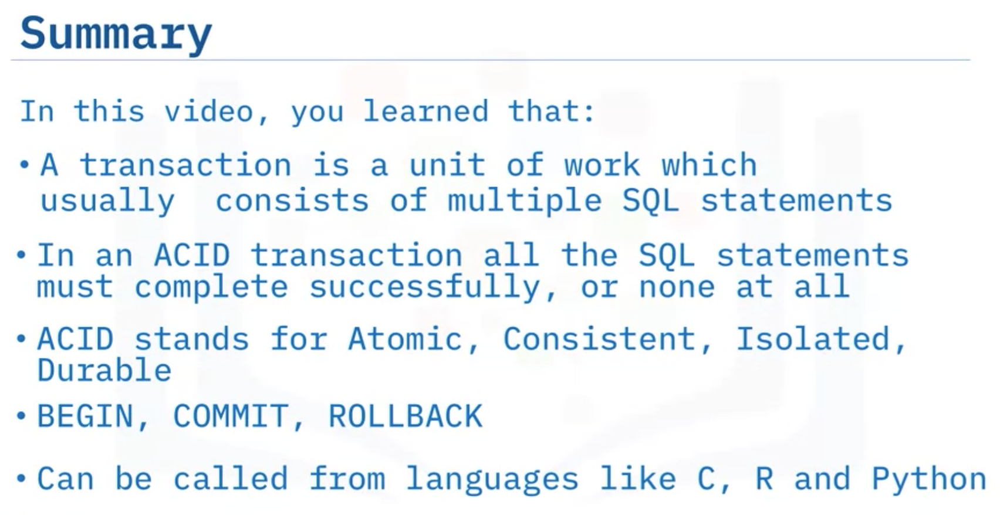 

```sql
--#SET TERMINATOR @
CREATE PROCEDURE TRANSACTION_ROSE                           -- Name of this stored procedure routine

LANGUAGE SQL                                                -- Language used in this routine 
MODIFIES SQL DATA                                           -- This routine will only write/modify data in the table

BEGIN

        DECLARE SQLCODE INTEGER DEFAULT 0;                  -- Host variable SQLCODE declared and assigned 0
        DECLARE retcode INTEGER DEFAULT 0;                  -- Local variable retcode with declared and assigned 0
        DECLARE CONTINUE HANDLER FOR SQLEXCEPTION           -- Handler tell the routine what to do when an error or warning occurs
        SET retcode = SQLCODE;                              -- Value of SQLCODE assigned to local variable retcode
        
        UPDATE BankAccounts
        SET Balance = Balance-200
        WHERE AccountName = 'Rose';
        
        UPDATE BankAccounts
        SET Balance = Balance+200
        WHERE AccountName = 'Shoe Shop';
        
        UPDATE ShoeShop
        SET Stock = Stock-1
        WHERE Product = 'Boots';
        
        UPDATE BankAccounts
        SET Balance = Balance-300
        WHERE AccountName = 'Rose';

        
        IF retcode < 0 THEN                                  --  SQLCODE returns negative value for error, zero for success, positive value for warning
            ROLLBACK WORK;
        
        ELSE
            COMMIT WORK;
        
        END IF;
        
END
@  
```

```sql
CALL TRANSACTION_ROSE;  -- Caller query

SELECT * FROM BankAccounts;

SELECT * FROM ShoeShop;
```

<br/>
<div align="right">
    <b><a href="#top">↥ back to top</a></b>
</div>
<br/>


## JOIN statements

- **inner join**, which displays only the rows from two tables that have matching value in a common column, usually the primary key of one table that exists as a foreign key in the second table.
  ```sql
  SELECT * FROM table1
      JOIN table2
      ON relation;
  ```
  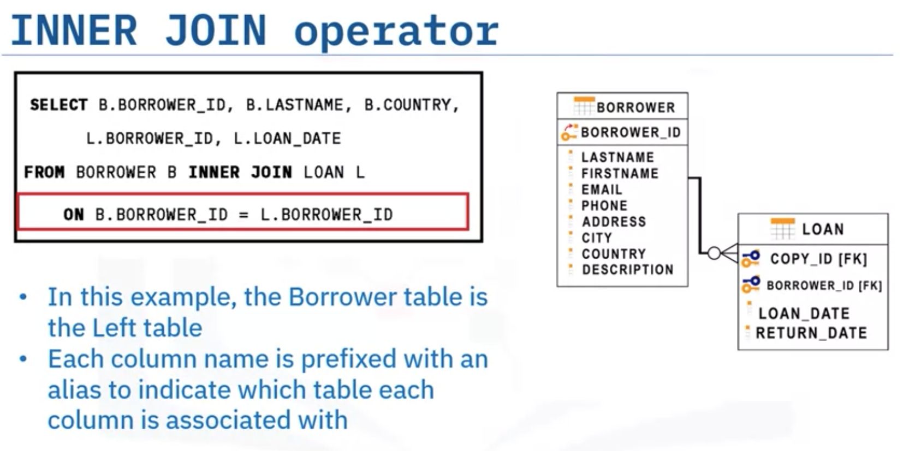 
  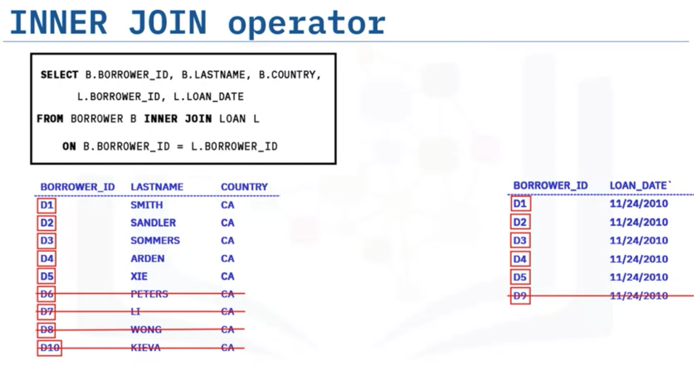 
- **outer joins**, which return matching rows, and even the rows from one or the other table that don’t match. 
  - left join
    ```sql
    SELECT columns
    FROM table1
    LEFT JOIN table2
    ON relation;
    ```
    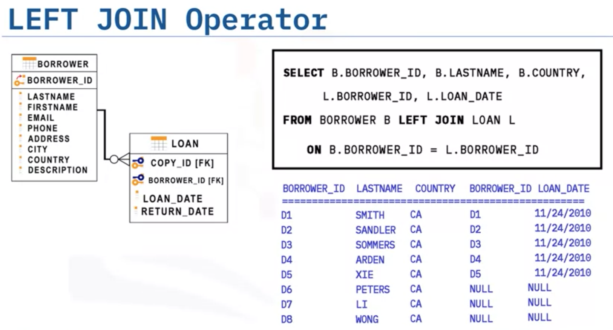 
  - right join
    ```sql
    SELECT columns
    FROM table1
    RIGHT JOIN table2
    ON relation;
    ```
    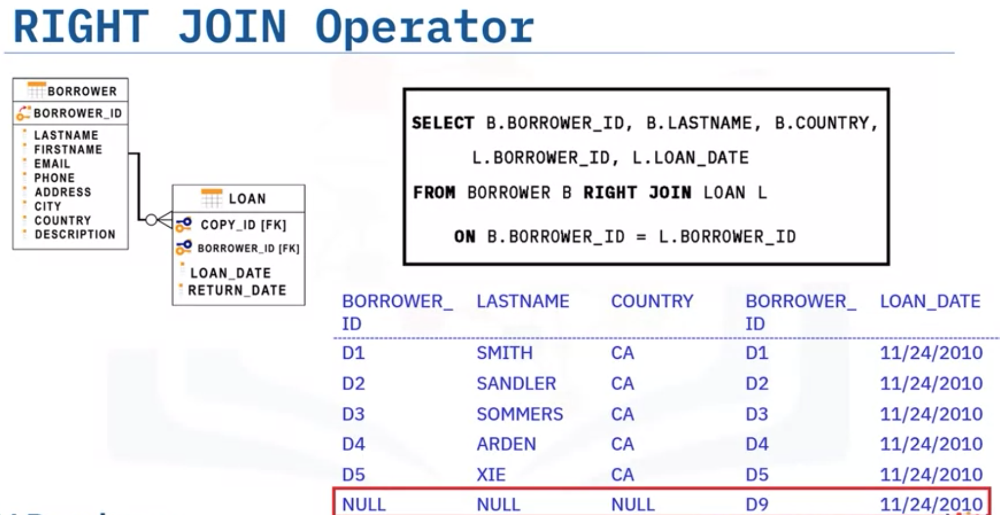 
  - full join
    ```sql
    SELECT columns
    FROM table1
    FULL JOIN table2
    ON relation;
    ```
    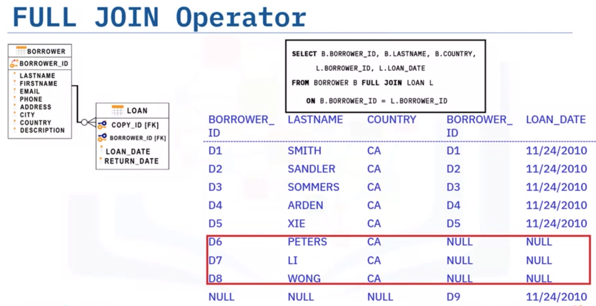 

The biggest difference between an INNER JOIN and an OUTER JOIN is that the inner join will keep only the information from both tables that's related to each other (in the resulting table). An Outer Join, on the other hand, will also keep information that is not related to the other table in the resulting table.

There are three types of Outer Join: LEFT JOIN, RIGHT JOIN, and FULL JOIN. The differences between them involve which unrelated data they keep – it can be from the first table, from the second, or from both of them. The cells without data to fill will have a value of NULL.

Examples:
```sql
--- Query1A ---
select E.F_NAME,E.L_NAME, JH.START_DATE 
	from EMPLOYEES as E 
	INNER JOIN JOB_HISTORY as JH on E.EMP_ID=JH.EMPL_ID 
	where E.DEP_ID ='5'
;	
--- Query1B ---	
select E.F_NAME,E.L_NAME, JH.START_DATE, J.JOB_TITLE 
	from EMPLOYEES as E 
	INNER JOIN JOB_HISTORY as JH on E.EMP_ID=JH.EMPL_ID 
	INNER JOIN JOBS as J on E.JOB_ID=J.JOB_IDENT
	where E.DEP_ID ='5'
;
--- Query 2A ---
select E.EMP_ID,E.L_NAME,E.DEP_ID,D.DEP_NAME
	from EMPLOYEES AS E 
	LEFT OUTER JOIN DEPARTMENTS AS D ON E.DEP_ID=D.DEPT_ID_DEP
;	
--- Query 2B ---
select E.EMP_ID,E.L_NAME,E.DEP_ID,D.DEP_NAME
	from EMPLOYEES AS E 
	LEFT OUTER JOIN DEPARTMENTS AS D ON E.DEP_ID=D.DEPT_ID_DEP 
	where YEAR(E.B_DATE) < 1980
;
--- alt Query 2B ---
select E.EMP_ID,E.L_NAME,E.DEP_ID,D.DEP_NAME
	from EMPLOYEES AS E 
	INNER JOIN DEPARTMENTS AS D ON E.DEP_ID=D.DEPT_ID_DEP 
	where YEAR(E.B_DATE) < 1980
;
--- Query 2C ---
select E.EMP_ID,E.L_NAME,E.DEP_ID,D.DEP_NAME
	from EMPLOYEES AS E 
	LEFT OUTER JOIN DEPARTMENTS AS D ON E.DEP_ID=D.DEPT_ID_DEP 
	AND YEAR(E.B_DATE) < 1980
;
--- Query 3A ---
select E.F_NAME,E.L_NAME,D.DEP_NAME
	from EMPLOYEES AS E 
	FULL OUTER JOIN DEPARTMENTS AS D ON E.DEP_ID=D.DEPT_ID_DEP
;
--- Query 3B ---
select E.F_NAME,E.L_NAME,D.DEPT_ID_DEP, D.DEP_NAME
	from EMPLOYEES AS E 
	FULL OUTER JOIN DEPARTMENTS AS D ON E.DEP_ID=D.DEPT_ID_DEP AND E.SEX = 'M'
;
--- alt Query 3B ---
select E.F_NAME,E.L_NAME,D.DEPT_ID_DEP, D.DEP_NAME
	from EMPLOYEES AS E 
	LEFT OUTER JOIN DEPARTMENTS AS D ON E.DEP_ID=D.DEPT_ID_DEP AND E.SEX = 'M'
;
```

Summary

- A join combines the rows from two or more tables based on a relationship between certain columns in these tables.
- To combine data from three or more different tables, you simply add new joins to the SQL statement. 
- There are two types of table joins: inner join and outer join; and three types of outer joins: left outer join, right outer join, and full outer join. 
- The most common type of join is the inner join, which matches the results from two tables and returns only the rows that match.
- You can use an alias as shorthand for a table or column name.
- You can use a self-join to compare rows within the same table.


## Reference Links

- [Hands-on Lab : String Patterns, Sorting and Grouping](https://cf-courses-data.s3.us.cloud-object-storage.appdomain.cloud/IBMDeveloperSkillsNetwork-DB0201EN-SkillsNetwork/labs/Labs_Coursera_V5/labs/Lab%20-%20String%20Patterns%20-%20Sorting%20-%20Grouping/instructional-labs.md.html?utm_medium=Exinfluencer&utm_source=Exinfluencer&utm_content=000026UJ&utm_term=10006555&utm_id=NA-SkillsNetwork-Channel-SkillsNetworkCoursesIBMDS0321ENSkillsNetwork26802033-2022-01-01&origin=www.coursera.org)
- [Hands-on Lab: Built-in functions](https://cf-courses-data.s3.us.cloud-object-storage.appdomain.cloud/IBMDeveloperSkillsNetwork-DB0201EN-SkillsNetwork/labs/Labs_Coursera_V5/labs/Lab%20-%20Built-in%20functions%20/Hands-on_Lab__Built-in_Functions.md.html?utm_medium=Exinfluencer&utm_source=Exinfluencer&utm_content=000026UJ&utm_term=10006555&utm_id=NA-SkillsNetwork-Channel-SkillsNetworkCoursesIBMDS0321ENSkillsNetwork26802033-2022-01-01&origin=www.coursera.org)
- [Hands-on Lab : Sub-queries and Nested SELECT Statements](https://cf-courses-data.s3.us.cloud-object-storage.appdomain.cloud/IBMDeveloperSkillsNetwork-DB0201EN-SkillsNetwork/labs/Labs_Coursera_V5/labs/Lab%20-%20Sub-queries%20and%20Nested%20SELECTs%20/instructional-labs.md.html?utm_medium=Exinfluencer&utm_source=Exinfluencer&utm_content=000026UJ&utm_term=10006555&utm_id=NA-SkillsNetwork-Channel-SkillsNetworkCoursesIBMDS0321ENSkillsNetwork26802033-2022-01-01&origin=www.coursera.org)
- [Hands-on Tutorial: Accessing Databases with SQL magic](https://cf-courses-data.s3.us.cloud-object-storage.appdomain.cloud/IBMDeveloperSkillsNetwork-DB0201EN-SkillsNetwork/labs/Module%205/DB0201EN-Week3-1-3-SQLmagic.ipynb?utm_medium=Exinfluencer&utm_source=Exinfluencer&utm_content=000026UJ&utm_term=10006555&utm_id=NA-SkillsNetwork-Channel-SkillsNetworkCoursesIBMDS0321ENSkillsNetwork26802033-2022-01-01)
- [Hands-on Lab: Analyzing a real World Data Set](https://cf-courses-data.s3.us.cloud-object-storage.appdomain.cloud/IBMDeveloperSkillsNetwork-DB0201EN-SkillsNetwork/labs/Module%205/DB0201EN-Week3-1-4-Analyzing.ipynb?utm_medium=Exinfluencer&utm_source=Exinfluencer&utm_content=000026UJ&utm_term=10006555&utm_id=NA-SkillsNetwork-Channel-SkillsNetworkCoursesIBMDS0321ENSkillsNetwork26802033-2022-01-01)


<br/>
<div align="right">
    <b><a href="#top">↥ back to top</a></b>
</div>
<br/>

