# Data Visualization with Python  <!-- omit in toc -->

- [Introduction to Data Visualization](#introduction-to-data-visualization)
  - [Introduction to Matplotlib](#introduction-to-matplotlib)
  - [Ploting with Matplotlib](#ploting-with-matplotlib)
  - [Jupyter Notebook: Introduction to Matplotlib and Line Plot](#jupyter-notebook-introduction-to-matplotlib-and-line-plot)
- [Basic Visualization Tools](#basic-visualization-tools)
  - [Area Plots](#area-plots)
  - [Histogram](#histogram)
  - [Bar Charts](#bar-charts)
  - [Jupyter Notebook: Area Plots, Histograms, Bar Charts](#jupyter-notebook-area-plots-histograms-bar-charts)
- [Specialized Visualization Tools](#specialized-visualization-tools)
  - [Pie Charts](#pie-charts)
  - [Box Plots](#box-plots)
  - [Scatter Plots](#scatter-plots)
  - [Bubble Plots](#bubble-plots)
  - [Jupyter Notebook: Pie, Box, Scatter and Bubble Plots](#jupyter-notebook-pie-box-scatter-and-bubble-plots)
- [Advanced Visualization Tools](#advanced-visualization-tools)
  - [Waffle Charts](#waffle-charts)
  - [Word Clouds](#word-clouds)
  - [Seaborn and Regression Plots](#seaborn-and-regression-plots)
  - [Jupyter Notebook: Waffle Charts, Word Clouds and Regression Plots](#jupyter-notebook-waffle-charts-word-clouds-and-regression-plots)
- [Creating Maps and Visualizing Geospatial Data](#creating-maps-and-visualizing-geospatial-data)
  - [Jupyter Notebook: Generating Maps in Python (Folium)](#jupyter-notebook-generating-maps-in-python-folium)
- [Creating Dashboards with Plotly and Dash](#creating-dashboards-with-plotly-and-dash)
  - [plotly.graph_objects](#plotlygraph_objects)
  - [plotly.express](#plotlyexpress)
    - [Bar Charts](#bar-charts-1)
    - [Bubble Charts](#bubble-charts)
    - [Histograms](#histograms)
    - [Pie Chart](#pie-chart)
    - [Sunburst Charts](#sunburst-charts)
  - [Jupyter Notebook: Plotly Basics](#jupyter-notebook-plotly-basics)
- [Dashboard](#dashboard)
  - [Dash Basics](#dash-basics)
  - [Make dashboards interactive (Dash Callbacks)](#make-dashboards-interactive-dash-callbacks)
    - [More Outputs](#more-outputs)
  - [Dashboard Summary](#dashboard-summary)
  - [Dash Auto Practice](#dash-auto-practice)
  - [Dash Airline](#dash-airline)

## Introduction to Data Visualization

Benefits of visualization:
- for exploratory data analysis
- communicate data clearly
- share unbiased representation of data
- use them to support recommendations to different stakeholders

### Introduction to Matplotlib

Read: [Matplotlib by John Hunter](https://www.aosabook.org/en/matplotlib.html)

The **Matplotlib architecture** is composed of three main layers:
- **Backend Layer** — Handles all the heavy works via communicating to the drawing toolkits in your machine. It is the most complex layer.
- **Artist Layer** — Allows full control and fine-tuning of the Matplotlib figure — the top-level container for all plot elements.
- **Scripting Layer** — The lightest scripting interface among the three layers, designed to make Matplotlib work like MATLAB script.

**Using Artist Layer to generate a histogram:**

```python
# Import the FigureCanvas from the backend of your choice
#  and attach the Figure artist to it.
from matplotlib.backends.backend_agg import FigureCanvasAgg as FigureCanvas
from matplotlib.figure import Figure
fig = Figure()
canvas = FigureCanvas(fig)

# Import the numpy library to generate the random numbers.
import numpy as np
x = np.random.randn(10000)

# Now use a figure method to create an Axes artist; the Axes artist is
#  added automatically to the figure container fig.axes.
# Here "111" is from the MATLAB convention: create a grid with 1 row and 1
#  column, and use the first cell in that grid for the location of the new
#  Axes.
ax = fig.add_subplot(111)

# Call the Axes method hist to generate the histogram; hist creates a
#  sequence of Rectangle artists for each histogram bar and adds them
#  to the Axes container.  Here "100" means create 100 bins.
ax.hist(x, 100)

# Decorate the figure with a title and save it.
ax.set_title('Normal distribution with $\mu=0, \sigma=1$')
fig.savefig('matplotlib_histogram.png')
```

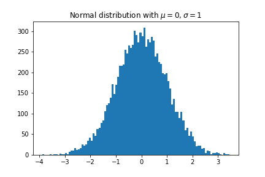

**Using Scripting Layer to do the same:**

```python
import matplotlib.pyplot as plt
import numpy as np

x = np.random.randn(10000)
plt.hist(x, 100)
plt.title(r'Normal distribution with $\mu=0, \sigma=1$')
plt.savefig('matplotlib_histogram.png')
plt.show()
```

### Ploting with Matplotlib

```python
%matplotlib notebook
import matplotlib.pyplot as plt

plt.plot(5, 5, 'o')
```

- A magic function starts with `%matplotlib`, and to enforce plots to be rendered within the browser, you pass in inline as the backend. 
- Matplotlib has a number of different backends available. One limitation of this backend is that you cannot modify a figure once it's rendered. 
- So after rendering the above figure, there is no way for us to add, for example, a figure title or label its axes. You will need to generate a new plot and add a title and the axes labels before calling the show function. 
- A backend that overcomes this limitation is the notebook backend. With the `notebook` backend in place, if a plt function is called, it checks if an active figure exists, and any functions you call will be applied to this active figure. If a figure does not exist, it renders a new figure. So when we call the `plt.plot` function to plot a circular mark at position (5, 5), the backend checks if an active figure exists.

**Matplotlib - Pandas**

Another thing that is great about Matplotlib is that pandas also has a built-in implementation of it.

### [Jupyter Notebook: Introduction to Matplotlib and Line Plot](res/NB1-Introduction-to-Matplotlib-and-Line-Plots.ipynb)

[view on GitHub](https://github.com/lijqhs/data-science-ibm/blob/main/c08-data-visualization-with-python/res/NB1-Introduction-to-Matplotlib-and-Line-Plots.ipynb)


<br/>
<div align="right">
    <b><a href="#top">↥ back to top</a></b>
</div>
<br/>

## Basic Visualization Tools

### Area Plots

```python
import matplotlib as mpl
import matplotlib.pyplot as plt
mpl.style.use(['ggplot'])  # for ggplot-like style

df_can.sort_values(by='Total', ascending=False, axis=0, inplace=True)
df_top7 = df_can.head(7)
df_top7 = df_top7[years].transpose()
df_top7.index = df_top7.index.map(int)

df_top7.plot(kind='area', alpha=0.45, figsize=(14, 8)) # pass a tuple (x, y) size

plt.title('Immigration Trend of Top 7 Countries')
plt.ylabel('Number of Immigrants')
plt.xlabel('Years')
plt.show()
```

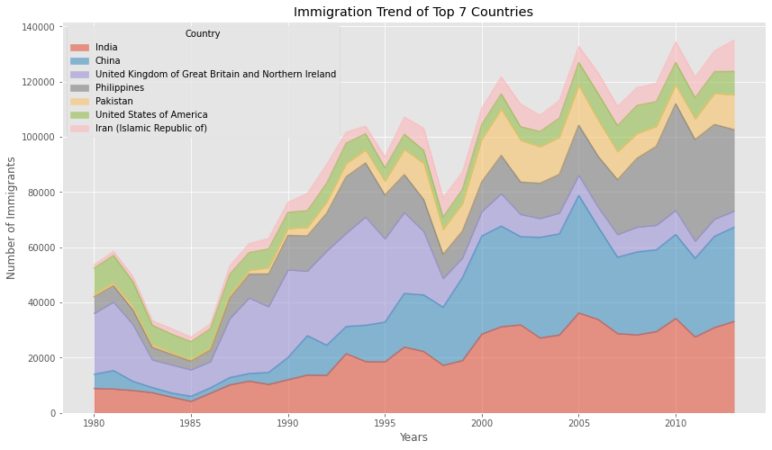


### Histogram

A **histogram** is a graph that shows the **frequency** of numerical data using rectangles. The height of a rectangle (the vertical axis) represents the distribution frequency of a variable (the amount, or how often that variable appears). The width of the rectangle (horizontal axis) represents the value of the variable (for instance, minutes, years, or ages).

```python
import matplotlib.pyplot as plt

df_can['2013'].plot(kind='hist', figsize=(14, 8))
plt.title('Histogram of Immigration from 195 countries in 2013')
plt.ylabel('Number of Countries')
plt.xlabel('Number of Immigrants')
plt.show()
```


A histogram that depicts the distribution of immigration to Canada in 2013, but notice how the bins are **not aligned with the tick marks** on the horizontal axis. This can make the histogram hard to read.

One way to solve this issue is to borrow the `histogram` function from the `Numpy` library. What `histogram` does:
- partitions the spread of the data in column 2013 into 10 bins of equal width,
- computes the number of datapoints that fall in each bin,
- returns this frequency (`count`) and the bin edges (`bin_edges`).


```python
import matplotlib.pyplot as plt
import numpy as np

count, bin_edges = np.histogram(df_can['2013'])

df_can['2013'].plot(kind='hist', xticks = bin_edges, figsize=(14, 8))
plt.title('Histogram of Immigration from 195 countries in 2013')
plt.ylabel('Number of Countries')
plt.xlabel('Number of Immigrants')
plt.show()
```

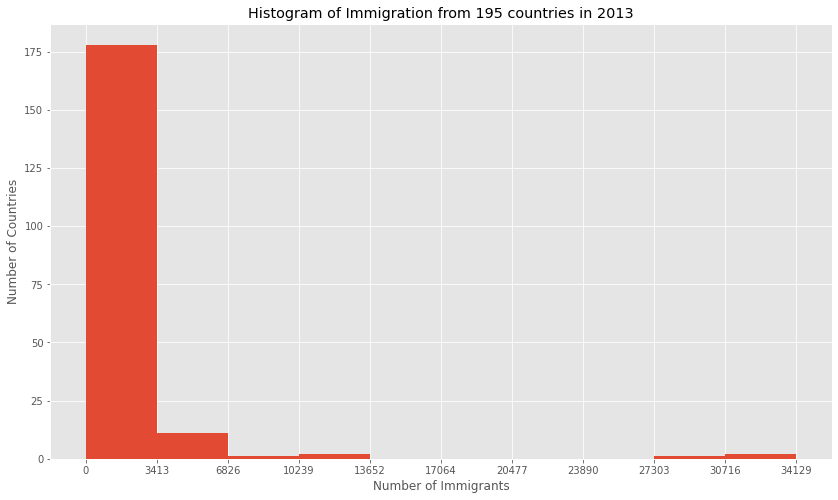

### Bar Charts

A bar chart is a very popular visualization tool. Unlike a histogram, a bar chart also known as a bar graph is a type of plot where the length of each bar is proportional to the value of the item that it represents. It is commonly used to compare the values of a variable at a given point in time.

```python
import matplotlib.pyplot as plt
years = list(map(str, range(1980, 2014)))

df_china = df_can.loc['China', years]

df_china.plot(kind='bar', figsize=(14, 8))
plt.title('Chinese Immigrants to Canada from 1980 to 2013')
plt.ylabel('Number of Immigrants')
plt.xlabel('Years')
plt.show()
```

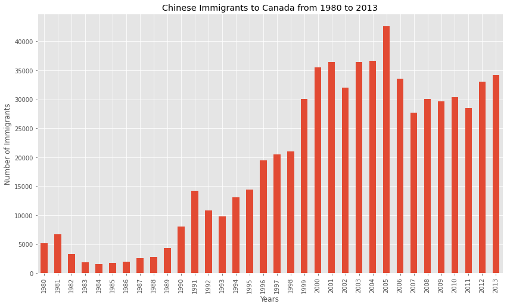


### [Jupyter Notebook: Area Plots, Histograms, Bar Charts](res/NB2-Area-Plots-Histograms-and-Bar-Charts.ipynb)

[view on GitHub](https://github.com/lijqhs/data-science-ibm/blob/main/c08-data-visualization-with-python/res/NB2-Area-Plots-Histograms-and-Bar-Charts.ipynb)

<br/>
<div align="right">
    <b><a href="#top">↥ back to top</a></b>
</div>
<br/>


## Specialized Visualization Tools

### Pie Charts

```python
df_continents = df_can.groupby('Continent', axis=0).sum()
# print(df_continents.head(6))

colors_list = ['gold', 'yellowgreen', 'lightcoral', 'lightskyblue', 'lightgreen', 'pink']
explode_list = [0.1, 0, 0, 0, 0.1, 0.1] # ratio for each continent with which to offset each wedge.

df_continents['Total'].plot(kind='pie',
                            figsize=(15, 8),
                            autopct='%1.1f%%', 
                            startangle=90,    
                            shadow=True,       
                            labels=None,         # turn off labels on pie chart
                            pctdistance=1.12,    # the ratio between the center of each pie slice and the start of the text generated by autopct 
                            colors=colors_list,  # add custom colors
                            explode=explode_list # 'explode' lowest 3 continents
                            )

# scale the title up by 12% to match pctdistance
plt.title('Immigration to Canada by Continent [1980 - 2013]', y=1.12) 

plt.axis('equal') 

# add legend
plt.legend(labels=df_continents.index, loc='upper left') 

plt.show()
```

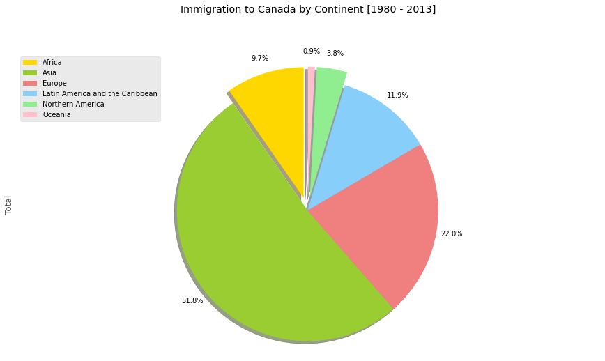


### Box Plots

In descriptive statistics, a [box plot](https://en.wikipedia.org/wiki/Box_plot) or boxplot is a method for graphically demonstrating the locality, spread and skewness groups of numerical data through their quartiles.

The spacings in each subsection of the box-plot indicate the degree of dispersion (spread) and skewness of the data, which are usually described using the five-number summary.

In the most straight-forward method, the boundary of the lower whisker is the minimum value of the data set, and the boundary of the upper whisker is the maximum value of the data set.

Another popular choice for the boundaries of the whiskers is based on the 1.5 **IQR** value. From above the upper quartile (Q3), a distance of 1.5 times the IQR is measured out and a whisker is drawn up to the largest observed data point from the dataset that falls within this distance. 

Similarly, a distance of 1.5 times the IQR is measured out below the lower quartile (Q1) and a whisker is drawn down to the lowest observed data point from the dataset that falls within this distance. **Because the whiskers must end at an observed data point, the whisker lengths can look unequal, even though 1.5 IQR is the same for both sides.** All other observed data points outside the boundary of the whiskers are plotted as outliers. The outliers can be plotted on the box-plot as a dot, a small circle, a star, etc..

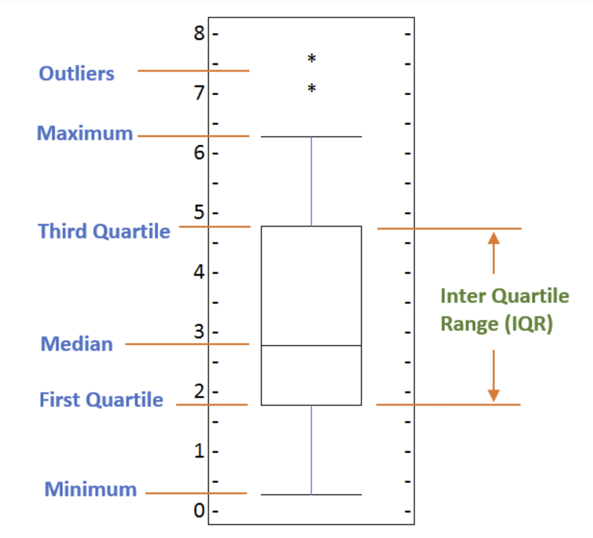

```python
years = list(map(str, range(1980, 2014)))
df_china = df_can.loc[['China'], years].transpose()

df_china.plot(kind='box', figsize=(14, 8))

plt.title('Box Plot of Chinese Immigrants from 1980-2013')
plt.ylabel('Number of Immigrants')
plt.show()
```

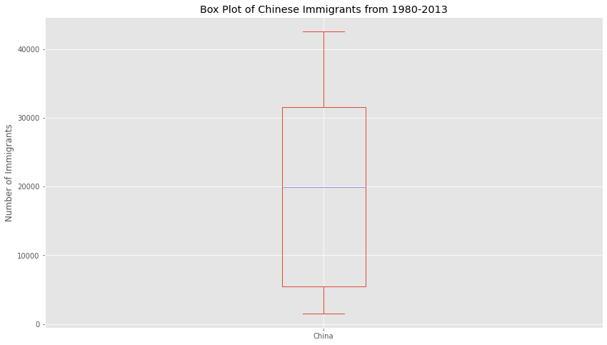


```python
df_china.describe()
```

| Country	| China |
| :--: | :--: |
| count	| 34.000000 |
| mean	| 19410.647059 |
| std	| 13568.230790 |
| min	| 1527.000000 |
| 25%	| 5512.750000 |
| 50%	| 19945.000000 |
| 75%	| 31568.500000 |
| max	| 42584.000000 |

### Scatter Plots

We can mathematically analyze the trend using a regression line (line of best fit).

Get the equation of line of best fit. We will use **Numpy**'s `polyfit()` method by passing in the following:
- `x`: x-coordinates of the data.
- `y`: y-coordinates of the data.
- `deg`: Degree of fitting polynomial. 1 = linear, 2 = quadratic, and so on.


```python
# we can use the sum() method to get the total population per year
df_tot = pd.DataFrame(df_can[years].sum(axis=0))

# change the years to type int (useful for regression later on)
df_tot.index = map(int, df_tot.index)

# reset the index to put in back in as a column in the df_tot dataframe
df_tot.reset_index(inplace = True)

# rename columns
df_tot.columns = ['year', 'total']

# view the final dataframe
df_tot.head()

df_tot.plot(kind='scatter', x='year', y='total', figsize=(15, 8), color='darkblue')

plt.title('Total Immigration to Canada from 1980 - 2013')
plt.xlabel('Year')
plt.ylabel('Number of Immigrants')


x = df_tot['year']      # year on x-axis
y = df_tot['total']     # total on y-axis
fit = np.polyfit(x, y, deg=1)


# plot line of best fit
plt.plot(x, fit[0] * x + fit[1], color='red') # recall that x is the Years
plt.annotate('y={0:.0f} x + {1:.0f}'.format(fit[0], fit[1]), xy=(2000, 150000))

plt.show()

# print out the line of best fit
'No. Immigrants = {0:.0f} * Year + {1:.0f}'.format(fit[0], fit[1]) 
```

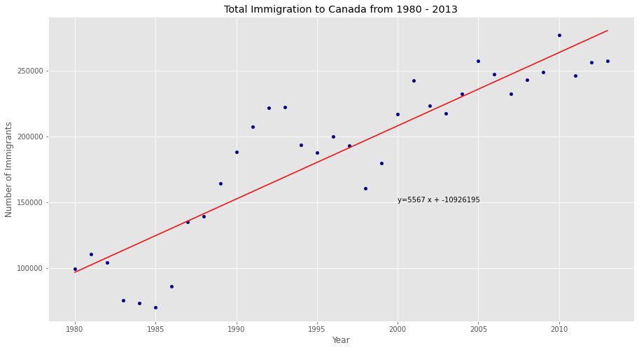

    No. Immigrants = 5567 * Year + -10926195

### Bubble Plots

- To plot two different scatter plots in one plot, we can include the axes one plot into the other by passing it via the `ax` parameter.
- We will also pass in the weights using the `s` parameter. Given that the normalized weights are between 0-1, they won't be visible on the plot. Therefore, we will:
  - multiply weights by 2000 to scale it up on the graph, and,
  - add 10 to compensate for the min value (which has a 0 weight and therefore scale with $\times 2000$).


```python
# transposed dataframe
df_can_t = df_can[years].transpose()

# cast the Years (the index) to type int
df_can_t.index = map(int, df_can_t.index)

# let's label the index. This will automatically be the column name when we reset the index
df_can_t.index.name = 'Year'

# reset index to bring the Year in as a column
df_can_t.reset_index(inplace=True)

# view the changes
df_can_t.head()

# normalized Chinese data
norm_china = (df_can_t['China'] - df_can_t['China'].min()) / (df_can_t['China'].max() - df_can_t['China'].min())

# normalized Indian data
norm_india = (df_can_t['India'] - df_can_t['India'].min()) / (df_can_t['India'].max() - df_can_t['India'].min())


# China
ax0 = df_can_t.plot(kind='scatter',
                    x='Year',
                    y='China',
                    figsize=(15, 8),
                    alpha=0.5,  # transparency
                    color='green',
                    s=norm_china * 2000 + 10,  # pass in weights 
                    xlim=(1975, 2015)
                    )

# India
ax1 = df_can_t.plot(kind='scatter',
                    x='Year',
                    y='India',
                    alpha=0.5,
                    color="blue",
                    s=norm_india * 2000 + 10,
                    ax=ax0
                    )

ax0.set_ylabel('Number of Immigrants')
ax0.set_title('Immigration from China and India from 1980 to 2013')
ax0.legend(['China', 'India'], loc='upper left', fontsize='x-large')
```

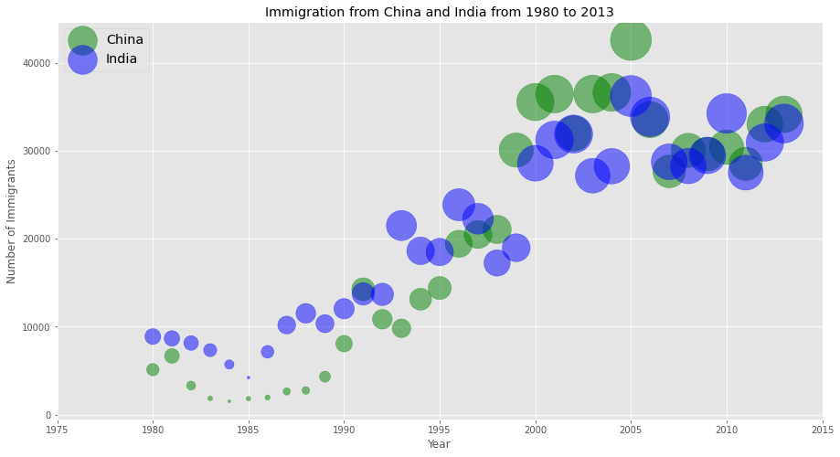


### [Jupyter Notebook: Pie, Box, Scatter and Bubble Plots](res/NB3-Pie-Charts-Box-Plots-Scatter-Plots-and-Bubble-Plots.ipynb)

[view on GitHub](https://github.com/lijqhs/data-science-ibm/blob/main/c08-data-visualization-with-python/res/NB3-Pie-Charts-Box-Plots-Scatter-Plots-and-Bubble-Plots.ipynb)

<br/>
<div align="right">
    <b><a href="#top">↥ back to top</a></b>
</div>
<br/>


## Advanced Visualization Tools

### Waffle Charts

To create a `waffle` chart, use function `create_waffle_chart` which takes the following parameters as input:

> 1.  **categories**: Unique categories or classes in dataframe.
> 2.  **values**: Values corresponding to categories or classes.
> 3.  **height**: Defined height of waffle chart.
> 4.  **width**: Defined width of waffle chart.
> 5.  **colormap**: Colormap class
> 6.  **value_sign**: In order to make our function more generalizable, we will add this parameter to address signs that could be associated with a value such as %, $, and so on. **value_sign** has a default value of empty string.


```python
def create_waffle_chart(categories, values, height, width, colormap, value_sign=''):

    # compute the proportion of each category with respect to the total
    total_values = sum(values)
    category_proportions = [(float(value) / total_values) for value in values]

    # compute the total number of tiles
    total_num_tiles = width * height # total number of tiles
    print ('Total number of tiles is', total_num_tiles)
    
    # compute the number of tiles for each catagory
    tiles_per_category = [round(proportion * total_num_tiles) for proportion in category_proportions]

    # print out number of tiles per category
    for i, tiles in enumerate(tiles_per_category):
        print (df_dsn.index.values[i] + ': ' + str(tiles))
    
    # initialize the waffle chart as an empty matrix
    waffle_chart = np.zeros((height, width))

    # define indices to loop through waffle chart
    category_index = 0
    tile_index = 0

    # populate the waffle chart
    for col in range(width):
        for row in range(height):
            tile_index += 1

            # if the number of tiles populated for the current category 
            # is equal to its corresponding allocated tiles...
            if tile_index > sum(tiles_per_category[0:category_index]):
                # ...proceed to the next category
                category_index += 1       
            
            # set the class value to an integer, which increases with class
            waffle_chart[row, col] = category_index
    
    # instantiate a new figure object
    fig = plt.figure()

    # use matshow to display the waffle chart
    colormap = plt.cm.coolwarm
    plt.matshow(waffle_chart, cmap=colormap)
    plt.colorbar()

    # get the axis
    ax = plt.gca()

    # set minor ticks
    ax.set_xticks(np.arange(-.5, (width), 1), minor=True)
    ax.set_yticks(np.arange(-.5, (height), 1), minor=True)
    
    # add dridlines based on minor ticks
    ax.grid(which='minor', color='w', linestyle='-', linewidth=2)

    plt.xticks([])
    plt.yticks([])

    # compute cumulative sum of individual categories to match color schemes between chart and legend
    values_cumsum = np.cumsum(values)
    total_values = values_cumsum[len(values_cumsum) - 1]

    # create legend
    legend_handles = []
    for i, category in enumerate(categories):
        if value_sign == '%':
            label_str = category + ' (' + str(values[i]) + value_sign + ')'
        else:
            label_str = category + ' (' + value_sign + str(values[i]) + ')'
            
        color_val = colormap(float(values_cumsum[i])/total_values)
        legend_handles.append(mpatches.Patch(color=color_val, label=label_str))

    # add legend to chart
    plt.legend(
        handles=legend_handles,
        loc='lower center', 
        ncol=len(categories),
        bbox_to_anchor=(0., -0.2, 0.95, .1)
    )
    plt.show()
```

```python
width = 40 # width of chart
height = 10 # height of chart

categories = df_dsn.index.values # categories
values = df_dsn['Total'] # correponding values of categories

colormap = plt.cm.coolwarm # color map class

create_waffle_chart(categories, values, height, width, colormap)
```

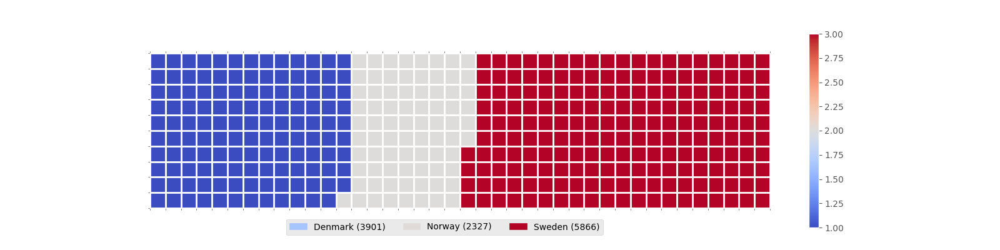


### Word Clouds

```python
import numpy as np  # useful for many scientific computing in Python
import pandas as pd # primary data structure library

%matplotlib inline

import matplotlib as mpl
import matplotlib.pyplot as plt
import matplotlib.patches as mpatches # needed for waffle Charts

mpl.style.use('ggplot') # optional: for ggplot-like style

# check for latest version of Matplotlib
print ('Matplotlib version: ', mpl.__version__) # >= 2.0.0


df_can = pd.read_excel(
    'Canada.xlsx',
    sheet_name='Canada by Citizenship',
    skiprows=range(20),
    skipfooter=2)

# clean up the dataset to remove unnecessary columns (eg. REG) 
df_can.drop(['AREA','REG','DEV','Type','Coverage'], axis = 1, inplace = True)

# let's rename the columns so that they make sense
df_can.rename (columns = {'OdName':'Country', 'AreaName':'Continent','RegName':'Region'}, inplace = True)

# for sake of consistency, let's also make all column labels of type string
df_can.columns = list(map(str, df_can.columns))

# set the country name as index - useful for quickly looking up countries using .loc method
df_can.set_index('Country', inplace = True)

# add total column
df_can['Total'] =  df_can.sum (axis = 1)

# years that we will be using in this lesson - useful for plotting later on
years = list(map(str, range(1980, 2014)))
print ('data dimensions:', df_can.shape)


total_immigration = df_can['Total'].sum()
# total_immigration

max_words = 90
word_string = ''
for country in df_can.index.values:
    # check if country's name is a single-word name
    if country.count(" ") == 0:
        repeat_num_times = int(df_can.loc[country, 'Total'] / total_immigration * max_words)
        word_string = word_string + ((country + ' ') * repeat_num_times)

# display the generated text
# word_string

# create the word cloud
wordcloud = WordCloud(background_color='white').generate(word_string)

# print('Word cloud created!')

# display the cloud
plt.figure(figsize=(14, 18))

plt.imshow(wordcloud, interpolation='bilinear')
plt.axis('off')
plt.show()
```


### Seaborn and Regression Plots

```python
df_dsn_tot = pd.DataFrame(df_dsn[years].sum(axis=0))

# change the years to type float (useful for regression later on)
df_dsn_tot.index = map(float, df_dsn_tot.index)

# reset the index to put in back in as a column in the df_tot dataframe
df_dsn_tot.reset_index(inplace=True)

# rename columns
df_dsn_tot.columns = ['year', 'total']

# view the final dataframe
df_dsn_tot.head()


plt.figure(figsize=(15, 10))

sns.set(font_scale=1.5)
sns.set_style('whitegrid')

ax = sns.regplot(x='year', y='total', data=df_dsn_tot, color='green', marker='+', scatter_kws={'s': 200})
ax.set(xlabel='Year', ylabel='Total Immigration')
ax.set_title('Total Immigration from Denmark, Sweden, and Norway to Canada from 1980 - 2013')
plt.show()
```

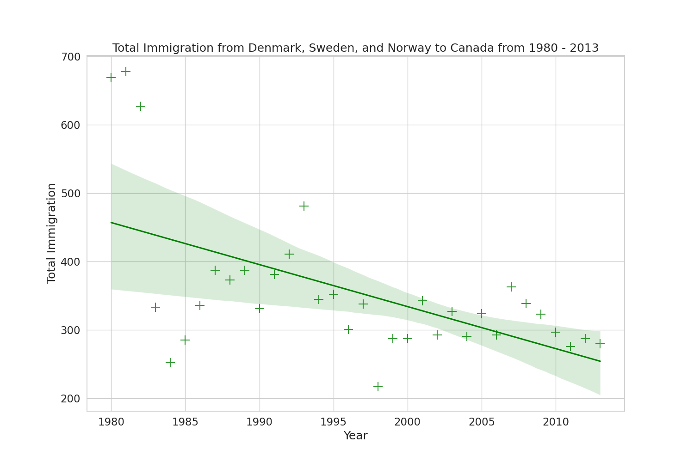

### [Jupyter Notebook: Waffle Charts, Word Clouds and Regression Plots](res/NB4_Waffle_Charts_Word_Clouds_and_Regression_Plots.ipynb)

[view on GitHub](https://github.com/lijqhs/data-science-notes/blob/main/c08-data-visualization-with-python/res/NB4_Waffle_Charts_Word_Clouds_and_Regression_Plots.ipynb)

<br/>
<div align="right">
    <b><a href="#top">↥ back to top</a></b>
</div>
<br/>


## Creating Maps and Visualizing Geospatial Data

[folium](https://python-visualization.github.io/folium/) builds on the data wrangling strengths of the Python ecosystem and the mapping strengths of the leaflet.js library. Manipulate your data in Python, then visualize it in on a Leaflet map via folium.

```python
import numpy as np
import matplotlib.pyplot as plt
%matplotlib inline
import pandas as pd
import folium

df_can = pd.read_excel(
    'Canada.xlsx',
    sheet_name='Canada by Citizenship',
    skiprows=range(20),
    skipfooter=2)

# clean up the dataset to remove unnecessary columns (eg. REG) 
df_can.drop(['AREA','REG','DEV','Type','Coverage'], axis=1, inplace=True)

# let's rename the columns so that they make sense
df_can.rename(columns={'OdName':'Country', 'AreaName':'Continent','RegName':'Region'}, inplace=True)

# for sake of consistency, let's also make all column labels of type string
df_can.columns = list(map(str, df_can.columns))

# add total column
df_can['Total'] = df_can.sum(axis=1)

# years that we will be using in this lesson - useful for plotting later on
years = list(map(str, range(1980, 2014)))
print ('data dimensions:', df_can.shape)

# create a plain world map
world_map = folium.Map(location=[0, 0], zoom_start=2)
```

```python
import json
world_geo = json.load(open('world_countries.json'))

# generate choropleth map using the total immigration of each country to Canada from 1980 to 2013
world_map.choropleth(
    geo_data=world_geo,
    data=df_can,
    columns=['Country', 'Total'],
    key_on='feature.properties.name',
    fill_color='YlOrRd', 
    fill_opacity=0.7, 
    line_opacity=0.2,
    legend_name='Immigration to Canada'
)

# display map
world_map
```

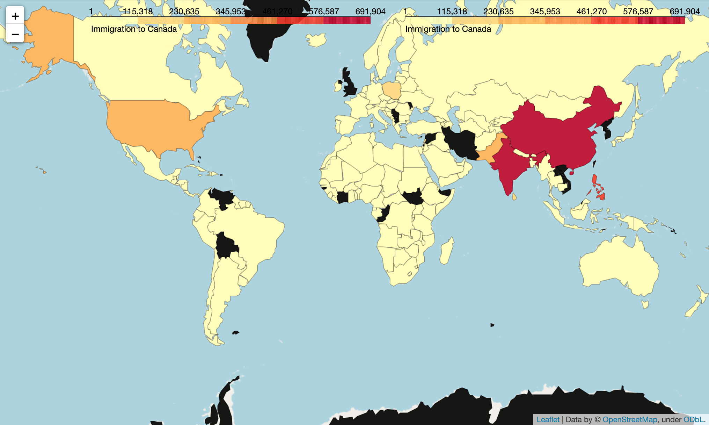

### [Jupyter Notebook: Generating Maps in Python (Folium)](res/NB5-Generating-Maps-in-Python.ipynb)

[view on GitHub](https://github.com/lijqhs/data-science-notes/blob/main/c08-data-visualization-with-python/res/NB5-Generating-Maps-in-Python.ipynb)


<br/>
<div align="right">
    <b><a href="#top">↥ back to top</a></b>
</div>
<br/>

## Creating Dashboards with Plotly and Dash

**Web-based dashboarding tools**:
- [Dash](https://plotly.com/dash/) is a python framework for building web analytic applications. It is written on top of Flask, Plotly.js, and React.js. Dash is well-suited for building data visualization apps with highly custom user interfaces.
- [Panel](https://panel.holoviz.org/) works with visualizations from Bokeh, Matplotlib, HoloViews, and many other Python plotting libraries, making them instantly viewable either individually or when combined with interactive widgets that control them.
- [Voilà](https://voila.readthedocs.io/en/stable/using.html) turns Jupyter notebooks into standalone web applications. It can be used with separate layout tools like jupyter-flex or templates like voila-vuetify.
- [Streamlit](https://github.com/streamlit/streamlit) can easily turn data scripts into shareable web apps with 3 main principles: 
  - embrace python scripting, 
  - treat widgets as variables, and 
  - reuse data and computation.

See also: [Dashboarding tools](https://pyviz.org/dashboarding/)

Additional useful resources:
- [Plotly python](https://plotly.com/python/getting-started/)
- [Plotly cheatsheet](https://images.plot.ly/plotly-documentation/images/plotly_js_cheat_sheet.pdf)
- [Open-source datasets](https://developer.ibm.com/exchanges/data/)


### [plotly.graph_objects](https://plotly.com/python/graph-objects/)

If Plotly Express does not provide a good starting point, it is possible to use the more generic `go.Scatter` class from [plotly.graph_objects](https://plotly.com/python/graph-objects/). Whereas `plotly.express` has two functions scatter and line, `go.Scatter` can be used both for plotting points (`makers`) or lines, depending on the value of mode. The different options of `go.Scatter` are documented in its [reference page](https://plotly.com/python/reference/scatter/).

Read: [Scatter and line plots with go.Scatter](https://plotly.com/python/line-and-scatter/#scatter-and-line-plots-with-goscatter)

```python
# using plotly
import pandas as pd
import plotly.express as px
import plotly.graph_objects as go

airline_data =  pd.read_csv('airline_data.csv',
                            encoding = "ISO-8859-1",
                            dtype={'Div1Airport': str, 'Div1TailNum': str, 
                                   'Div2Airport': str, 'Div2TailNum': str})
print("Data Shape:", airline_data.shape)
df_sample500 = airline_data.sample(n=500, random_state=42)
# df_sample500.head()
print("Sample Shape:", df_sample500.shape)
```

    Data Shape: (27000, 110)
    Sample Shape: (500, 110)

**How departure time changes with respect to airport distance**

```python
# First we create a figure using go.Figure and adding trace to it through go.scatter
fig = go.Figure(data=go.Scatter(x=df_sample500['Distance'], 
                                y=df_sample500['DepTime'], 
                                mode='markers', 
                                marker=dict(color='green')))
# Updating layout through `update_layout`. Here we are adding title to the plot and providing title to x and y axis.
fig.update_layout(title='Distance vs Departure Time', 
                  xaxis_title='Distance', 
                  yaxis_title='DepTime')
# Display the figure
fig.show()
```

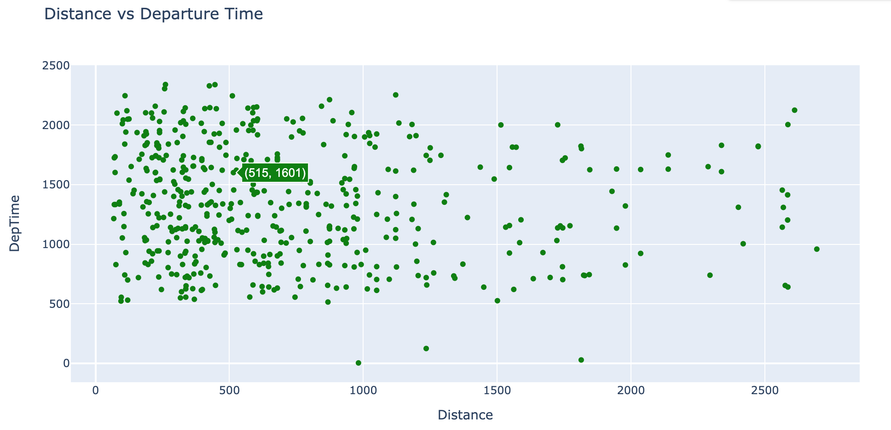

**Extract average monthly arrival delay time and see how it changes over the year**

```python
# Group the data by Month and compute average over arrival delay time.
line_data = df_sample500.groupby('Month')['ArrDelay'].mean().reset_index()
# Display the data
line_data
```

```python
# Scatter and line plot vary by updating mode parameter.
fig = go.Figure(data=go.Scatter(x=line_data['Month'], 
                                y=line_data['ArrDelay'], 
                                mode='lines', 
                                marker=dict(color='blue')))
fig.update_layout(title='Monthly Averaged Delay Time', 
                  xaxis_title='Month', 
                  yaxis_title='ArrDelay')
fig.show()
```

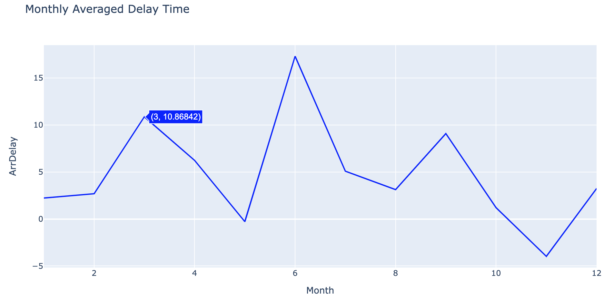


<br/>
<div align="right">
    <b><a href="#top">↥ back to top</a></b>
</div>
<br/>


### [plotly.express](https://plotly.com/python/plotly-express/)

#### [Bar Charts](https://plotly.com/python/bar-charts/)

**Extract number of flights from a specific airline that goes to a destination**

```python
# Group the data by destination state and reporting airline. Compute total number of flights in each combination
bar_data = df_sample500.groupby(['DestState'])['Flights'].sum().reset_index()

# Use plotly express bar chart function px.bar. Provide input data, x and y axis variable, and title of the chart.
# This will give total number of flights to the destination state.
fig = px.bar(bar_data, x="DestState", y="Flights", 
             title='Total number of flights to the destination state split by reporting airline') 
fig.show()
```

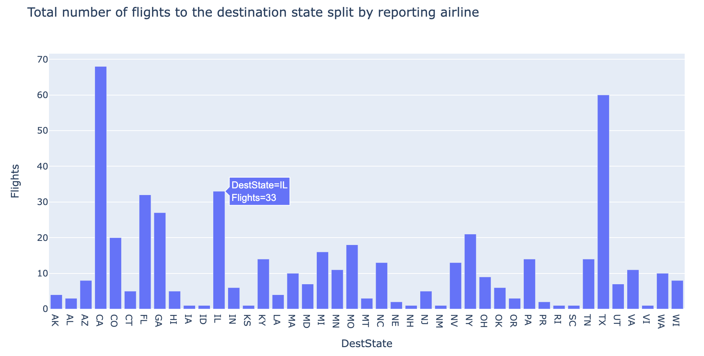


**Get number of flights as per reporting airline**

#### [Bubble Charts](https://plotly.com/python/bubble-charts/)

A bubble chart is a scatter plot in which a third dimension of the data is shown through the size of markers. For other types of scatter plot, see the scatter plot documentation.

**Get number of flights as per reporting airline**

```python
# Group the data by reporting airline and get number of flights
bub_data = df_sample500.groupby('Reporting_Airline')['Flights'].sum().reset_index()

fig = px.scatter(bub_data, x="Reporting_Airline", y="Flights", 
                 size="Flights", 
                 hover_name="Reporting_Airline", 
                 title='Number of flights as per reporting airline')
fig.show()
```

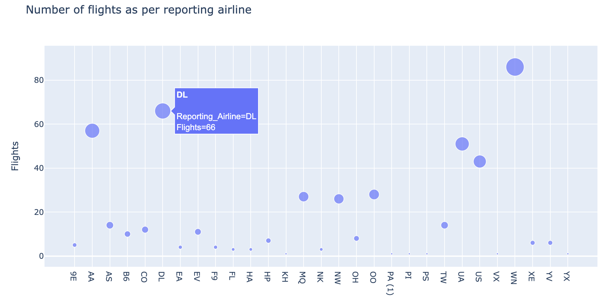

#### [Histograms](https://plotly.com/python/histograms/)

**Get distribution of arrival delay**

```python
# Set missing values to 0
df_sample500['ArrDelay'] = df_sample500['ArrDelay'].fillna(0)
fig = px.histogram(df_sample500, x="ArrDelay", 
                   title="Distribution of Arrival Delay")
fig.show()
```

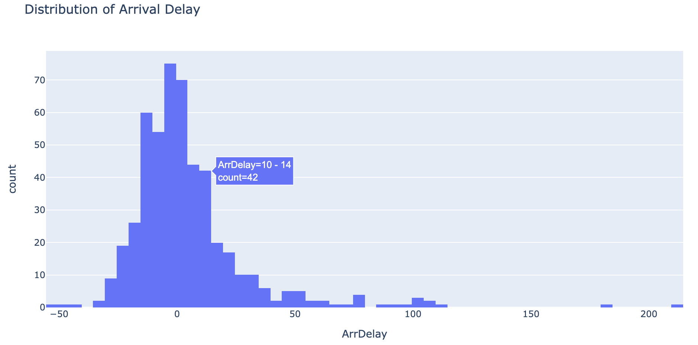

#### [Pie Chart](https://plotly.com/python/pie-charts/)

**Proportion of distance group by month (month indicated by numbers)**

```python
# Use px.pie function to create the chart. Input dataset. 
# Values parameter will set values associated to the sector. 'Month' feature is passed to it.
# labels for the sector are passed to the `names` parameter.
fig = px.pie(df_sample500, values='Month', names='DistanceGroup', 
             title='Distance group proportion by month')
fig.show()
```

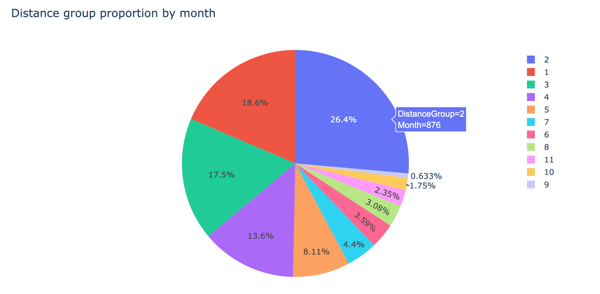


#### [Sunburst Charts](https://plotly.com/python/sunburst-charts)

**Hierarchical view in the order of month and destination state holding value of number of flights**

```python
fig = px.sunburst(df_sample500, path=['Month', 'DestStateName'], values='Flights', 
                  title="State Holding Value of Number of Flights by Month and Destination")
fig.show()
```

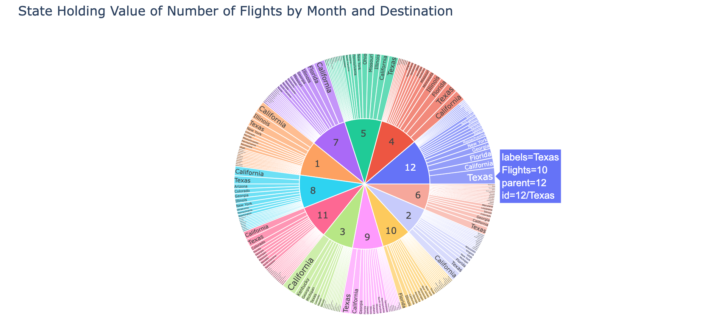

### [Jupyter Notebook: Plotly Basics](res/NB6-Plotly_Basics.ipynb)


<br/>
<div align="right">
    <b><a href="#top">↥ back to top</a></b>
</div>
<br/>

## Dashboard

### Dash Basics

- [Dash](https://dash.plotly.com/) is a Open-Source User Interface Python library for creating reactive, web-based applications. It is enterprise-ready and a first-class member of Plotly’s open-source tools. 
- Dash applications are web servers running Flask and communicating JSON packets over HTTP requests. 
- Dash’s frontend renders components using React.js. It is **easy to build a Graphical User Interface** using dash as it abstracts all technologies required to build the applications. 
- Dash is Declarative and Reactive. Dash output can be rendered in web browser and can be deployed to servers. 
- Dash uses a simple reactive decorator for binding code to the UI. This is inherently **mobile and cross-platform ready**. 

```python
# Import required packages
import pandas as pd
import plotly.express as px
import dash
import dash_html_components as html
import dash_core_components as dcc

# Read the airline data into pandas dataframe
airline_data =  pd.read_csv('airline_data.csv', 
                            encoding = "ISO-8859-1",
                            dtype={'Div1Airport': str, 'Div1TailNum': str, 
                                   'Div2Airport': str, 'Div2TailNum': str})

# Randomly sample 500 data points. Setting the random state to be 42 so that we get same result.
data = airline_data.sample(n=500, random_state=42)

# Pie Chart Creation
fig_pie = px.pie(data, values='Flights', names='DistanceGroup', title='Distance group proportion by flights')
fig_sunburst = px.sunburst(data, path=['Month', 'DestStateName'], values='Flights', 
                  title="State Holding Value of Number of Flights by Month and Destination")

# Create a dash application
app = dash.Dash(__name__)

# Get the layout of the application and adjust it.
# Create an outer division using html.Div and add title to the dashboard using html.H1 component
# Add description about the graph using HTML P (paragraph) component
# Finally, add graph component.
app.layout = html.Div([
       html.H1('Airline Dashboard',
               style={'textAlign': 'center', 
                      'color': '#503D36', 
                      'font-size': 40}),
       html.P('Proportion of distance group (250 mile distance interval group) by flights.', 
              style={'textAlign':'center', 'color': '#F57241'}),
       dcc.Graph(figure=fig_pie),
       html.P('Hierarchical view in the order of month and destination state holding value of number of flights.', 
              style={'textAlign':'center', 'color': '#F57241'}),
       dcc.Graph(figure=fig_sunburst),
    ])

# Run the application                   
if __name__ == '__main__':
    app.run_server()
```

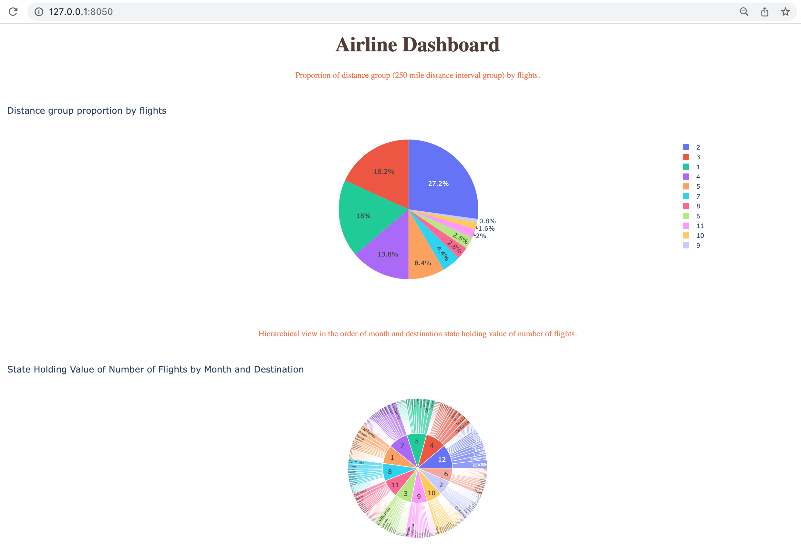


<br/>
<div align="right">
    <b><a href="#top">↥ back to top</a></b>
</div>
<br/>


### Make dashboards interactive (Dash Callbacks)

A callback function is a python function that is automatically called by Dash whenever an input component's property changes. Callback function is decorated with `@app.callback` decorator. *([decorators](https://realpython.com/primer-on-python-decorators/) wrap a function, modifying its behavior.)*

- [Python decorators reference 1](https://realpython.com/primer-on-python-decorators/)
- [Python decorators reference 2](https://peps.python.org/pep-0318/#current-syntax)
- [Callbacks with example](https://dash.plotly.com/basic-callbacks)
- [Dash app gallery](https://dash.gallery/Portal/)
- [Dash community components](https://community.plotly.com/t/community-components-index/60098)


```python
# Import required libraries
import pandas as pd
import plotly.graph_objects as go
import dash
import dash_html_components as html
import dash_core_components as dcc
from dash.dependencies import Input, Output

# Read the airline data into pandas dataframe
airline_data =  pd.read_csv('airline_data.csv', 
                            encoding = "ISO-8859-1",
                            dtype={'Div1Airport': str, 'Div1TailNum': str, 
                                   'Div2Airport': str, 'Div2TailNum': str})


# Create a dash application
app = dash.Dash(__name__)

# Get the layout of the application and adjust it.
# Create an outer division using html.Div and add title to the dashboard using html.H1 component
# Add a html.Div and core input text component
# Finally, add graph component.
app.layout = html.Div(children=[
        html.H1("Airline Performance Dashboard",
                style={'textAlign': 'center', 
                        'color': '#503D36', 
                        'font-size': 40}),
        html.Div(["Input Year", 
                  dcc.Input(id='input-year', 
                            type='number', 
                            value='2010', 
                            style={'height': '50px', 
                                'font-size': 35}),], 
                style={'font-size': 40}),
        html.Br(),
        html.Br(),
        html.Div(dcc.Graph(id='line-plot')),
    ])


# add callback decorator
@app.callback(Output(component_id='line-plot', component_property='figure'),
               Input(component_id='input-year', component_property='value'))

# Add computation to callback function and return graph
def get_graph(entered_year):
    # Select data based on the entered year
    df =  airline_data[airline_data['Year']==int(entered_year)]

    # Group the data by Month and compute average over arrival delay time.
    line_data = df.groupby('Month')['ArrDelay'].mean().reset_index()

    # 
    fig = go.Figure(data=go.Scatter(x=line_data['Month'],
                                    y=line_data['ArrDelay'],
                                    mode='lines',
                                    marker=dict(color='green')))
    fig.update_layout(title='Month vs Average Flight Delay Time',
                      xaxis_title="Month",
                      yaxis_title='ArrDelay')
    return fig

# Run the app
if __name__ == '__main__':
    app.run_server()
```


<br/>
<div align="right">
    <b><a href="#top">↥ back to top</a></b>
</div>
<br/>


#### More Outputs

Analyze flight delays in a dashboard.

**Dashboard Components**
- Monthly average carrier delay by reporting airline for the given year.
- Monthly average weather delay by reporting airline for the given year.
- Monthly average national air system delay by reporting airline for the given year.
- Monthly average security delay by reporting airline for the given year.
- Monthly average late aircraft delay by reporting airline for the given year.

```python
# Import required libraries
import pandas as pd
import plotly.graph_objects as go
import dash
# import dash_html_components as html
# import dash_core_components as dcc
from dash import dcc
from dash import html
from dash.dependencies import Input, Output
import plotly.express as px

# Read the airline data into pandas dataframe
airline_data =  pd.read_csv('airline_data.csv', 
                            encoding = "ISO-8859-1",
                            dtype={'Div1Airport': str, 'Div1TailNum': str, 
                                   'Div2Airport': str, 'Div2TailNum': str})


# Create a dash application
app = dash.Dash(__name__)

# Build dash app layout
app.layout = html.Div(children=[
        html.H1('Flight Delay Time Statistics',
                style={'textAlign': 'left', 
                        'color': '#503D36', 
                        'font-size': 30}),
        html.Div(["Input Year: ", 
                  dcc.Input(id='input-year', 
                            type='number', 
                            value='2010', 
                            style={'height': '35px', 
                                'font-size': 30}),], 
        style={'font-size': 30}),
        html.Br(),
        html.Br(), 
        html.Div([
                html.Div(dcc.Graph(id='carrier-plot')),
                html.Div(dcc.Graph(id='weather-plot'))
        ], style={'display': 'flex'}),

        html.Div([
                html.Div(dcc.Graph(id='nas-plot')),
                html.Div(dcc.Graph(id='security-plot'))
        ], style={'display': 'flex'}),

        html.Div(dcc.Graph(id='late-plot'), style={'width':'50%'})
    ])


""" Compute_info function description

This function takes in airline data and selected year as an input and performs computation for creating charts and plots.

Arguments:
    airline_data: Input airline data.
    entered_year: Input year for which computation needs to be performed.

Returns:
    Computed average dataframes for carrier delay, weather delay, NAS delay, security delay, and late aircraft delay.

"""
def compute_info(airline_data, entered_year):
    # Select data
    df =  airline_data[airline_data['Year']==int(entered_year)]
    # Compute delay averages
    avg_car = df.groupby(['Month','Reporting_Airline'])['CarrierDelay'].mean().reset_index()
    avg_weather = df.groupby(['Month','Reporting_Airline'])['WeatherDelay'].mean().reset_index()
    avg_NAS = df.groupby(['Month','Reporting_Airline'])['NASDelay'].mean().reset_index()
    avg_sec = df.groupby(['Month','Reporting_Airline'])['SecurityDelay'].mean().reset_index()
    avg_late = df.groupby(['Month','Reporting_Airline'])['LateAircraftDelay'].mean().reset_index()
    return avg_car, avg_weather, avg_NAS, avg_sec, avg_late


# Callback decorator
@app.callback( [
               Output(component_id='carrier-plot', component_property='figure'),
               Output(component_id='weather-plot', component_property='figure'),
               Output(component_id='nas-plot', component_property='figure'),
               Output(component_id='security-plot', component_property='figure'),
               Output(component_id='late-plot', component_property='figure'),
               ],
               Input(component_id='input-year', component_property='value'))
# Computation to callback function and return graph
def get_graph(entered_year):

    # Compute required information for creating graph from the data
    avg_car, avg_weather, avg_NAS, avg_sec, avg_late = compute_info(airline_data, entered_year)

    # Line plot for carrier delay
    carrier_fig = px.line(avg_car, 
                          x='Month', 
                          y='CarrierDelay', 
                          color='Reporting_Airline', 
                          title='Average carrier delay time (minutes) by airline')
    # Line plot for weather delay
    weather_fig = px.line(avg_weather, 
                          x='Month', 
                          y='WeatherDelay', 
                          color='Reporting_Airline', 
                          title='Average weather delay time (minutes) by airline')
    # Line plot for nas delay
    nas_fig = px.line(avg_NAS, 
                        x='Month', 
                        y='NASDelay', 
                        color='Reporting_Airline', 
                        title='Average NAS delay time (minutes) by airline')
    # Line plot for security delay
    sec_fig = px.line(avg_sec, 
                        x='Month', 
                        y='SecurityDelay', 
                        color='Reporting_Airline', 
                        title='Average security delay time (minutes) by airline')
    # Line plot for late aircraft delay
    late_fig = px.line(avg_late, 
                          x='Month', 
                          y='LateAircraftDelay', 
                          color='Reporting_Airline', 
                          title='Average late aircraft delay time (minutes) by airline')

    return[carrier_fig, weather_fig, nas_fig, sec_fig, late_fig]

# Run the app
if __name__ == '__main__':
    app.run_server()
```

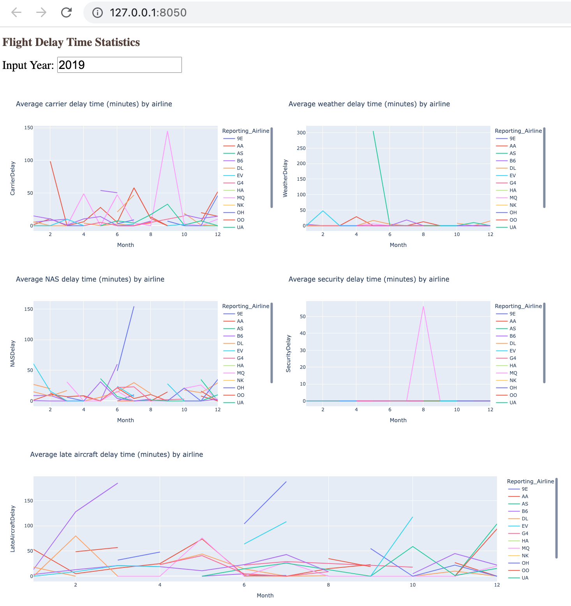


<br/>
<div align="right">
    <b><a href="#top">↥ back to top</a></b>
</div>
<br/>


### Dashboard Summary

- Best dashboards answer critical business questions. It will help business make informed decisions, thereby improving performance. 
- Dashboards can produce real-time visuals. 
- Plotly is an interactive, open-source plotting library that supports over 40 chart types. 
- The web based visualizations created using Plotly python can be displayed in Jupyter notebook, saved to standalone HTML files, or served as part of pure Python-built web applications using Dash. 
- Plotly Graph Objects is the low-level interface to figures, traces, and layout whereas plotly express is a high-level wrapper for Plotly. 
- Dash is an Open-Source User Interface Python library for creating reactive, web-based applications. It is both enterprise-ready and a first-class member of Plotly’s open-source tools. 
- Core and HTML are the two components of dash. 
- The dash_html_components library has a component for every HTML tag. 
- The dash_core_components describe higher-level components that are interactive and are generated with JavaScript, HTML, and CSS through the React.js library. 
- A callback function is a python function that is automatically called by Dash whenever an input component's property changes. Callback function is decorated with `@app.callback` decorator. 
- Callback decorator function takes two parameters: Input and Output. Input and Output to the callback function will have component id and component property. Multiple inputs or outputs should be enclosed inside either a list or tuple. 


<br/>
<div align="right">
    <b><a href="#top">↥ back to top</a></b>
</div>
<br/>

### Dash Auto Practice

```python
import pandas as pd
import dash
import dash_html_components as html
import dash_core_components as dcc
from dash.dependencies import Input, Output, State
import plotly.graph_objects as go
import plotly.express as px
from dash import no_update

app = dash.Dash(__name__)

# REVIEW1: Clear the layout and do not display exception till callback gets executed
app.config.suppress_callback_exceptions = True

# Read the automobiles data into pandas dataframe
auto_data =  pd.read_csv('automobileEDA.csv', 
                            encoding = "ISO-8859-1",
                            )

#Layout Section of Dash

app.layout = html.Div(children=[#TASK 3A
    html.H1('Car Automobile Components', 
            style={'textAlign': 'center', 
                    'color': '#503D36',
                    'font-size': 24}),
    #outer division starts
    html.Div([
        # First inner divsion for  adding dropdown helper text for Selected Drive wheels
        html.Div([
            #TASK 3B
            html.H2('Drive Wheels Type:', style={'margin-right': '2em'}),
        ]),

        #TASK 3C
        dcc.Dropdown(
            id='demo-dropdown',
            options=[
                    {'label': 'Rear Wheel Drive', 'value': 'rwd'},
                    {'label': 'Front Wheel Drive', 'value': 'fwd'},
                    {'label': 'Four Wheel Drive', 'value': '4wd'}
                ],
            value='rwd'
        ),
        #Second Inner division for adding 2 inner divisions for 2 output graphs 
        html.Div([
            #TASK 3D
            html.Div([ ], id='plot1'),
            html.Div([ ], id='plot2')

        ], style={'display': 'flex'}),


    ])
    #outer division ends

])
#layout ends

#Place to add @app.callback Decorator
#TASK 3E
@app.callback([Output(component_id='plot1', component_property='children'),
               Output(component_id='plot2', component_property='children')],
               Input(component_id='demo-dropdown', component_property='value'))
#Place to define the callback function .
#TASK 3F
def display_selected_drive_charts(value):
    filtered_df = auto_data[auto_data['drive-wheels']==value].\
        groupby(['drive-wheels','body-style'],as_index=False).mean()

    fig1 = px.pie(filtered_df, values='price', names='body-style', title="Pie Chart")
    fig2 = px.bar(filtered_df, x='body-style', y='price', title='Bar Chart')

    return [dcc.Graph(figure=fig1), dcc.Graph(figure=fig2)]


if __name__ == '__main__':
    app.run_server()
```

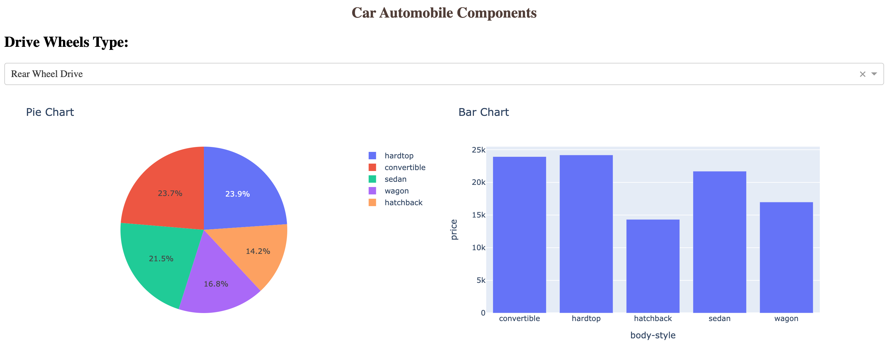

### Dash Airline

```python
# Import required libraries
import pandas as pd
import dash
import dash_html_components as html
import dash_core_components as dcc
from dash.dependencies import Input, Output, State
import plotly.graph_objects as go
import plotly.express as px
from dash import no_update


# Create a dash application
app = dash.Dash(__name__)

# REVIEW1: Clear the layout and do not display exception till callback gets executed
app.config.suppress_callback_exceptions = True

# Read the airline data into pandas dataframe
airline_data =  pd.read_csv('airline_data.csv', 
                            encoding = "ISO-8859-1",
                            dtype={'Div1Airport': str, 'Div1TailNum': str, 
                                   'Div2Airport': str, 'Div2TailNum': str})


# List of years 
year_list = [i for i in range(2005, 2021, 1)]

"""Compute graph data for creating yearly airline performance report 
Function that takes airline data as input and create 5 dataframes based on 
the grouping condition to be used for plotting charts and graphs.

Argument:
    df: Filtered dataframe
    
Returns:
   Dataframes to create graph. 
"""
def compute_data_choice_1(df):
    # Cancellation Category Count
    bar_data = df.groupby(['Month','CancellationCode'])['Flights'].sum().reset_index()
    # Average flight time by reporting airline
    line_data = df.groupby(['Month','Reporting_Airline'])['AirTime'].mean().reset_index()
    # Diverted Airport Landings
    div_data = df[df['DivAirportLandings'] != 0.0]
    # Source state count
    map_data = df.groupby(['OriginState'])['Flights'].sum().reset_index()
    # Destination state count
    tree_data = df.groupby(['DestState', 'Reporting_Airline'])['Flights'].sum().reset_index()
    return bar_data, line_data, div_data, map_data, tree_data


"""Compute graph data for creating yearly airline delay report
This function takes in airline data and selected year as an input 
and performs computation for creating charts and plots.

Arguments:
    df: Input airline data.
    
Returns:
    Computed average dataframes for carrier delay, weather delay, NAS delay, security delay, and late aircraft delay.
"""
def compute_data_choice_2(df):
    # Compute delay averages
    avg_car = df.groupby(['Month','Reporting_Airline'])['CarrierDelay'].mean().reset_index()
    avg_weather = df.groupby(['Month','Reporting_Airline'])['WeatherDelay'].mean().reset_index()
    avg_NAS = df.groupby(['Month','Reporting_Airline'])['NASDelay'].mean().reset_index()
    avg_sec = df.groupby(['Month','Reporting_Airline'])['SecurityDelay'].mean().reset_index()
    avg_late = df.groupby(['Month','Reporting_Airline'])['LateAircraftDelay'].mean().reset_index()
    return avg_car, avg_weather, avg_NAS, avg_sec, avg_late


# Application layout
app.layout = html.Div(children=
    [ 
        # TASK1: Add title to the dashboard
        # Enter your code below. Make sure you have correct formatting.

        html.H1('US Domestic Airline Flights Performance',
                style={'textAlign': 'center', 
                        'color': '#503D36', 
                        'font-size': 24}),

        # REVIEW2: Dropdown creation
        # Create an outer division 
        html.Div(
            [
                # Add an division
                html.Div(
                    [
                        # Create an division for adding dropdown helper text for report type
                        html.Div(
                            [
                                html.H2('Report Type:', style={'margin-right': '2em'}),
                            ]
                        ),
                        # TASK2: Add a dropdown
                        # Enter your code below. Make sure you have correct formatting.
                        dcc.Dropdown(
                            id='input-type',
                            options=[
                                    {'label': 'Yearly Airline Performance Report', 'value': 'OPT1'},
                                    {'label': 'Yearly Airline Delay Report', 'value': 'OPT2'}
                                ],
                            placeholder='Select a report type',
                            style={'width': '80%', 'padding': '3px', 'font-size': '20px', 'text-align-last': 'center'}
                        ),
                    # Place them next to each other using the division style
                    ], 
                    style={'display':'flex'}
                ),
                
                # Add next division 
                html.Div(
                    [
                        # Create an division for adding dropdown helper text for choosing year
                        html.Div(
                            [
                                html.H2('Choose Year:', style={'margin-right': '2em'})
                            ]
                        ),
                        dcc.Dropdown(
                            id='input-year', 
                            # Update dropdown values using list comphrehension
                            options=[{'label': i, 'value': i} for i in year_list],
                            placeholder="Select a year",
                            style={'width':'80%', 'padding':'3px', 'font-size': '20px', 'text-align-last' : 'center'}),
                            # Place them next to each other using the division style
                    ], 
                    style={'display': 'flex'}
                ),  
            ]
        ),
        
        # Add Computed graphs
        # REVIEW3: Observe how we add an empty division and providing an id that will be updated during callback
        html.Div([ ], id='plot1'),

        html.Div(
            [
                html.Div([ ], id='plot2'),
                html.Div([ ], id='plot3')
            ], 
            style={'display': 'flex'}
        ),
        
        # TASK3: Add a division with two empty divisions inside. See above disvision for example.
        # Enter your code below. Make sure you have correct formatting.
        html.Div(
            [
                html.Div([ ], id='plot4'),
                html.Div([ ], id='plot5')
            ], 
            style={'display': 'flex'}
        ),   
    ])

# Callback function definition
# TASK4: Add 5 ouput components
# Enter your code below. Make sure you have correct formatting.
@app.callback( 
    [
        Output(component_id='plot1', component_property='children'),
        Output(component_id='plot2', component_property='children'),
        Output(component_id='plot3', component_property='children'),
        Output(component_id='plot4', component_property='children'),
        Output(component_id='plot5', component_property='children')
    ],
    [
        Input(component_id='input-type', component_property='value'),
        Input(component_id='input-year', component_property='value')
    ],
    # REVIEW4: Holding output state till user enters all the form information. In this case, it will be chart type and year
    [
        State("plot1", 'children'), 
        State("plot2", "children"),
        State("plot3", "children"), 
        State("plot4", "children"),
        State("plot5", "children")
    ])
# Add computation to callback function and return graph
def get_graph(chart, year, children1, children2, c3, c4, c5):
      
        # Select data
        df =  airline_data[airline_data['Year']==int(year)]
       
        if chart == 'OPT1':
            # Compute required information for creating graph from the data
            bar_data, line_data, div_data, map_data, tree_data = compute_data_choice_1(df)
            
            # Number of flights under different cancellation categories
            bar_fig = px.bar(bar_data, x='Month', y='Flights', color='CancellationCode', 
                    title='Monthly Flight Cancellation')
            
            # TASK5: Average flight time by reporting airline
            # Enter your code below. Make sure you have correct formatting.
            line_fig = px.line(line_data, x='Month', y='AirTime', color='Reporting_Airline', 
                    title='Average monthly flight time (minutes) by airline')
            
            # Percentage of diverted airport landings per reporting airline
            pie_fig = px.pie(div_data, 
                    values='Flights', 
                    names='Reporting_Airline', 
                    title='% of flights by reporting airline'
                )
            
            # REVIEW5: Number of flights flying from each state using choropleth
            map_fig = px.choropleth(map_data,  # Input data
                    locations='OriginState', 
                    color='Flights',  
                    hover_data=['OriginState', 'Flights'], 
                    locationmode = 'USA-states', # Set to plot as US States
                    color_continuous_scale='GnBu',
                    range_color=[0, map_data['Flights'].max()]
                ) 

            map_fig.update_layout(
                    title_text = 'Number of flights from origin state', 
                    geo_scope='usa'
                ) # Plot only the USA instead of globe
            
            # TASK6: Number of flights flying to each state from each reporting airline
            # Enter your code below. Make sure you have correct formatting.
            tree_fig = px.treemap(tree_data, path=['DestState', 'Reporting_Airline'], 
                    values='Flights',
                    color='Flights',
                    color_continuous_scale='RdBu',
                    title='Flight count by airline to destination state'
                )
            
            
            # REVIEW6: Return dcc.Graph component to the empty division
            return [dcc.Graph(figure=tree_fig), 
                    dcc.Graph(figure=pie_fig),
                    dcc.Graph(figure=map_fig),
                    dcc.Graph(figure=bar_fig),
                    dcc.Graph(figure=line_fig)
                   ]
        else:
            # REVIEW7: This covers chart type 2 and we have completed this exercise under Flight Delay Time Statistics Dashboard section
            # Compute required information for creating graph from the data
            avg_car, avg_weather, avg_NAS, avg_sec, avg_late = compute_data_choice_2(df)
            
            # Create graph
            carrier_fig = px.line(avg_car, x='Month', y='CarrierDelay', color='Reporting_Airline', title='Average carrrier delay time (minutes) by airline')
            weather_fig = px.line(avg_weather, x='Month', y='WeatherDelay', color='Reporting_Airline', title='Average weather delay time (minutes) by airline')
            nas_fig = px.line(avg_NAS, x='Month', y='NASDelay', color='Reporting_Airline', title='Average NAS delay time (minutes) by airline')
            sec_fig = px.line(avg_sec, x='Month', y='SecurityDelay', color='Reporting_Airline', title='Average security delay time (minutes) by airline')
            late_fig = px.line(avg_late, x='Month', y='LateAircraftDelay', color='Reporting_Airline', title='Average late aircraft delay time (minutes) by airline')
            
            return[dcc.Graph(figure=carrier_fig), 
                   dcc.Graph(figure=weather_fig), 
                   dcc.Graph(figure=nas_fig), 
                   dcc.Graph(figure=sec_fig), 
                   dcc.Graph(figure=late_fig)]


# Run the app
if __name__ == '__main__':
    app.run_server()
```

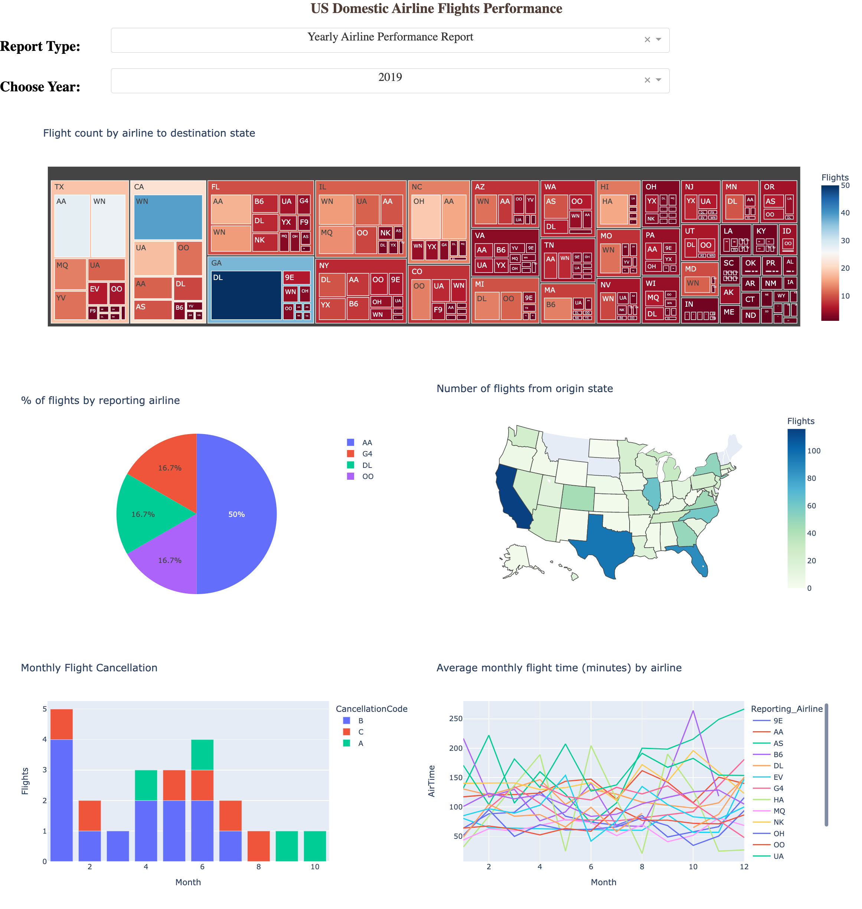


<br/>
<div align="right">
    <b><a href="#top">↥ back to top</a></b>
</div>
<br/>

