# Machine Learning with Python  <!-- omit in toc -->

- [Introduction to Machine Learning](#introduction-to-machine-learning)
- [Regression](#regression)
  - [Simple Linear Regression](#simple-linear-regression)
    - [Model Evaluation in Regression Models](#model-evaluation-in-regression-models)
    - [Evaluation Metrics](#evaluation-metrics)
    - [Jupyter Notebook: Simple Linear Regression](#jupyter-notebook-simple-linear-regression)
  - [Multiple Linear Regression](#multiple-linear-regression)
    - [Jupyter Notebook: Multiple Linear Regression](#jupyter-notebook-multiple-linear-regression)
  - [Non-Linear Regression](#non-linear-regression)
    - [Jupyter Notebook: Non-Linear Regression](#jupyter-notebook-non-linear-regression)

## Introduction to Machine Learning

**Learning Objectives**:
- Give examples of Machine Learning in various industries.
- Outline the steps machine learning uses to solve problems.
- Provide examples of various techniques used in machine learning.
- Describe the Python libraries for Machine Learning.
- Explain the differences between Supervised and Unsupervised algorithms.
- Describe the capabilities of various algorithms.


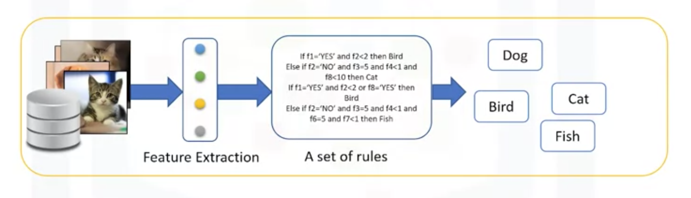

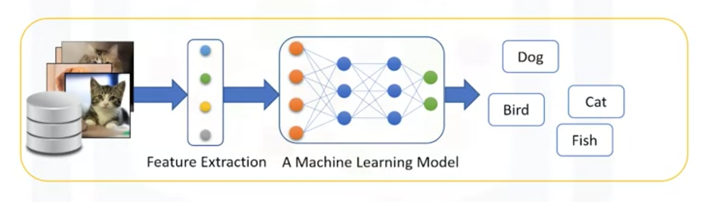


>Machine learning is the subfield of computer science that gives "computers the ability to learn **without being explicitly programmed**.”

In essence, machine learning follows the same process that a 4-year-old child uses to learn, understand, and differentiate animals. So, machine learning algorithms, inspired by the human learning process, iteratively learn from data, and allow computers to find hidden insights.


- How do you think Netflix and Amazon recommend videos, movies, and TV shows to its users? They use Machine Learning to produce suggestions that you might enjoy! This is similar to how your friends might recommend a television show to you, based on their knowledge of the types of shows you like to watch. 
- How do you think banks make a decision when approving a loan application? They use machine learning to predict the probability of default for each applicant, and then approve or refuse the loan application based on that probability. 
- Telecommunication companies use their customers’ demographic data to segment them, or predict if they will unsubscribe from their company the next month.


**Major machine learning techniques**:

| techniques | applications |
| :--: | :-- |
| Regression/Estimation | Predicting continuous values |
| Classification | Predicting the item class/category of a case |
| Clustering | Finding the structure of data; summarization |
| Associations | Associating frequent co-occurring items/events |
| Anomaly detection | Discovering abnormal and unusual cases |
| Sequence mining | Predicting next events; click-stream (Markov Model, HMM) |
| Dimension Reduction | Reducing the size of data (PCA) |
| Recommendation systems | Recommending items |


>“What is the difference between these buzzwords that we keep hearing these days, such as Artificial intelligence (or AI), Machine Learning and Deep Learning?” 

- In brief, **AI** tries to make computers intelligent in order to mimic the cognitive functions of humans. So, Artificial Intelligence is a general field with a broad scope including: Computer Vision, Language Processing, Creativity, and Summarization. 
- **Machine Learning** is the branch of AI that covers the statistical part of artificial intelligence. It teaches the computer to solve problems by looking at hundreds or thousands of examples, learning from them, and then using that experience to solve the same problem in new situations. 
- **Deep Learning** is a very special field of Machine Learning where computers can actually learn and make intelligent decisions on their own. Deep learning involves a deeper level of automation in comparison with most machine learning algorithms.

**Supervised vs. Unsupervised Learning**

- There are two types of supervised learning techniques. They are classification, and regression. **Classification** is the process of predicting a discrete class label, or category. **Regression** is the process of predicting a continuous value as opposed to predicting a categorical value in classification.
- The unsupervised algorithm trains on the dataset, and draws conclusions on unlabeled data. Generally speaking, unsupervised learning has more difficult algorithms than supervised learning since we know little to no information about the data, or the outcomes that are to be expected. Dimension reduction, density estimation, market basket analysis, and clustering are the most widely used unsupervised machine learning techniques.

<br/>
<div align="right">
    <b><a href="#top">↥ back to top</a></b>
</div>
<br/>

## Regression

Regression algorithms:

- Ordinal regression
- Poisson regression
- Fast forest quantile regression
- Linear, Polynomial, Lasso, Stepwise, Ridge regression
- Bayesian linear regression
- Neural network regression
- Decision forest regression
- Boosted decision tree regression
- KNN (K-nearest neighbors)

### Simple Linear Regression

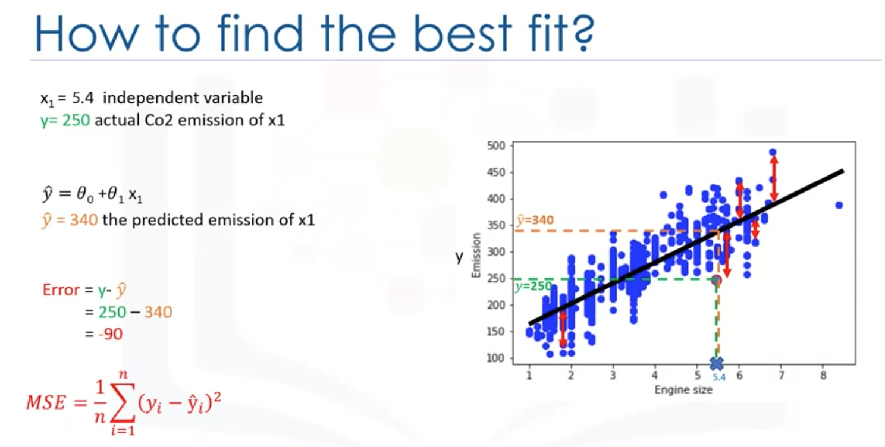

How to find the best parameters for the line: (two options)
- use a mathematic approach
- use an optimization approach

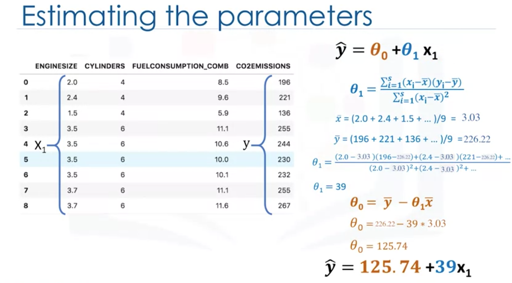

#### Model Evaluation in Regression Models

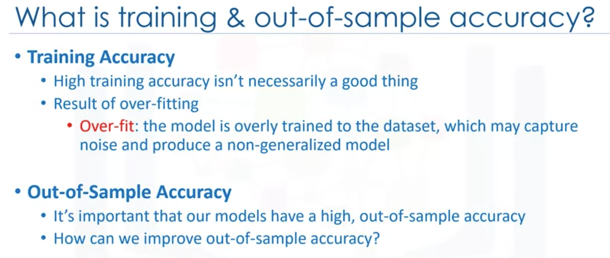

- Ensure that you train your model with the testing set afterwards, as you don't want to lose potentially valuable data. The issue with train/test split is that it's highly dependent on the datasets on which the data was trained and tested. 
- The variation of this causes train/test split to have a better **out-of-sample prediction** than training and testing on the same dataset, but it still has some problems due to this dependency.
- Another evaluation model, called **K-fold cross-validation**, resolves most of these issues.


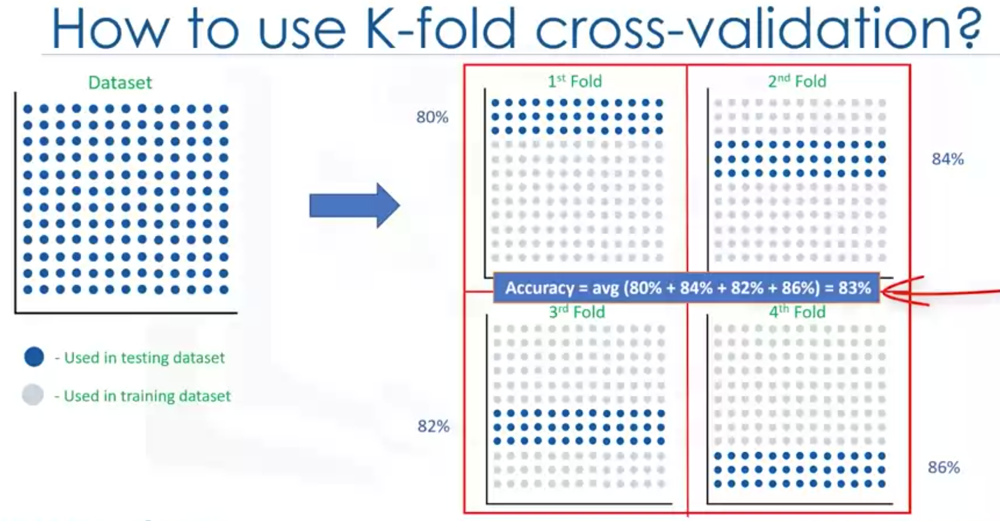

#### Evaluation Metrics

Evaluation metrics are used to explain the performance of a model. 

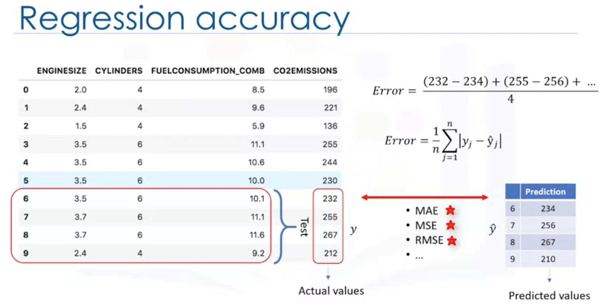


- **Mean Squared Error** is the mean of the squared error. It's more popular than Mean Absolute Error because the focus is geared more towards large errors. This is due to the squared term, exponentially increasing larger errors in comparison to smaller ones. 
- **Root Mean Squared Error** is the square root of the mean squared error. This is one of the most popular of the evaluation metrics because Root Mean Squared Error is interpretable in the same units as the response vector or Y units, making it easy to relate its information. 
- **R-squared** is not an error per se but is a popular metric for the accuracy of your model. It represents how close the data values are to the fitted regression line. The higher the R-squared, the better the model fits your data. Each of these metrics can be used for quantifying of your prediction. The choice of metric completely depends on the type of model your data type and domain of knowledge.


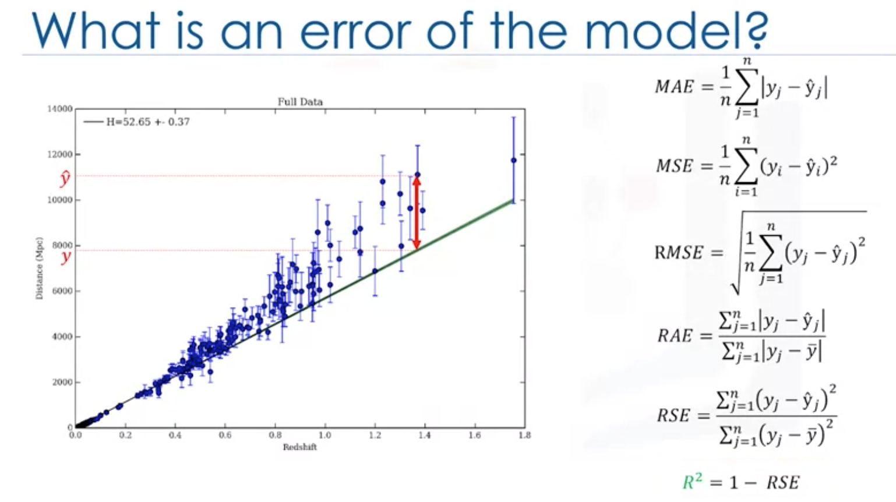

#### [Jupyter Notebook: Simple Linear Regression](res/NB1-Simple-Linear-Regression-Co2.ipynb)


<br/>
<div align="right">
    <b><a href="#top">↥ back to top</a></b>
</div>
<br/>


### Multiple Linear Regression

Estimating multiple linear regression parameters:
- How to estimate *θ*?
  - Ordinary Least Squares
    - Linear algebra operations
    - Takes a long time for large datasets (10k+ rows)
  - An optimization algorithm
    - Gradient Descent
    - Proper approach if you have a very large dataset

Questions:
- How to determine whether to use simple or multiple linear regression?
- How many independent variables should you use?
- Should the independent variable be continuous?
- What are the linear relationships between the dependent variable and the independent variables?

See also: [How to Choose a Feature Selection Method For Machine Learning](https://machinelearningmastery.com/feature-selection-with-real-and-categorical-data/)


#### [Jupyter Notebook: Multiple Linear Regression](res/NB2-Mulitple-Linear-Regression-Co2.ipynb)

<br/>
<div align="right">
    <b><a href="#top">↥ back to top</a></b>
</div>
<br/>


### Non-Linear Regression


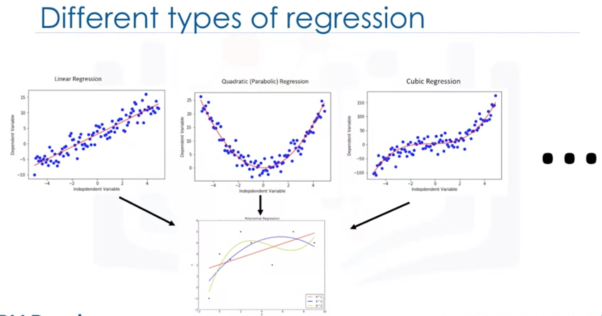

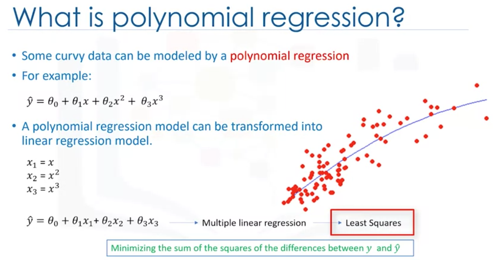

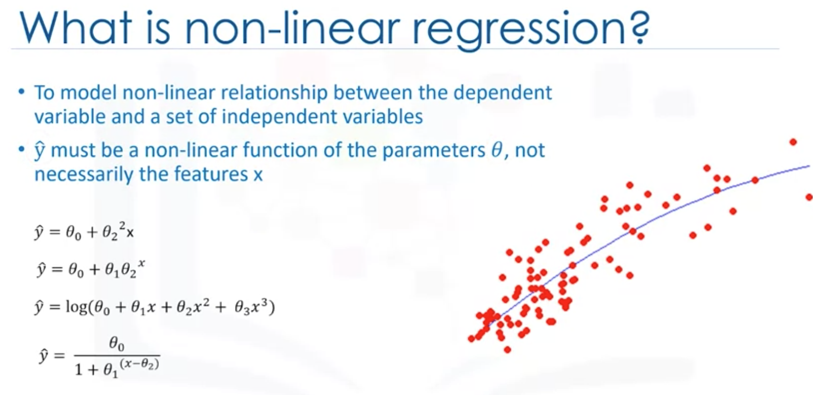


**How can I know if a problem is linear or non-linear in an easy way?**
- Firstly **visually** figure out if the relation is linear or non-linear. It's best to plot bivariate plots of output variables with each input variable. Also, you can calculate the **correlation coefficient** between independent and dependent variables, and if, for all variables, it is 0.7 or higher, there is a linear tendency and thus, it's not appropriate to fit a non-linear regression. 
- Secondly we have to do is to use non-linear regression instead of linear regression when we cannot accurately model the relationship with linear parameters. 

**How should I model my data if it displays non-linear on a scatter plot?**
- You have to use either a polynomial regression, use a non-linear regression model, or transform your data.

See also: [Data Analysis with Python](../c07-data-analysis-with-python/readme.md#polynomial-regression-and-pipelines)


```python
import matplotlib.pyplot as plt
import pandas as pd
import pylab as pl
import numpy as np
%matplotlib inline

from sklearn.preprocessing import PolynomialFeatures
from sklearn import linear_model
from sklearn.metrics import r2_score

# read dataset
df = pd.read_csv("FuelConsumptionCo2.csv")
cdf = df[['ENGINESIZE','CYLINDERS','FUELCONSUMPTION_COMB','CO2EMISSIONS']]
# cdf.head()

# split dataset
msk = np.random.rand(len(df)) < 0.8
train = cdf[msk]
test = cdf[~msk]

train_x = np.asanyarray(train[['ENGINESIZE']])
train_y = np.asanyarray(train[['CO2EMISSIONS']])

test_x = np.asanyarray(test[['ENGINESIZE']])
test_y = np.asanyarray(test[['CO2EMISSIONS']])

# polynomial regression (transform first)
poly = PolynomialFeatures(degree=2)
train_x_poly = poly.fit_transform(train_x)
# train_x_poly

# linear regression
clf = linear_model.LinearRegression()
train_y_ = clf.fit(train_x_poly, train_y)

# The coefficients
print ('Coefficients: ', clf.coef_)
print ('Intercept: ',clf.intercept_)

# plot
plt.scatter(train.ENGINESIZE, train.CO2EMISSIONS,  color='blue')
XX = np.arange(0.0, 10.0, 0.1)
yy = clf.intercept_[0]+ clf.coef_[0][1]*XX+ clf.coef_[0][2]*np.power(XX, 2)
plt.plot(XX, yy, '-r' )
plt.xlabel("Engine size")
plt.ylabel("Emission")

# test
test_x_poly = poly.transform(test_x)
test_y_ = clf.predict(test_x_poly)

print("Mean absolute error: %.2f" % np.mean(np.absolute(test_y_ - test_y)))
print("Residual sum of squares (MSE): %.2f" % np.mean((test_y_ - test_y) ** 2))
print("R2-score: %.2f" % r2_score(test_y,test_y_ ) )
```

    Coefficients:  [[ 0.         51.79906437 -1.70908836]]
    Intercept:  [104.94682631]
    Mean absolute error: 24.32
    Residual sum of squares (MSE): 936.39
    R2-score: 0.77


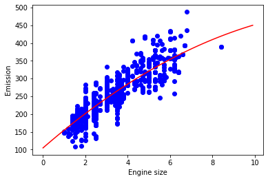

#### [Jupyter Notebook: Non-Linear Regression](res/NB3-Polynomial-Regression-Co2.ipynb)


<br/>
<div align="right">
    <b><a href="#top">↥ back to top</a></b>
</div>
<br/>


<br/>
<div align="right">
    <b><a href="#top">↥ back to top</a></b>
</div>
<br/>


