# Machine Learning with Python  <!-- omit in toc -->

- [Introduction to Machine Learning](#introduction-to-machine-learning)
- [Regression](#regression)
  - [Simple Linear Regression](#simple-linear-regression)
    - [Model Evaluation in Regression Models](#model-evaluation-in-regression-models)
    - [Evaluation Metrics](#evaluation-metrics)
    - [Jupyter Notebook: Simple Linear Regression](#jupyter-notebook-simple-linear-regression)
  - [Multiple Linear Regression](#multiple-linear-regression)
    - [Jupyter Notebook: Multiple Linear Regression](#jupyter-notebook-multiple-linear-regression)
  - [Non-Linear Regression](#non-linear-regression)
    - [Jupyter Notebook: Polynomial Regression](#jupyter-notebook-polynomial-regression)
    - [Jupyter Notebook: Non-Linear Regression](#jupyter-notebook-non-linear-regression)
- [Classification](#classification)
  - [k-Nearest Neighbors algorithm](#k-nearest-neighbors-algorithm)
    - [Jupyter Notebook: k-Nearest Neighbors](#jupyter-notebook-k-nearest-neighbors)
  - [Evaluation Metrics in Classification](#evaluation-metrics-in-classification)
    - [Jaccard Index](#jaccard-index)
    - [F1 Score](#f1-score)
    - [Log Loss](#log-loss)
  - [Decision Trees](#decision-trees)
    - [Entropy](#entropy)
    - [Information Gain)](#information-gain)
    - [Jupyter Notebook: Decision Trees](#jupyter-notebook-decision-trees)
  - [Logistic Regression](#logistic-regression)
    - [Gradient Descent](#gradient-descent)
    - [Jupyter Notebook: Logistic Regression](#jupyter-notebook-logistic-regression)
  - [Support Vector Machine](#support-vector-machine)
    - [Kernel methods](#kernel-methods)
    - [Jupyter Notebook: SVM](#jupyter-notebook-svm)
- [Clustering](#clustering)
- [Recommender Systems](#recommender-systems)

## Introduction to Machine Learning

**Learning Objectives**:
- Give examples of Machine Learning in various industries.
- Outline the steps machine learning uses to solve problems.
- Provide examples of various techniques used in machine learning.
- Describe the Python libraries for Machine Learning.
- Explain the differences between Supervised and Unsupervised algorithms.
- Describe the capabilities of various algorithms.


>Machine learning is the subfield of computer science that gives "computers the ability to learn **without being explicitly programmed**.”

In essence, machine learning follows the same process that a 4-year-old child uses to learn, understand, and differentiate animals. So, machine learning algorithms, inspired by the human learning process, iteratively learn from data, and allow computers to find hidden insights.


- How do you think Netflix and Amazon recommend videos, movies, and TV shows to its users? They use Machine Learning to produce suggestions that you might enjoy! This is similar to how your friends might recommend a television show to you, based on their knowledge of the types of shows you like to watch. 
- How do you think banks make a decision when approving a loan application? They use machine learning to predict the probability of default for each applicant, and then approve or refuse the loan application based on that probability. 
- Telecommunication companies use their customers’ demographic data to segment them, or predict if they will unsubscribe from their company the next month.


**Major machine learning techniques**:

| techniques | applications |
| :--: | :-- |
| Regression/Estimation | Predicting continuous values |
| Classification | Predicting the item class/category of a case |
| Clustering | Finding the structure of data; summarization |
| Associations | Associating frequent co-occurring items/events |
| Anomaly detection | Discovering abnormal and unusual cases |
| Sequence mining | Predicting next events; click-stream (Markov Model, HMM) |
| Dimension Reduction | Reducing the size of data (PCA) |
| Recommendation systems | Recommending items |


>“What is the difference between these buzzwords that we keep hearing these days, such as Artificial intelligence (or AI), Machine Learning and Deep Learning?” 

- In brief, **AI** tries to make computers intelligent in order to mimic the cognitive functions of humans. So, Artificial Intelligence is a general field with a broad scope including: Computer Vision, Language Processing, Creativity, and Summarization. 
- **Machine Learning** is the branch of AI that covers the statistical part of artificial intelligence. It teaches the computer to solve problems by looking at hundreds or thousands of examples, learning from them, and then using that experience to solve the same problem in new situations. 
- **Deep Learning** is a very special field of Machine Learning where computers can actually learn and make intelligent decisions on their own. Deep learning involves a deeper level of automation in comparison with most machine learning algorithms.

**Supervised vs. Unsupervised Learning**

- There are two types of supervised learning techniques. They are classification, and regression. **Classification** is the process of predicting a discrete class label, or category. **Regression** is the process of predicting a continuous value as opposed to predicting a categorical value in classification.
- The unsupervised algorithm trains on the dataset, and draws conclusions on unlabeled data. Generally speaking, unsupervised learning has more difficult algorithms than supervised learning since we know little to no information about the data, or the outcomes that are to be expected. Dimension reduction, density estimation, market basket analysis, and clustering are the most widely used unsupervised machine learning techniques.

<br/>
<div align="right">
    <b><a href="#top">↥ back to top</a></b>
</div>
<br/>

## Regression

Learning Objectives:

- Demonstrate understanding of the basics of regression.
- Demonstrate understanding of simple linear regression.
- Describe approaches for evaluating regression models.
- Describe evaluation metrics for determining accuracy of regression models.
- Demonstrate understanding of multiple linear regression.
- Demonstrate understanding of non-linear regression.
- Apply Simple and Multiple, Linear Regression on a dataset for estimation.

Regression algorithms:

- Ordinal regression
- Poisson regression
- Fast forest quantile regression
- Linear, Polynomial, Lasso, Stepwise, Ridge regression
- Bayesian linear regression
- Neural network regression
- Decision forest regression
- Boosted decision tree regression
- KNN (K-nearest neighbors)

### Simple Linear Regression


How to find the best parameters for the line: (two options)
- use a mathematic approach
- use an optimization approach


#### Model Evaluation in Regression Models


- Ensure that you train your model with the testing set afterwards, as you don't want to lose potentially valuable data. The issue with train/test split is that it's highly dependent on the datasets on which the data was trained and tested. 
- The variation of this causes train/test split to have a better **out-of-sample prediction** than training and testing on the same dataset, but it still has some problems due to this dependency.
- Another evaluation model, called **K-fold cross-validation**, resolves most of these issues.


#### Evaluation Metrics

Evaluation metrics are used to explain the performance of a model. 


- **Mean Squared Error** is the mean of the squared error. It's more popular than Mean Absolute Error because the focus is geared more towards large errors. This is due to the squared term, exponentially increasing larger errors in comparison to smaller ones. 
- **Root Mean Squared Error** is the square root of the mean squared error. This is one of the most popular of the evaluation metrics because Root Mean Squared Error is interpretable in the same units as the response vector or Y units, making it easy to relate its information. 
- **R-squared** is not an error per se but is a popular metric for the accuracy of your model. It represents how close the data values are to the fitted regression line. The higher the R-squared, the better the model fits your data. Each of these metrics can be used for quantifying of your prediction. The choice of metric completely depends on the type of model your data type and domain of knowledge.


#### [Jupyter Notebook: Simple Linear Regression](res/NB1-Simple-Linear-Regression-Co2.ipynb)


<br/>
<div align="right">
    <b><a href="#top">↥ back to top</a></b>
</div>
<br/>


### Multiple Linear Regression

Estimating multiple linear regression parameters:
- How to estimate *θ*?
  - Ordinary Least Squares
    - Linear algebra operations
    - Takes a long time for large datasets (10k+ rows)
  - An optimization algorithm
    - Gradient Descent
    - Proper approach if you have a very large dataset

Questions:
- How to determine whether to use simple or multiple linear regression?
- How many independent variables should you use?
- Should the independent variable be continuous?
- What are the linear relationships between the dependent variable and the independent variables?

See also: [How to Choose a Feature Selection Method For Machine Learning](https://machinelearningmastery.com/feature-selection-with-real-and-categorical-data/)


#### [Jupyter Notebook: Multiple Linear Regression](res/NB2-Mulitple-Linear-Regression-Co2.ipynb)

<br/>
<div align="right">
    <b><a href="#top">↥ back to top</a></b>
</div>
<br/>


### Non-Linear Regression


**How can I know if a problem is linear or non-linear in an easy way?**
- Firstly **visually** figure out if the relation is linear or non-linear. It's best to plot bivariate plots of output variables with each input variable. Also, you can calculate the **correlation coefficient** between independent and dependent variables, and if, for all variables, it is 0.7 or higher, there is a linear tendency and thus, it's not appropriate to fit a non-linear regression. 
- Secondly we have to do is to use non-linear regression instead of linear regression when we cannot accurately model the relationship with linear parameters. 

**How should I model my data if it displays non-linear on a scatter plot?**
- You have to use either a polynomial regression, use a non-linear regression model, or transform your data.

See also: [Data Analysis with Python](../c07-data-analysis-with-python/readme.md#polynomial-regression-and-pipelines)


#### [Jupyter Notebook: Polynomial Regression](res/NB3-Polynomial-Regression-Co2.ipynb)


```python
import matplotlib.pyplot as plt
import pandas as pd
import pylab as pl
import numpy as np
%matplotlib inline

from sklearn.preprocessing import PolynomialFeatures
from sklearn import linear_model
from sklearn.metrics import r2_score

# read dataset
df = pd.read_csv("FuelConsumptionCo2.csv")
cdf = df[['ENGINESIZE','CYLINDERS','FUELCONSUMPTION_COMB','CO2EMISSIONS']]
# cdf.head()

# split dataset
msk = np.random.rand(len(df)) < 0.8
train = cdf[msk]
test = cdf[~msk]

train_x = np.asanyarray(train[['ENGINESIZE']])
train_y = np.asanyarray(train[['CO2EMISSIONS']])

test_x = np.asanyarray(test[['ENGINESIZE']])
test_y = np.asanyarray(test[['CO2EMISSIONS']])

# polynomial regression (transform first)
poly = PolynomialFeatures(degree=2)
train_x_poly = poly.fit_transform(train_x)
# train_x_poly

# linear regression
clf = linear_model.LinearRegression()
train_y_ = clf.fit(train_x_poly, train_y)

# The coefficients
print ('Coefficients: ', clf.coef_)
print ('Intercept: ',clf.intercept_)

# plot
plt.scatter(train.ENGINESIZE, train.CO2EMISSIONS,  color='blue')
XX = np.arange(0.0, 10.0, 0.1)
yy = clf.intercept_[0]+ clf.coef_[0][1]*XX+ clf.coef_[0][2]*np.power(XX, 2)
plt.plot(XX, yy, '-r' )
plt.xlabel("Engine size")
plt.ylabel("Emission")

# test
test_x_poly = poly.transform(test_x)
test_y_ = clf.predict(test_x_poly)

print("Mean absolute error: %.2f" % np.mean(np.absolute(test_y_ - test_y)))
print("Residual sum of squares (MSE): %.2f" % np.mean((test_y_ - test_y) ** 2))
print("R2-score: %.2f" % r2_score(test_y,test_y_ ) )
```

    Coefficients:  [[ 0.         51.79906437 -1.70908836]]
    Intercept:  [104.94682631]
    Mean absolute error: 24.32
    Residual sum of squares (MSE): 936.39
    R2-score: 0.77


#### [Jupyter Notebook: Non-Linear Regression](res/NB4-NoneLinearRegression.ipynb)

```python
import numpy as np
import matplotlib.pyplot as plt
%matplotlib inline

import pandas as pd
from scipy.optimize import curve_fit
from sklearn.metrics import r2_score

df = pd.read_csv("china_gdp.csv")
# df.head(10)

# choose model
def sigmoid(x, Beta_1, Beta_2):
     y = 1 / (1 + np.exp(-Beta_1*(x-Beta_2)))
     return y

# normalize data
x_data, y_data = (df["Year"].values, df["Value"].values)
xdata =x_data/max(x_data)
ydata =y_data/max(y_data)


# build the model using train set
popt, pcov = curve_fit(sigmoid, xdata, ydata)

# plot
x = np.linspace(1960, 2015, 55)
x = x/max(x)
plt.figure(figsize=(8,5))
y = sigmoid(x, *popt)
plt.plot(xdata, ydata, 'ro', label='data')
plt.plot(x,y, linewidth=3.0, label='fit')
plt.legend(loc='best')
plt.ylabel('GDP')
plt.xlabel('Year')
plt.show()
```

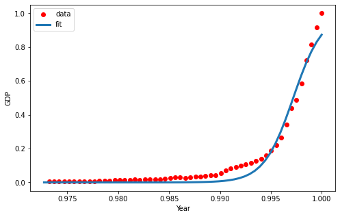


<br/>
<div align="right">
    <b><a href="#top">↥ back to top</a></b>
</div>
<br/>

## Classification

Learning Objectives:

- Compare and contrast the characteristics of different Classification methods.
- Explain how to apply the K Nearest Neighbors algorithm.
- Describe model evaluation metrics.
- Describe how a decision tree works.
- Outline how to build a decision tree.
- Explain the capabilities of logistic regression.
- Compare and contrast linear regression with logistic regression.
- Explain how to change the parameters of a logistic regression model.
- Describe the cost function and gradient descent in logistic regression.
- Provide an overview of the Support Vector Machine method.
- Apply Classification algorithms on various datasets to solve real world problems.

Classification algorithms:

- Decision Trees (ID3, C4.5, C5.0)
- Naive Bayes
- Linear Discriminant Analysis
- k-Nearest Neighbors
- Logistic Regression
- Neural Networks
- Support Vector Machines (SVM)

### k-Nearest Neighbors algorithm

1. Pick a value for `k`
2. Calculate the distance of unknown case from all cases
3. Select the k-observations in the training data that are "nearest" to the unknown data point
4. Predict the response of the unknown data point using the most popular response value from the k-nearest neighbors

How can we find the best value for `k`?

- A low value of `k` causes a highly complex model as well, which might result in overfitting of the model.
- If we choose a very high value of `k` such as `k` equals 20, then the model becomes overly generalized.
- The general solution is to reserve a part of your data for testing the accuracy of the model and iterate `k` starting from one to find the best accuracy.


#### [Jupyter Notebook: k-Nearest Neighbors](res/NB5-K-Nearest-neighbors.ipynb)


<br/>
<div align="right">
    <b><a href="#top">↥ back to top</a></b>
</div>
<br/>


### Evaluation Metrics in Classification

#### Jaccard Index

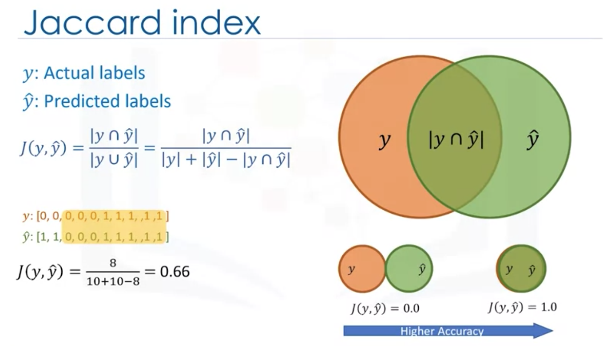

#### F1 Score

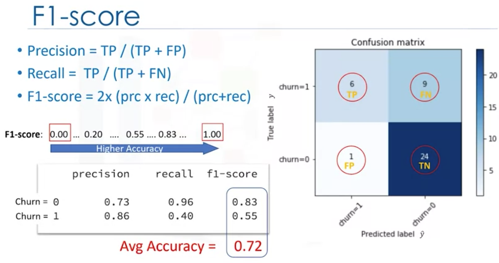

#### Log Loss

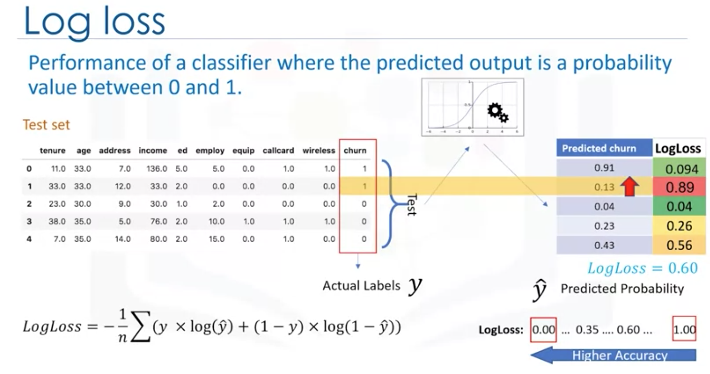

<br/>
<div align="right">
    <b><a href="#top">↥ back to top</a></b>
</div>
<br/>


### Decision Trees

- Decision trees are built by splitting the training set into distinct nodes, where one node contains all of or most of one category of the data. 
- Decision trees are about testing an attribute and branching the cases based on the result of the test. 
- Each internal node corresponds to a test, and each branch corresponds to a result of the test, and each leaf node assigns classification.


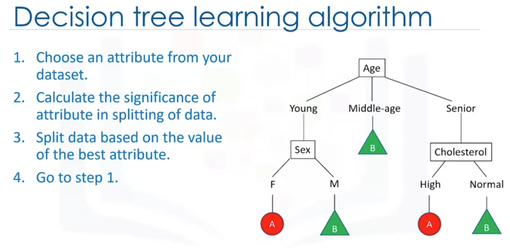

- Decision trees are built using recursive partitioning to classify the data. The algorithm chooses the **most predictive feature** to split the data on. What is important in making a decision tree, is to determine which attribute is the best or more predictive to split data based on the feature. Indeed, **predictiveness** is based on decrease in **impurity of nodes**.
- The choice of attribute to split data is very important and it is all about purity of the leaves after the split. A node in the tree is considered **pure** if in 100% of the cases, the nodes fall into a specific category of the target field. 
- In fact, the method uses **recursive partitioning** to split the training records into segments by minimizing the impurity at each step. Impurity of nodes is calculated by **entropy** of data in the node. 

#### Entropy

- **Entropy** is the amount of information **disorder** or the amount of **randomness** in the data. The entropy in the node depends on how much random data is in that node and is calculated for each node. 
- In decision trees, we're looking for trees that have the **smallest entropy** in their nodes. The entropy is used to calculate the **homogeneity** of the samples in that node. If the samples are completely homogeneous, the entropy is zero and if the samples are equally divided it has an entropy of one.


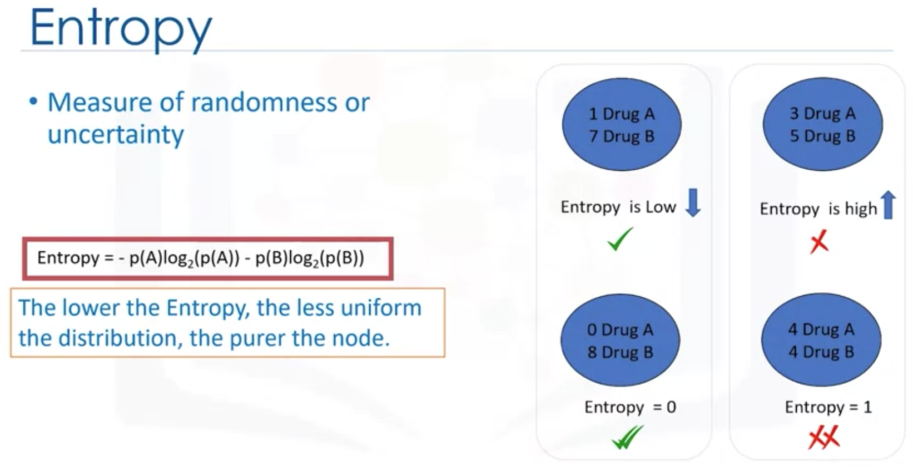

In which tree do we have less entropy after splitting rather than before splitting? The answer is the tree with the higher information gain after splitting.

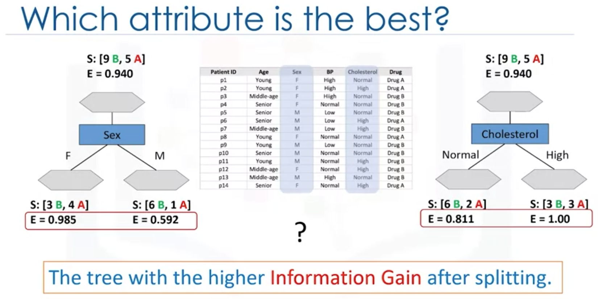


 #### [Information Gain](https://en.wikipedia.org/wiki/Information_gain_(decision_tree))
 
>[Information gain](https://machinelearningmastery.com/information-gain-and-mutual-information/) is the information that can increase the level of certainty after splitting. It is the entropy of a tree before the split minus the weighted entropy after the split by an attribute. We can think of information gain and entropy as opposites. As entropy or the amount of randomness decreases, the information gain or amount of certainty increases and vice versa. So, constructing a decision tree is all about finding attributes that return the highest information gain.

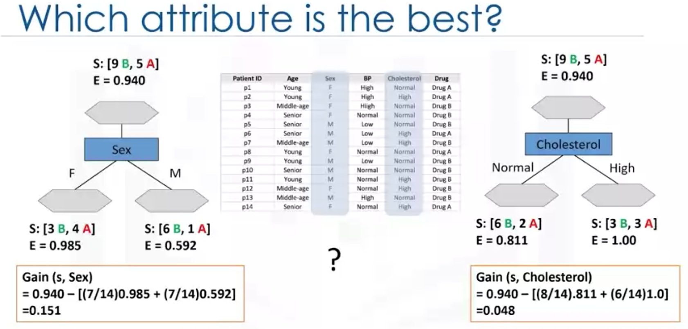

```python
import numpy as np 
import pandas as pd
from sklearn.tree import DecisionTreeClassifier
import sklearn.tree as tree
from sklearn import preprocessing

# load data
my_data = pd.read_csv("drug200.csv", delimiter=",")
X = my_data[['Age', 'Sex', 'BP', 'Cholesterol', 'Na_to_K']].values
y = my_data["Drug"]

# preprocess data
le_sex = preprocessing.LabelEncoder()
le_sex.fit(['F','M'])
X[:,1] = le_sex.transform(X[:,1]) 

le_BP = preprocessing.LabelEncoder()
le_BP.fit([ 'LOW', 'NORMAL', 'HIGH'])
X[:,2] = le_BP.transform(X[:,2])

le_Chol = preprocessing.LabelEncoder()
le_Chol.fit([ 'NORMAL', 'HIGH'])
X[:,3] = le_Chol.transform(X[:,3]) 

# split dataset
from sklearn.model_selection import train_test_split
X_trainset, X_testset, y_trainset, y_testset = train_test_split(X, y, test_size=0.3, random_state=3)

# build model
drugTree = DecisionTreeClassifier(criterion="entropy", max_depth = 4)
drugTree.fit(X_trainset,y_trainset)

# predict
predTree = drugTree.predict(X_testset)

# evaluate
from sklearn import metrics
import matplotlib.pyplot as plt
print("DecisionTrees's Accuracy: ", metrics.accuracy_score(y_testset, predTree))

# plot
tree.plot_tree(drugTree)
plt.show()
```

    DecisionTrees's Accuracy:  0.9833333333333333

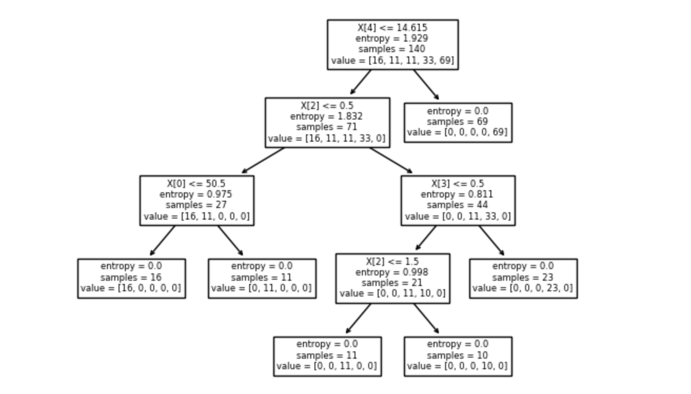

#### [Jupyter Notebook: Decision Trees](res/NB6-Decision-Trees-drug.ipynb)

<br/>
<div align="right">
    <b><a href="#top">↥ back to top</a></b>
</div>
<br/>


### [Logistic Regression](https://en.wikipedia.org/wiki/Logistic_regression)

Logistic regression is a statistical and machine learning technique for classifying records of a dataset based on the values of the input fields. Logistic regression can be used for both **binary classification** and **multi-class classification**.

- What is logistic regression? 
- What kind of problems can be solved by logistic regression? 
- In which situations do we use logistic regression?

>[Logistic regression](https://www.ibm.com/topics/logistic-regression) estimates the probability of an event occurring, such as voted or didn’t vote, based on a given dataset of independent variables. Since the outcome is a probability, the dependent variable is bounded between 0 and 1. 
>
>In logistic regression, a logit transformation is applied on the odds—that is, the probability of success divided by the probability of failure. This is also commonly known as the log odds, or the natural logarithm of odds, and this logistic function is represented by the following formulas:
>
>Logit(pi) = 1/(1+ exp(-pi))  
>ln(pi/(1-pi)) = Beta_0 + Beta_1*X_1 + … + B_k*K_k

Logistic regression applications:

- Predicting the probability of a person having a heart attack
- Predicting the mortality in injured patients
- Predicting a customer's propensity to purchase a product or halt a subscription
- Predicting the probability of failure of a given process or product
- Predicting the likelihood of a homeowner defaulting on a mortgage

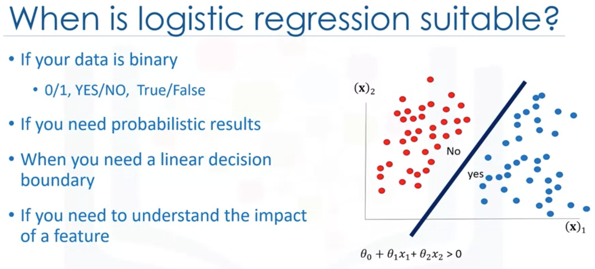

The training process:

1. Initialize *θ*
2. Calculate *y&#770;=σ(θ<sup>T</sup>X)* for a sample
3. Compare the output of y&#770; with actual output of sample, `y`, and record it as error
4. Calculate the error for all samples
5. Change the *θ* to reduce the cost
6. Go back to step 2

Minimizing the cost function of the model
- How to find the best parameters for our model?
  - Minimize the cost function
- How to minimize the cost function?
  - Using Gradient Descent
- What is gradient descent?
  - A technique to use the derivative of a cost function to change the parameter values, in order to minimize the cost

#### [Gradient Descent](https://en.wikipedia.org/wiki/Gradient_descent)

>The gradient is the slope of the surface at every point and the direction of the gradient is the direction of the greatest uphill.
>
>The gradient value also indicates how big of a step to take. If the slope is large we should take a large step because we are far from the minimum. If the slope is small we should take a smaller step. Gradient descent takes increasingly smaller steps towards the minimum with each iteration.
>
>Also we multiply the gradient value by a constant value µ, which is called the learning rate. Learning rate, gives us additional control on how fast we move on the surface. In sum, we can simply say, gradient descent is like taking steps in the current direction of the slope, and the learning rate is like the length of the step you take.


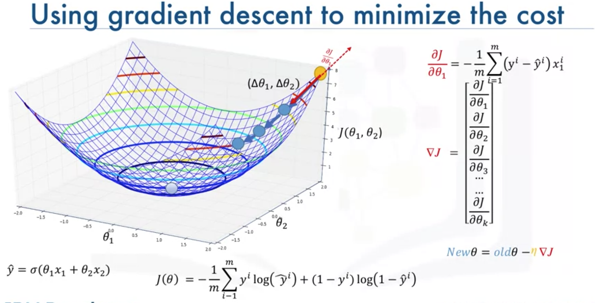

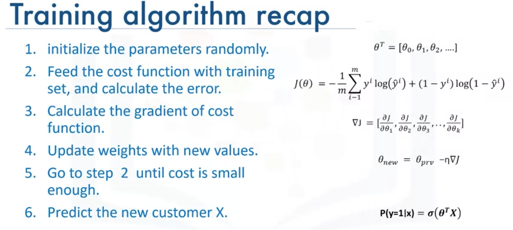

#### [Jupyter Notebook: Logistic Regression](res/NB7-Logistic-Reg-churn.ipynb)


```python
import pandas as pd
import pylab as pl
import numpy as np
import scipy.optimize as opt
from sklearn import preprocessing
%matplotlib inline 
import matplotlib.pyplot as plt

# load data
churn_df = pd.read_csv("ChurnData.csv")
churn_df = churn_df[['tenure', 'age', 'address', 'income', 'ed', 'employ', 'equip',   'callcard', 'wireless','churn']]
churn_df['churn'] = churn_df['churn'].astype('int')
X = np.asarray(churn_df[['tenure', 'age', 'address', 'income', 'ed', 'employ', 'equip']])
y = np.asarray(churn_df['churn'])

# preprocess data
from sklearn import preprocessing
X = preprocessing.StandardScaler().fit(X).transform(X)

# split dataset
from sklearn.model_selection import train_test_split
X_train, X_test, y_train, y_test = train_test_split( X, y, test_size=0.2, random_state=4)
print ('Train set:', X_train.shape,  y_train.shape)
print ('Test set:', X_test.shape,  y_test.shape)

# build model
from sklearn.linear_model import LogisticRegression
from sklearn.metrics import confusion_matrix
LR = LogisticRegression(C=0.01, solver='liblinear').fit(X_train,y_train)

# predict
yhat = LR.predict(X_test)
yhat_prob = LR.predict_proba(X_test)

# evaluate
# jaccard index
from sklearn.metrics import jaccard_score
jaccard_score(y_test, yhat,pos_label=0)

# confusion matrix
from sklearn.metrics import classification_report, confusion_matrix
import itertools
def plot_confusion_matrix(cm, classes,
                          normalize=False,
                          title='Confusion matrix',
                          cmap=plt.cm.Blues):
    """
    This function prints and plots the confusion matrix.
    Normalization can be applied by setting `normalize=True`.
    """
    if normalize:
        cm = cm.astype('float') / cm.sum(axis=1)[:, np.newaxis]
        print("Normalized confusion matrix")
    else:
        print('Confusion matrix, without normalization')

    print(cm)

    plt.imshow(cm, interpolation='nearest', cmap=cmap)
    plt.title(title)
    plt.colorbar()
    tick_marks = np.arange(len(classes))
    plt.xticks(tick_marks, classes, rotation=45)
    plt.yticks(tick_marks, classes)

    fmt = '.2f' if normalize else 'd'
    thresh = cm.max() / 2.
    for i, j in itertools.product(range(cm.shape[0]), range(cm.shape[1])):
        plt.text(j, i, format(cm[i, j], fmt),
                 horizontalalignment="center",
                 color="white" if cm[i, j] > thresh else "black")

    plt.tight_layout()
    plt.ylabel('True label')
    plt.xlabel('Predicted label')
print(confusion_matrix(y_test, yhat, labels=[1,0]))

# Compute confusion matrix
cnf_matrix = confusion_matrix(y_test, yhat, labels=[1,0])
np.set_printoptions(precision=2)


# Plot non-normalized confusion matrix
plt.figure()
plot_confusion_matrix(cnf_matrix, classes=['churn=1','churn=0'],normalize= False,  title='Confusion matrix')

print (classification_report(y_test, yhat))

# log loss
from sklearn.metrics import log_loss
log_loss(y_test, yhat_prob)
```

    Train set: (160, 7) (160,)
    Test set: (40, 7) (40,)
    [[ 6  9]
    [ 1 24]]
    Confusion matrix, without normalization
    [[ 6  9]
    [ 1 24]]
                  precision    recall  f1-score   support

              0       0.73      0.96      0.83        25
              1       0.86      0.40      0.55        15

        accuracy                           0.75        40
      macro avg       0.79      0.68      0.69        40
    weighted avg       0.78      0.75      0.72        40

    0.6017092478101185


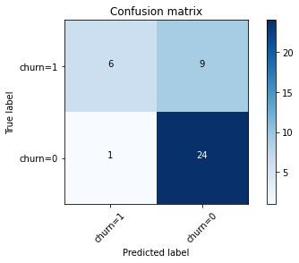

<br/>
<div align="right">
    <b><a href="#top">↥ back to top</a></b>
</div>
<br/>


### Support Vector Machine

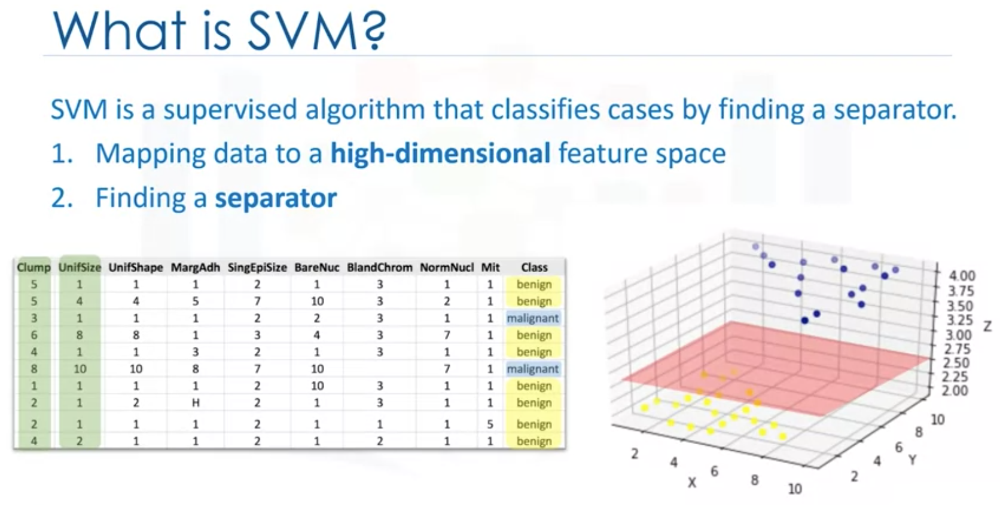

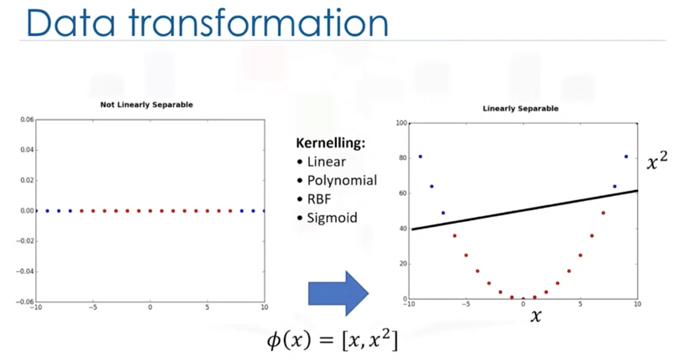

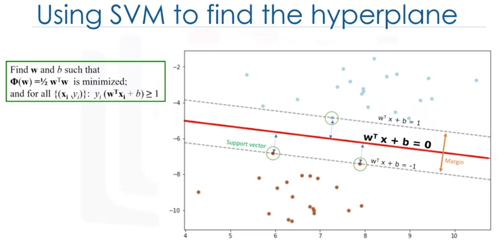

#### [Kernel methods](https://en.wikipedia.org/wiki/Kernel_method)

The SVM algorithm offers a choice of kernel functions for performing its processing. Basically, mapping data into a higher dimensional space is called kernelling. The mathematical function used for the transformation is known as the kernel function, and can be of different types, such as:

1. Linear
2. Polynomial
3. Radial basis function (RBF)
4. Sigmoid


**Pros and cons of SVM**
- Advantages:
  - Accurate in high-dimensional spaces
  - Memory efficient
- Disadvantages:
  - Prone to over-fitting
  - No probability estimation
  - Small datasets (SVMs are not very efficient computationally if your dataset is very big, such as when you have more than 1,000 rows)

**SVM applications**
- Image recognition
- Text category assignment
- Detecting spam
- Sentiment analysis
- Gene Expression Classification
- Regression, outlier detection and clustering


#### [Jupyter Notebook: SVM](res/NB8-SVM.ipynb)

```python
import pandas as pd
import pylab as pl
import numpy as np
import scipy.optimize as opt
from sklearn import preprocessing
from sklearn.model_selection import train_test_split
%matplotlib inline 
import matplotlib.pyplot as plt

# load data
cell_df = pd.read_csv("cell_samples.csv")
# BareNuc column includes some values that are not numerical. drop those rows
cell_df = cell_df[pd.to_numeric(cell_df['BareNuc'], errors='coerce').notnull()] 
cell_df['BareNuc'] = cell_df['BareNuc'].astype('int')

feature_df = cell_df[['Clump', 'UnifSize', 'UnifShape', 'MargAdh', 'SingEpiSize', 'BareNuc', 'BlandChrom', 'NormNucl', 'Mit']]
X = np.asarray(feature_df)

cell_df['Class'] = cell_df['Class'].astype('int')
y = np.asarray(cell_df['Class'])

# split dataset
X_train, X_test, y_train, y_test = train_test_split( X, y, test_size=0.2, random_state=4)
print ('Train set:', X_train.shape,  y_train.shape)
print ('Test set:', X_test.shape,  y_test.shape)

# build model
from sklearn import svm
clf = svm.SVC(kernel='rbf')
clf.fit(X_train, y_train) 

# predict
yhat = clf.predict(X_test)

# evaluate
from sklearn.metrics import classification_report, confusion_matrix
import itertools

def plot_confusion_matrix(cm, classes,
                          normalize=False,
                          title='Confusion matrix',
                          cmap=plt.cm.Blues):
    """
    This function prints and plots the confusion matrix.
    Normalization can be applied by setting `normalize=True`.
    """
    if normalize:
        cm = cm.astype('float') / cm.sum(axis=1)[:, np.newaxis]
        print("Normalized confusion matrix")
    else:
        print('Confusion matrix, without normalization')

    print(cm)

    plt.imshow(cm, interpolation='nearest', cmap=cmap)
    plt.title(title)
    plt.colorbar()
    tick_marks = np.arange(len(classes))
    plt.xticks(tick_marks, classes, rotation=45)
    plt.yticks(tick_marks, classes)

    fmt = '.2f' if normalize else 'd'
    thresh = cm.max() / 2.
    for i, j in itertools.product(range(cm.shape[0]), range(cm.shape[1])):
        plt.text(j, i, format(cm[i, j], fmt),
                 horizontalalignment="center",
                 color="white" if cm[i, j] > thresh else "black")

    plt.tight_layout()
    plt.ylabel('True label')
    plt.xlabel('Predicted label')

# Compute confusion matrix
cnf_matrix = confusion_matrix(y_test, yhat, labels=[2,4])
np.set_printoptions(precision=2)

print(classification_report(y_test, yhat))

# Plot non-normalized confusion matrix
plt.figure()
plot_confusion_matrix(cnf_matrix, classes=['Benign(2)','Malignant(4)'],normalize= False,  title='Confusion matrix')

# f1_score
from sklearn.metrics import f1_score
print(f1_score(y_test, yhat, average='weighted'))

from sklearn.metrics import jaccard_score
print(jaccard_score(y_test, yhat,pos_label=2))
```
```
Train set: (546, 9) (546,)
Test set: (137, 9) (137,)
              precision    recall  f1-score   support

           2       1.00      0.94      0.97        90
           4       0.90      1.00      0.95        47

    accuracy                           0.96       137
   macro avg       0.95      0.97      0.96       137
weighted avg       0.97      0.96      0.96       137

Confusion matrix, without normalization
[[85  5]
 [ 0 47]]
0.9639038982104676
0.9444444444444444
```


<br/>
<div align="right">
    <b><a href="#top">↥ back to top</a></b>
</div>
<br/>


## Clustering

Learning Objectives:

- Explain the different types of clustering algorithms and their use cases.
- Describe the K-Means Clustering technique.
- Describe accuracy concerns for the K-Means Clustering technique.
- Explain the Hierarchical Clustering technique.
- Provide an overview of the agglomerative algorithm for hierarchical clustering.
- List the advantages and disadvantages of using Hierarchical Clustering.
- Describe the capabilities of the density-based clustering called DBSCAN.
- Apply clustering on different types of datasets.


<br/>
<div align="right">
    <b><a href="#top">↥ back to top</a></b>
</div>
<br/>

## Recommender Systems

Learning Objectives:
- Explain how the different recommender systems work.
- Describe the advantages of using recommendation systems.
- Explain the difference between memory-based and model-based implementations of recommender systems.
- Explain how content-based recommender systems work.
- Explain how collaborative filtering systems work.
- Implement a recommender system on a real dataset.


<br/>
<div align="right">
    <b><a href="#top">↥ back to top</a></b>
</div>
<br/>
