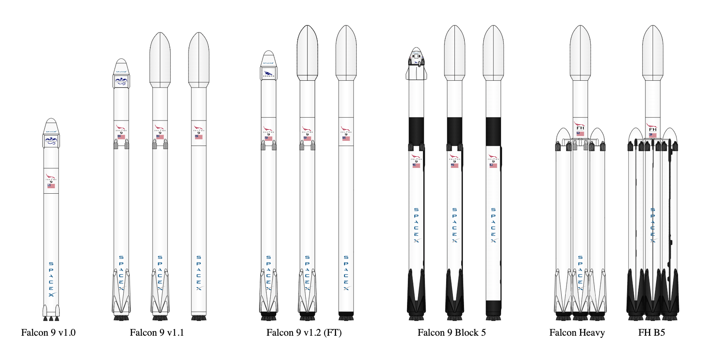

# Applied Data Science Capstone <!-- omit in toc -->

- [Data Collection](#data-collection)
  - [Data Collection API](#data-collection-api)
    - [Jupyter Notebook: Data Collection API](#jupyter-notebook-data-collection-api)
  - [Web Scraping](#web-scraping)
    - [Jupyter Notebook: Web Scraping](#jupyter-notebook-web-scraping)
  - [Data Wrangling](#data-wrangling)
    - [Jupyter Notebook: Data Wrangling](#jupyter-notebook-data-wrangling)
- [Exploratory Data Analysis](#exploratory-data-analysis)
  - [Exploratory Analysis Using SQL](#exploratory-analysis-using-sql)
    - [Jupyter Notebook: Using SQL](#jupyter-notebook-using-sql)
    - [Lab Reference Links](#lab-reference-links)
  - [Exploratory Analysis Using Pandas and Matplotlib](#exploratory-analysis-using-pandas-and-matplotlib)
    - [Jupyter Notebook: Data Visualization](#jupyter-notebook-data-visualization)
  - [Interactive Visual Analytics and Dashboards](#interactive-visual-analytics-and-dashboards)
    - [Jupyter Notebook: Folium](#jupyter-notebook-folium)
    - [SpaceX Dash App](#spacex-dash-app)
- [Predictive Analysis (Classification)](#predictive-analysis-classification)
  - [Jupyter Notebook: Machine Learning Prediction](#jupyter-notebook-machine-learning-prediction)
- [How to Present Your Findings](#how-to-present-your-findings)
  - [Structure of A Report](#structure-of-a-report)

## Data Collection



### Data Collection API

The [SpaceX REST API](https://github.com/r-spacex/SpaceX-API) endpoints:

- https://api.spacexdata.com/v4/cores
- https://api.spacexdata.com/v4/capsules
- https://api.spacexdata.com/v4/launches/past

```python
import requests
import pandas as pd

spacex_url = "https://api.spacexdata.com/v4/launches/past"
response = requests.get(spacex_url)
data = pd.json_normalize(response.json())
```

#### [Jupyter Notebook: Data Collection API](res/1-jupyter-labs-spacex-data-collection-api.ipynb)

### Web Scraping

Data Source: [Wikipedia: List of Falcon 9 and Falcon Heavy launches](https://en.wikipedia.org/wiki/List_of_Falcon_9_and_Falcon_Heavy_launches)

#### [Jupyter Notebook: Web Scraping](res/2-jupyter-labs-webscraping.ipynb)

### Data Wrangling

#### [Jupyter Notebook: Data Wrangling](res/3-jupyter-spacex-data-wrangling.ipynb)


<br/>
<div align="right">
    <b><a href="#top">↥ back to top</a></b>
</div>
<br/>


## Exploratory Data Analysis

### Exploratory Analysis Using SQL

#### [Jupyter Notebook: Using SQL](res/4-jupyter-labs-eda-sql-coursera_sqllite.ipynb)


- [Accessing SQLite Databases Using Python and Pandas](https://datacarpentry.org/python-ecology-lesson/09-working-with-sql/index.html)

#### Lab Reference Links

- [Hands-on Lab : String Patterns, Sorting and Grouping](https://cf-courses-data.s3.us.cloud-object-storage.appdomain.cloud/IBMDeveloperSkillsNetwork-DB0201EN-SkillsNetwork/labs/Labs_Coursera_V5/labs/Lab%20-%20String%20Patterns%20-%20Sorting%20-%20Grouping/instructional-labs.md.html?utm_medium=Exinfluencer&utm_source=Exinfluencer&utm_content=000026UJ&utm_term=10006555&utm_id=NA-SkillsNetwork-Channel-SkillsNetworkCoursesIBMDS0321ENSkillsNetwork26802033-2022-01-01&origin=www.coursera.org)
- [Hands-on Lab: Built-in functions](https://cf-courses-data.s3.us.cloud-object-storage.appdomain.cloud/IBMDeveloperSkillsNetwork-DB0201EN-SkillsNetwork/labs/Labs_Coursera_V5/labs/Lab%20-%20Built-in%20functions%20/Hands-on_Lab__Built-in_Functions.md.html?utm_medium=Exinfluencer&utm_source=Exinfluencer&utm_content=000026UJ&utm_term=10006555&utm_id=NA-SkillsNetwork-Channel-SkillsNetworkCoursesIBMDS0321ENSkillsNetwork26802033-2022-01-01&origin=www.coursera.org)
- [Hands-on Lab : Sub-queries and Nested SELECT Statements](https://cf-courses-data.s3.us.cloud-object-storage.appdomain.cloud/IBMDeveloperSkillsNetwork-DB0201EN-SkillsNetwork/labs/Labs_Coursera_V5/labs/Lab%20-%20Sub-queries%20and%20Nested%20SELECTs%20/instructional-labs.md.html?utm_medium=Exinfluencer&utm_source=Exinfluencer&utm_content=000026UJ&utm_term=10006555&utm_id=NA-SkillsNetwork-Channel-SkillsNetworkCoursesIBMDS0321ENSkillsNetwork26802033-2022-01-01&origin=www.coursera.org)
- [Hands-on Tutorial: Accessing Databases with SQL magic](https://cf-courses-data.s3.us.cloud-object-storage.appdomain.cloud/IBMDeveloperSkillsNetwork-DB0201EN-SkillsNetwork/labs/Module%205/DB0201EN-Week3-1-3-SQLmagic.ipynb?utm_medium=Exinfluencer&utm_source=Exinfluencer&utm_content=000026UJ&utm_term=10006555&utm_id=NA-SkillsNetwork-Channel-SkillsNetworkCoursesIBMDS0321ENSkillsNetwork26802033-2022-01-01)
- [Hands-on Lab: Analyzing a real World Data Set](https://cf-courses-data.s3.us.cloud-object-storage.appdomain.cloud/IBMDeveloperSkillsNetwork-DB0201EN-SkillsNetwork/labs/Module%205/DB0201EN-Week3-1-4-Analyzing.ipynb?utm_medium=Exinfluencer&utm_source=Exinfluencer&utm_content=000026UJ&utm_term=10006555&utm_id=NA-SkillsNetwork-Channel-SkillsNetworkCoursesIBMDS0321ENSkillsNetwork26802033-2022-01-01)


### Exploratory Analysis Using Pandas and Matplotlib

#### [Jupyter Notebook: Data Visualization](res/5-jupyter-labs-eda-dataviz.ipynb)


### Interactive Visual Analytics and Dashboards

#### [Jupyter Notebook: Folium](res/6-jupyter_launch_site_location_folium.ipynb)

```python
# Function to assign color to launch outcome
def assign_marker_color(launch_outcome):
    if launch_outcome == 1:
        return 'green'
    else:
        return 'red'
    
spacex_df['marker_color'] = spacex_df['class'].apply(assign_marker_color)
```

```python
marker_cluster = MarkerCluster()
# Add marker_cluster to current site_map
site_map.add_child(marker_cluster)

# for each row in spacex_df data frame
# create a Marker object with its coordinate
# and customize the Marker's icon property to indicate if this launch was successed or failed, 
# e.g., icon=folium.Icon(color='white', icon_color=row['marker_color']
for index, record in spacex_df.iterrows():
    # TODO: Create and add a Marker cluster to the site map
    # marker = folium.Marker(...)
    
    marker = folium.map.Marker(
        [record['Lat'],record['Long']],
        # Create an icon as a text label
        icon=folium.Icon(color='white', icon_color=record['marker_color'])
    )
    marker_cluster.add_child(marker)
```


<br/>
<div align="right">
    <b><a href="#top">↥ back to top</a></b>
</div>
<br/>


#### SpaceX Dash App


[SpaceX Dash App Assignment Guide](https://cf-courses-data.s3.us.cloud-object-storage.appdomain.cloud/IBM-DS0321EN-SkillsNetwork/labs/module_3/lab_theia_plotly_dash.md.html)

```python
# Import required libraries
import pandas as pd
import dash
import dash_html_components as html
import dash_core_components as dcc
from dash.dependencies import Input, Output
import plotly.express as px

# Read the airline data into pandas dataframe
spacex_df = pd.read_csv("spacex_launch_dash.csv")
max_payload = spacex_df['Payload Mass (kg)'].max()
min_payload = spacex_df['Payload Mass (kg)'].min()

# Create a dash application
app = dash.Dash(__name__)

# Create an app layout
app.layout = html.Div(children=[
    html.H1('SpaceX Launch Records Dashboard',
            style={'textAlign': 'center', 'color': '#503D36', 'font-size': 40}),
    # TASK 1: Add a dropdown list to enable Launch Site selection
    # The default select value is for ALL sites
    # dcc.Dropdown(id='site-dropdown',...)
    dcc.Dropdown(
        id='site-dropdown',
        options=[
            {'label': 'All Sites', 'value': 'ALL'},
            {'label': 'CCAFS LC-40', 'value': 'CCAFS LC-40'},
            {'label': 'CCAFS SLC-40', 'value': 'CCAFS SLC-40'},
            {'label': 'KSC LC-39A', 'value': 'KSC LC-39A'},
            {'label': 'VAFB SLC-4E', 'value': 'VAFB SLC-4E'}
        ],
        value='all',
        placeholder="Select a Launch Site here",
        searchable=True
    ),
    html.Br(),

    # TASK 2: Add a pie chart to show the total successful launches count for all sites
    # If a specific launch site was selected, show the Success vs. Failed counts for the site
    html.Div(dcc.Graph(id='success-pie-chart')),
    html.Br(),

    html.P("Payload range (Kg):"),
    # TASK 3: Add a slider to select payload range
    #dcc.RangeSlider(id='payload-slider',...)
    dcc.RangeSlider(id='payload-slider',
                min=0, max=10000, step=1000,
                # marks={0: '0',
                #        100: '100'},
                value=[min_payload, max_payload]),

    # TASK 4: Add a scatter chart to show the correlation between payload and launch success
    html.Div(dcc.Graph(id='success-payload-scatter-chart')),
])

# TASK 2:
# Add a callback function for `site-dropdown` as input, `success-pie-chart` as output
@app.callback(Output(component_id='success-pie-chart', component_property='figure'),
               Input(component_id='site-dropdown', component_property='value'))
#Place to define the callback function .
def get_pie_chart(entered_site):
    filtered_df = spacex_df
    if entered_site == 'ALL':
        fig = px.pie(filtered_df, values='class', # use value 1 to calc success rate
                    names='Launch Site', 
                    title='Total Success Launches by Site')
        return fig
    else:
        # return the outcomes piechart for a selected site
        filtered_df = filtered_df[filtered_df['Launch Site'] == entered_site]
        fig = px.pie(filtered_df, #values='class', # no need to use value 1 to calc, just count 0 or 1
                    names='class', 
                    title=f'Total Success Launches for {entered_site}')
        return fig


# TASK 4:
# Add a callback function for `site-dropdown` and `payload-slider` as inputs, `success-payload-scatter-chart` as output
@app.callback(Output(component_id='success-payload-scatter-chart', component_property='figure'),
              [Input(component_id='site-dropdown', component_property='value'), 
               Input(component_id="payload-slider", component_property="value")])
#Place to define the callback function .
def get_scatter_plot(entered_site, payload):
    filtered_df = spacex_df
    if entered_site == 'ALL':
        fig = px.scatter(filtered_df, x='Payload Mass (kg)', y="class", 
                         color="Booster Version Category",
                         title='Correlation between Payload and Success for all Sites')
        return fig
    else:
        # return the outcomes piechart for a selected site
        filtered_df = filtered_df[(filtered_df['Launch Site']==entered_site) \
                & (filtered_df['Payload Mass (kg)'] >= payload[0]) \
                & (filtered_df['Payload Mass (kg)'] <= payload[1])]

        fig = px.scatter(filtered_df, x='Payload Mass (kg)', y="class", 
                         color="Booster Version Category",
                         title=f'Correlation between Payload and Success for {entered_site}')
        return fig


# Run the app
if __name__ == '__main__':
    app.run_server()
```


Plotly Dash Reference links:
- [dcc.Dropdown (input)](https://dash.plotly.com/dash-core-components/dropdown)
- [dcc.RangeSlider (input)](https://dash.plotly.com/dash-core-components/rangeslider)
- [Pie Charts (output)](https://plotly.com/python/pie-charts/)
- [Scatter Plots (output)](https://plotly.com/python/line-and-scatter/)

<br/>
<div align="right">
    <b><a href="#top">↥ back to top</a></b>
</div>
<br/>


## Predictive Analysis (Classification)

```python
import pandas as pd
from sklearn import preprocessing
from sklearn.model_selection import train_test_split
from sklearn.model_selection import GridSearchCV
from sklearn.neighbors import KNeighborsClassifier

def plot_confusion_matrix(y,y_predict):
    "this function plots the confusion matrix"
    from sklearn.metrics import confusion_matrix

    cm = confusion_matrix(y, y_predict)
    ax= plt.subplot()
    sns.heatmap(cm, annot=True, ax = ax); #annot=True to annotate cells
    ax.set_xlabel('Predicted labels')
    ax.set_ylabel('True labels')
    ax.set_title('Confusion Matrix'); 
    ax.xaxis.set_ticklabels(['did not land', 'land']); ax.yaxis.set_ticklabels(['did not land', 'landed'])
  
# load data
data = pd.read_csv("dataset_part_2.csv")
X = pd.read_csv('dataset_part_3.csv')
Y = data['Class'].to_numpy()
X = preprocessing.StandardScaler().fit(X).transform(X)

# split data
X_train, X_test, Y_train, Y_test = train_test_split(X, Y, test_size=0.2, random_state=2)
print ('Train set:', X_train.shape,  Y_train.shape)
print ('Test set:', X_test.shape,  Y_test.shape)

# build model to search best parameter
parameters = {'n_neighbors': [1, 2, 3, 4, 5, 6, 7, 8, 9, 10],
              'algorithm': ['auto', 'ball_tree', 'kd_tree', 'brute'],
              'p': [1,2]}
KNN = KNeighborsClassifier()
knn_cv = GridSearchCV(KNN, parameters, cv=10)
knn_cv.fit(X,Y)

print("tuned hpyerparameters :(best parameters) ",knn_cv.best_params_)
print("accuracy :",knn_cv.best_score_)

# accuracy on test data
knn_cv.score(X_test, Y_test)

# plot the confusion matrix
yhat = knn_cv.predict(X_test)
plot_confusion_matrix(Y_test,yhat)
```

### [Jupyter Notebook: Machine Learning Prediction](res/7-SpaceX_Machine_Learning_Prediction_Part_5.ipynb)


## How to Present Your Findings

### Structure of A Report

- Cover Page
- Executive Summary
- Table of Contents
- Introduction
- Methodology
- Results
- Discussion
- Conclusion
- Appendix


<br/>
<div align="right">
    <b><a href="#top">↥ back to top</a></b>
</div>
<br/>

