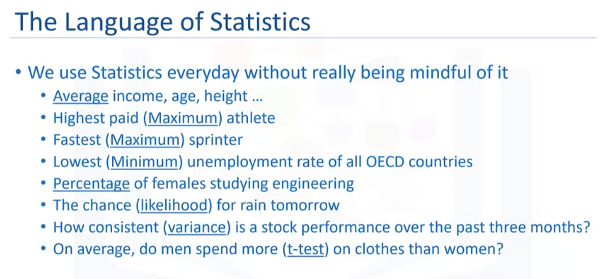
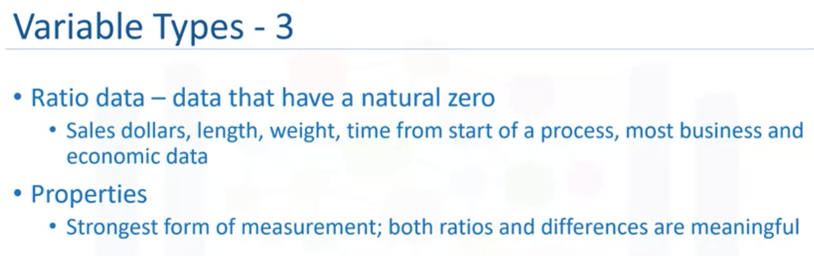
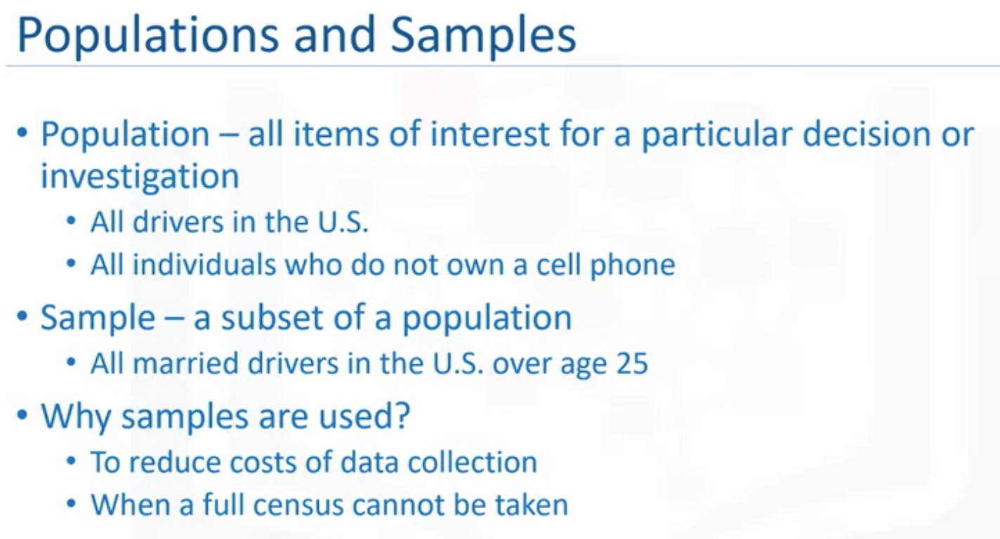
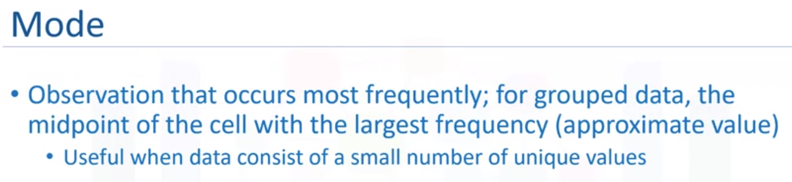
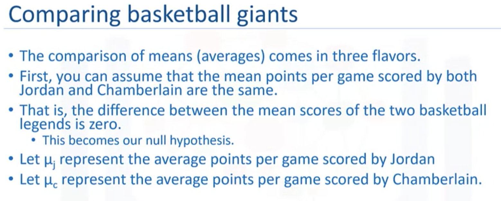
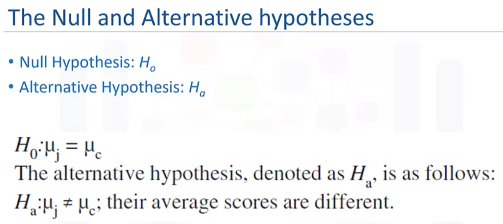
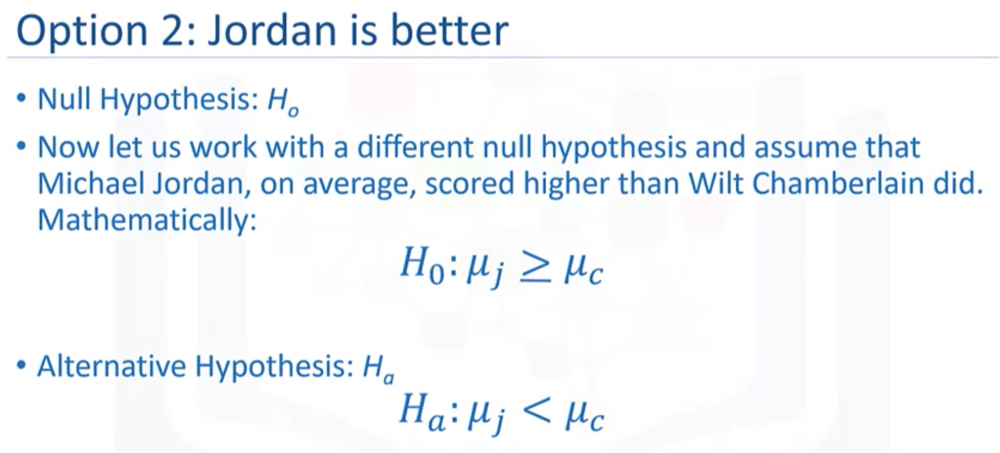
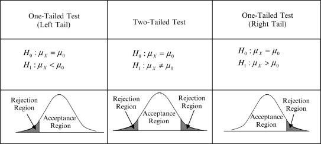
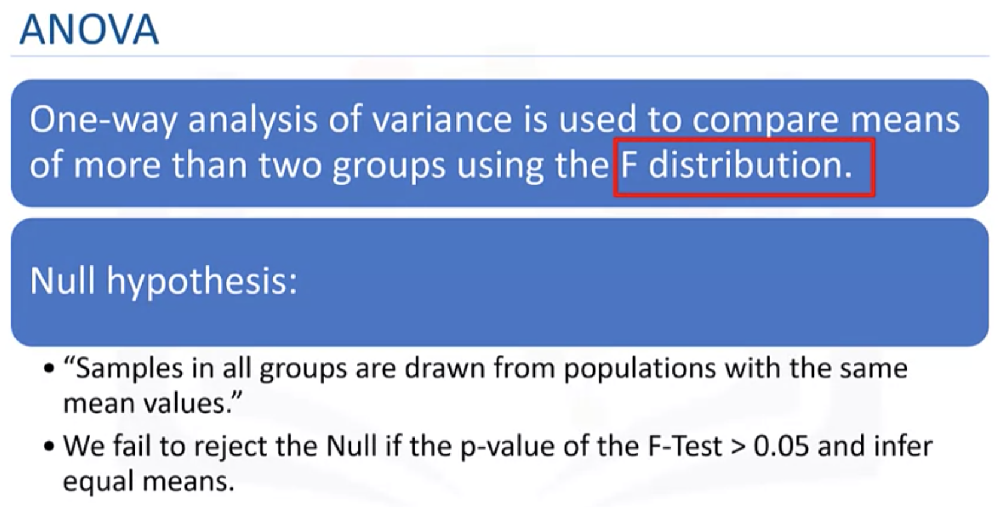
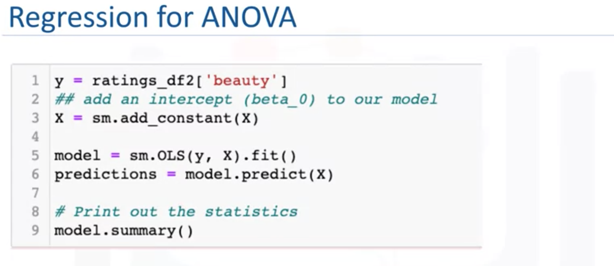

# Statistics for Data Science with Python  <!-- omit in toc -->

This course is one of courses in the [Data Science Fundamentals with Python and SQL Specialization](https://www.coursera.org/specializations/data-science-fundamentals-python-sql), which is useful for data analysis but not included in this Data Science Professional Certificate.

- [Introduction and Descriptive Statistics](#introduction-and-descriptive-statistics)
  - [Types of Data](#types-of-data)
  - [Measure of Central Tendency](#measure-of-central-tendency)
  - [Measure of Dispersion](#measure-of-dispersion)
    - [Reliability](#reliability)
- [Data Visualization](#data-visualization)
- [Introduction to Probability Distribution](#introduction-to-probability-distribution)
  - [Hypothesis Test](#hypothesis-test)
  - [Z test or T test](#z-test-or-t-test)
  - [Levene's Test](#levenes-test)
  - [ANOVA](#anova)
  - [Correlation Test](#correlation-test)
- [Regression Analysis](#regression-analysis)
  - [Regression in place of t - test](#regression-in-place-of-t---test)
  - [Regression in place of ANOVA](#regression-in-place-of-anova)
  - [Regression in place of Correlation](#regression-in-place-of-correlation)

## Introduction and Descriptive Statistics


</img>

### Types of Data

</img>

</img>

</img>

</img>


</img>


</img>

### Measure of Central Tendency

```python
# get information about each variable
df.info()
```

</img>


</img>

</img>

</img>

```python
df.describe()
```

### Measure of Dispersion

</img>

**Dispersion**, which is also called variability, scatter or spread, is the extent to which the data distribution is stretched or squeezed. The common measures of dispersion are **standard deviation** and **variance**.

</img>

#### Reliability

- Average paints a partial picture
- Average statistics are incomplete without standard deviation/variance
- Risk metrics are all about variance

[Jupyter Notebook: Descriptive Statistics](res/Descriptive_Stats.ipynb)

## Data Visualization

[The Extreme Presentation Method](https://extremepresentation.com/):
- The step-by-step approach for designing presentations of complex or controversial information in ways that drive people to action.


</img>

- `seaborn`
- `matplotlib`

[Jupyter Notebook: Visualizing Data](res/Visualizing_Data.ipynb)

## Introduction to Probability Distribution


</img>

### Hypothesis Test

</img>

</img>

</img>

</img>

</img>

</img>

To use both the **p-value** and significance level together,  you have to decide on a value for **alpha** after you state your hypothesis.  Suppose that is alpha = 0.10 (or 10%).  You then collect the data and calculate the p-value.  
- If the p-value is greater than alpha, you assume that the null hypothesis is true and you fail to reject.  
- If the p-value is less than alpha, you assume that the null hypothesis is false and you reject it. 
- In cases when the p-value and the significance levels are approximately equal e.g. a p-value of 0.11, it is your call to decide to reject or fail to reject or you could decide to resample and collect more data.

**Normal Distribution:**

```python
import numpy as np
import matplotlib.pyplot as plt
from scipy.stats import norm

x_axis = np.arange(-4, 4, 0.1)
plt.plot(x_axis, norm.pdf(x_axis,0,1))
plt.show()
```

</img>


[Jupyter Notebook: T Test](res/Introduction_to_probability_distribution.ipynb)


### Z test or T test
- If the population's standard deviation is known, use z test
- Otherwise, use T-test

Comparing means - 4 cases:
- Use Z test: Comparing sample mean to a population mean when the population standard deviation is known
- Use **T test**: Comparing sample mean to a population mean when the population standard deviation is not known
- Always use **T test**: Comparing the means of two independent samples with unequal variances
- Always use **T test**: Comparing the means of two independent samples with equal variances

| Type of Test | `z` or `t` Statistics* | Expected p-value | Decision |
| :---: | :---: | :---: | :---: | 
| Two-tailed test | The absolute value of the calculated `z` or `t` statistics is greater than 1.96 | Less than 0.05 | Reject the null hypothesis |
| One-tailed test | The absolute value of the calculated `z` or `t` statistics is greater than 1.64 | Less than 0.05 | Reject the null hypothesis |

\* in large samples this rule of thumb holds true for the `t-test` because in large sample sizes, the t-distribution is approximate to a normal distribution

</img>

</img>

</img>

</img>

### Levene's Test

[Levene's test](https://www.statisticshowto.com/levene-test/) is used to check that variances are equal for all samples when your data comes from a non normal distribution. You can use Levene's test to check the assumption of equal variances before running a test like One-Way ANOVA.

</img>

</img>

### ANOVA

ANOVA - Comparing means of more than two groups

[Analysis of variance (ANOVA)](https://en.wikipedia.org/wiki/Analysis_of_variance) is a collection of statistical models and their associated estimation procedures (such as the "variation" among and between groups) used to analyze the differences among means.

</img>

### Correlation Test

Correlation test is used to evaluate the association between two or more variables. For instance, if we are interested to know whether there is a relationship between the heights of fathers and sons, a correlation coefficient can be calculated to answer this question.

</img>

See also: 
- [How To Do Cross Tabulation Analysis](https://www.youtube.com/watch?v=BAcG2TE5tmU)
- [Contingency table](https://en.wikipedia.org/wiki/Contingency_table)
- [Pivot table](https://en.wikipedia.org/wiki/Pivot_table)


[Jupyter Notebook: Hypothesis Testing](res/Hypothesis_Testing.ipynb)


## Regression Analysis

Linear regression is a linear relationship between the response variable and predictor variables. It can be used to predict the value of a continuous variable, based on the value of another continuous variable. The t-test statistic helps to determine the correlation between the response and the predictor variables. A one-sample t-test will be used in linear regression to test the null hypothesis that the slope or the coefficient is equal to zero. In the case of the multiple regression model, the null hypothesis is that the coefficient of each of the predictor variables is equal to zero.

### Regression in place of t - test

</img>

</img>

### Regression in place of ANOVA

</img>

</img>

### Regression in place of Correlation

</img>


[Jupyter Notebook: Regression Analysis](res/Regression_Analysis.ipynb)
