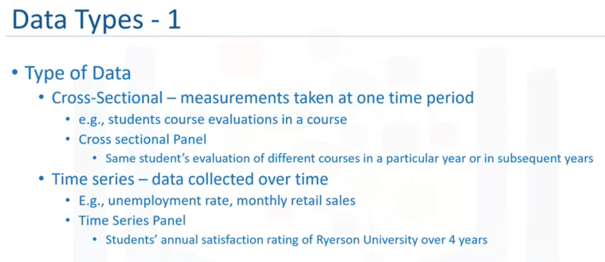
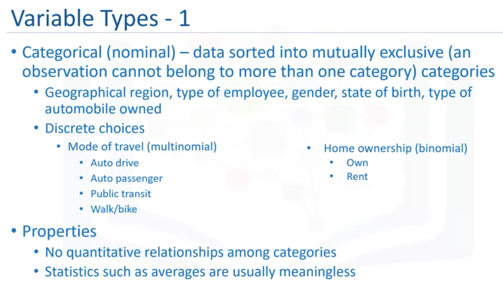
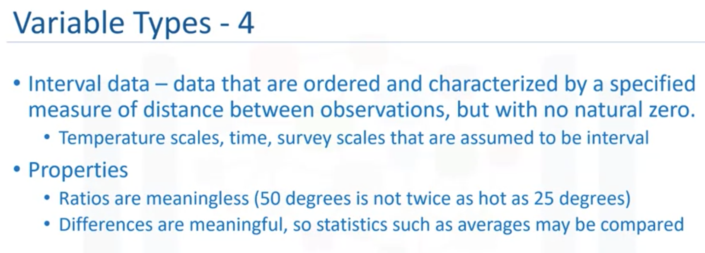
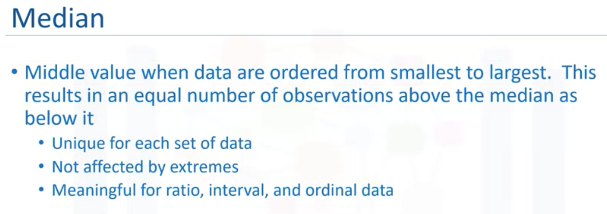
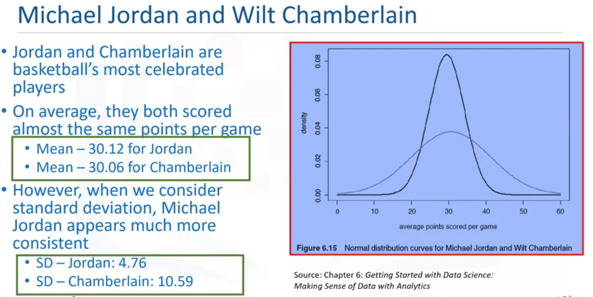
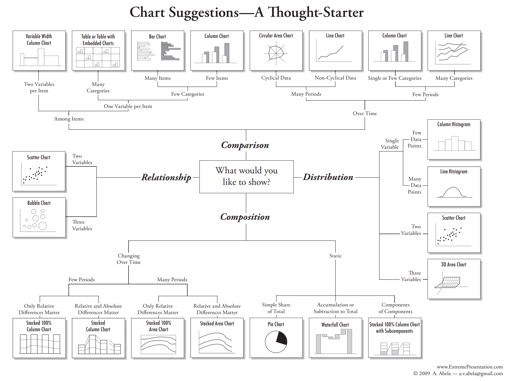

# Statistics for Data Science with Python  <!-- omit in toc -->

This course is one of courses in the [Data Science Fundamentals with Python and SQL Specialization](https://www.coursera.org/specializations/data-science-fundamentals-python-sql), which is useful for data analysis but not included in this Data Science Professional Certificate.

- [Introduction and Descriptive Statistics](#introduction-and-descriptive-statistics)
  - [Types of Data](#types-of-data)
  - [Measure of Central Tendency](#measure-of-central-tendency)
  - [Measure of Dispersion](#measure-of-dispersion)
    - [Reliability](#reliability)
- [Data Visualization](#data-visualization)
- [Introduction to Probability Distribution](#introduction-to-probability-distribution)
- [Hypothesis Testing](#hypothesis-testing)
- [Regression Analysis](#regression-analysis)

## Introduction and Descriptive Statistics


</img>

### Types of Data

</img>

</img>

</img>

</img>


</img>


</img>

### Measure of Central Tendency

```python
# get information about each variable
df.info()
```

</img>


</img>

</img>

</img>

```python
df.describe()
```

### Measure of Dispersion

</img>

**Dispersion**, which is also called variability, scatter or spread, is the extent to which the data distribution is stretched or squeezed. The common measures of dispersion are **standard deviation** and **variance**.

</img>

#### Reliability

- Average paints a partial picture
- Average statistics are incomplete without standard deviation/variance
- Risk metrics are all about variance

[Jupyter Notebook: Descriptive Statistics](res/Descriptive_Stats.ipynb)

## Data Visualization

[The Extreme Presentation Method](https://extremepresentation.com/):
- The step-by-step approach for designing presentations of complex or controversial information in ways that drive people to action.


</img>

- `seaborn`
- `matplotlib`

[Jupyter Notebook: Visualizing Data](res/Visualizing_Data.ipynb)

## Introduction to Probability Distribution

## Hypothesis Testing

## Regression Analysis